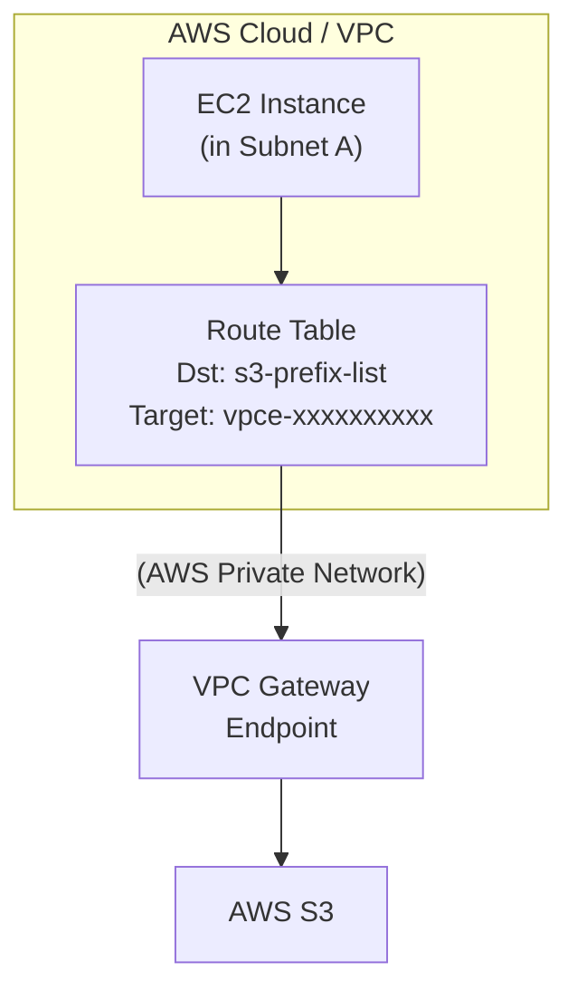
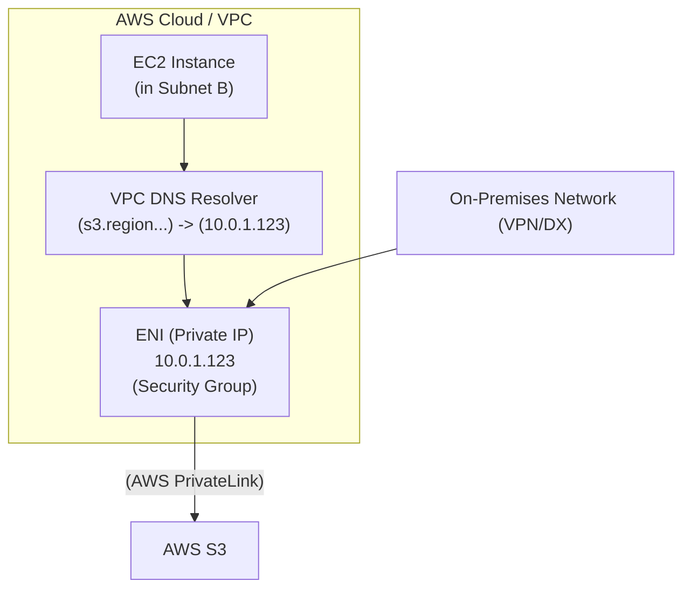

AWS 환경에서 VPC(Virtual Private Cloud) 내의 리소스(예: EC2 인스턴스)가 S3 버킷과 통신해야 하는 경우는 매우 흔합니다. 이때 인터넷을 통하지 않고 AWS 내부 네트워크를 통해 안전하고 빠르게 통신하기 위해 VPC 엔드포인트를 사용합니다.

S3를 위한 VPC 엔드포인트는 크게 **Gateway 방식**과 **Interface 방식**, 두 가지로 나뉩니다. 두 방식은 비용, 보안, 아키텍처 유연성, 그리고 로그 추적 관점에서 중요한 차이점을 가지므로, 워크로드의 특성에 맞는 올바른 방식을 선택하는 것이 중요합니다.

이 글에서는 두 방식의 핵심적인 차이점을 다각도로 분석하고, 각각의 구성 흐름과 실제 S3 접근 로그의 차이점까지 상세히 알아보겠습니다.

### 1. Gateway 엔드포인트 (Gateway Endpoint)

Gateway 엔드포인트는 VPC 외부에 있는 별개의 리소스가 아니라, **VPC 내에 논리적으로 존재하는 구성요소**입니다. 이는 VPC의 라우팅 테이블을 수정하여 S3로 향하는 트래픽을 AWS Private Network를 통해 전달하는 방식으로 동작하며, VPC 내에서 S3로의 경로를 지정하는 '게이트웨이' 역할을 합니다.

#### **구성 흐름 (Configuration Flow)**

1.  VPC 내의 EC2 인스턴스가 S3 버킷의 Public DNS 이름으로 API 요청을 보냅니다.
2.  해당 인스턴스가 속한 서브넷의 라우팅 테이블에 S3 서비스(prefix-list)로 향하는 트래픽을 VPC 엔드포인트(vpce-xxxx)로 보내라는 규칙이 정의되어 있습니다.
3.  요청은 인터넷 게이트웨이(IGW)나 NAT 게이트웨이를 거치지 않고, VPC 엔드포인트를 통해 AWS 내부 네트워크로 직접 라우팅되어 S3에 도달합니다.

#### **흐름 다이어그램**



### 2. Interface 엔드포인트 (Interface Endpoint)

Interface 엔드포인트는 AWS PrivateLink 기술을 기반으로 하며, VPC 내 서브넷에 프라이빗 IP 주소를 가진 ENI(Elastic Network Interface)를 생성하여 S3 서비스에 연결합니다. 서비스에 대한 프라이빗 '진입점'을 만드는 것과 같습니다.

#### **구성 흐름 (Configuration Flow)**

1.  VPC 내의 EC2 인스턴스가 S3의 DNS 이름(`bucket.s3.region.amazonaws.com` 등)으로 API 요청을 보냅니다.
2.  VPC에 설정된 Private DNS 기능이 이 요청을 가로채, S3의 Public IP가 아닌 VPC 내에 생성된 Interface 엔드포인트 ENI의 **프라이빗 IP**로 해석(Resolve)해 줍니다.
3.  요청은 이 프라이빗 IP를 통해 AWS 내부 네트워크로 전달되어 S3에 도달합니다.

#### **흐름 다이어그램**



### 3. 비교 요약 표

| 항목 | Gateway 엔드포인트 | Interface 엔드포인트 (PrivateLink) |
| :--- | :--- | :--- |
| **핵심 원리** | 라우팅 테이블 타겟 | VPC 내 프라이빗 IP를 가진 ENI |
| **비용** | **무료** | **유료** (시간당 요금 + 데이터 처리 요금) |
| **보안 제어** | 엔드포인트 정책, S3 버킷 정책 | **보안 그룹**, NACL, 엔드포인트 정책, S3 버킷 정책 |
| **On-Premise 접근** | **불가능** | **가능** (VPN, Direct Connect 경유) |
| **S3 로그 `remoteIp`** | **소스 EC2의 Private IP** | **엔드포인트 ENI의 Private IP** |
| **DNS** | Public DNS 사용 (경로만 변경) | Private DNS를 통해 프라이빗 IP로 해석 |

### 4. S3 접근 로그 비교 (Access Log Comparison)

두 방식의 가장 큰 운영상의 차이점 중 하나는 S3 서버 접근 로그에 기록되는 소스 IP(`remoteIp`)입니다.

#### **Gateway 엔드포인트를 통한 접근 로그 예시**

Gateway 방식은 소스 IP를 변환하지 않으므로, 로그에 **요청을 보낸 EC2 인스턴스의 실제 프라이빗 IP**가 기록됩니다.

```log
... [17/Aug/2025:11:20:15 +0000] 10.0.1.55 ... GET.OBJECT my-object.txt ... "vpce-0123456789abcdef0"
```

*   `remoteIp`: `10.0.1.55` (요청을 보낸 EC2 인스턴스의 IP)
*   `vpc_endpoint_id`: `vpce-0123456789abcdef0` (사용된 Gateway 엔드포인트의 ID)

> **장점**: 어떤 인스턴스가 S3에 접근했는지 직접적으로 추적하기 용이합니다.

#### **Interface 엔드포인트를 통한 접근 로그 예시**

Interface 방식은 트래픽이 엔드포인트의 ENI를 통해 나가므로, 로그에 **Interface 엔드포인트 ENI의 프라이빗 IP**가 기록됩니다.

```log
... [17/Aug/2025:11:30:25 +0000] 10.0.2.123 ... GET.OBJECT my-other-object.txt ... "vpce-fedcba9876543210f"
```

*   `remoteIp`: `10.0.2.123` (Interface 엔드포인트 ENI의 IP)
*   `vpc_endpoint_id`: `vpce-fedcba9876543210f` (사용된 Interface 엔드포인트의 ID)

> **고려사항**: 로그만으로는 어떤 EC2 인스턴스가 요청을 보냈는지 직접 알 수 없습니다. 실제 소스를 추적하려면 해당 시간에 어떤 인스턴스가 이 엔드포인트를 사용했는지 알기 위해 **VPC 흐름 로그(Flow Logs)**를 추가로 분석해야 할 수 있습니다.

### 5. 최종 선택 가이드

*   **Gateway 엔드포인트 추천 경우:**
    *   **비용이 가장 중요한 고려사항일 때**
    *   VPC 내부의 리소스에서만 S3에 접근하는 경우
    *   S3 접근 로그에서 소스 인스턴스의 IP를 직접 확인하고 싶을 때

*   **Interface 엔드포인트 추천 경우:**
    *   **온프레미스 데이터 센터에서 VPN/Direct Connect를 통해 S3에 접근해야 할 때** (가장 핵심적인 사용 사례)
    *   VPC 피어링으로 연결된 다른 VPC에서 S3에 접근해야 할 때
    *   보안 그룹을 사용하여 VPC 내에서도 소스 IP 기반의 세밀한 네트워크 제어가 반드시 필요할 때
    *   비용과 로그 추적의 복잡성을 감수하더라도 아키텍처의 유연성과 확장성이 더 중요할 때

### 6. 결론

Gateway와 Interface 엔드포인트는 각각 명확한 장단점을 가지고 있습니다. **비용 효율성과 명확한 로그 추적을 원한다면 Gateway 방식**이 정답에 가깝고, **온프레미스 연결을 포함한 높은 수준의 유연성과 강력한 네트워크 제어가 필요하다면 Interface 방식**을 선택해야 합니다.

### 7. 참고 자료 (References)

*   **AWS 공식 문서: VPC Endpoints**
    *   [https://docs.aws.amazon.com/vpc/latest/userguide/vpc-endpoints.html](https://docs.aws.amazon.com/vpc/latest/userguide/vpc-endpoints.html)
*   **AWS 공식 문서: Gateway Endpoints**
    *   [https://docs.aws.amazon.com/vpc/latest/userguide/vpc-endpoints-gateway.html](https://docs.aws.amazon.com/vpc/latest/userguide/vpc-endpoints-gateway.html)
*   **AWS 공식 문서: Interface Endpoints (AWS PrivateLink)**
    *   [https://docs.aws.amazon.com/vpc/latest/userguide/vpc-endpoints-interface.html](https://docs.aws.amazon.com/vpc/latest/userguide/vpc-endpoints-interface.html)
*   **AWS 공식 문서: S3 서버 접근 로깅**
    *   [https://docs.aws.amazon.com/AmazonS3/latest/userguide/ServerAccessLogging.html](https://docs.aws.amazon.com/AmazonS3/latest/userguide/ServerAccessLogging.html)
