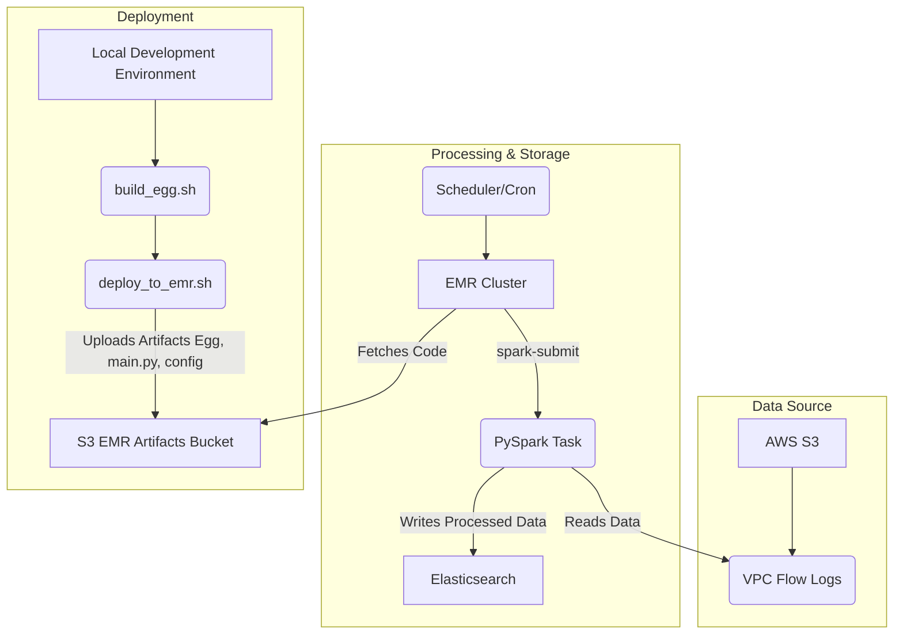

# 대용량 AWS VPC Flow 로그, PySpark와 EMR로 분석하고 Elasticsearch에 저장하기

들어가며: 왜 VPC Flow 로그 분석이 중요한가?

AWS 환경에서 네트워크 트래픽을 모니터링하고 보안을 강화하기 위해 VPC Flow 로그는 필수적인 데이터 소스입니다. VPC Flow 로그는 VPC 내의 모든 네트워크 인터페이스에서 발생하는 IP 트래픽 정보를 캡처하여, 다음과 같은 중요한 질문에 답을 제공합니다.

*   "어떤 IP가 우리 데이터베이스에 접근을 시도했는가?"
*   "비정상적으로 많은 데이터가 외부로 전송되고 있지는 않은가?"
*   "보안 그룹(Security Group)에 의해 차단(REJECT)된 트래픽은 무엇인가?"

하지만 VPC Flow 로그는 그 양이 엄청나게 많고, 원본(raw) 데이터는 분석하기 어려운 형태를 띄고 있습니다. 하루에도 수십, 수백 기가바이트에 달하는 로그를 효율적으로 처리하고 의미 있는 인사이트를 얻기 위해서는 강력한 데이터 처리 파이프라인이 필요합니다.

이 글에서는 S3에 저장된 대용량 VPC Flow 로그를 AWS EMR(Elastic MapReduce) 클러스터와 PySpark를 사용해 주기적으로 분석하고, 그 결과를 Elasticsearch에 저장하여 검색 및 시각화를 용이하게 하는 파이프라인 구축 사례를 소개합니다.

#### 시스템 간 데이터 및 연동 흐름

이 태스크의 데이터 파이프라인은 다음과 같은 흐름으로 동작하며, 각 시스템이 유기적으로 연동됩니다.



1.  데이터 소스 (AWS S3): AWS VPC Flow 로그는 설정에 따라 S3 버킷에 자동으로 저장됩니다. 로그는 `.../year=YYYY/month=MM/day=DD/hour=HH/` 와 같은 시간 기반 파티션 구조로 저장되어, 특정 시간대의 데이터를 효율적으로 조회할 수 있습니다.
2.  태스크 실행 트리거 (Scheduler/Cron): 외부 스케줄러(예: AWS Lambda, AWS Step Functions, Apache Airflow 또는 간단한 Cron 잡)가 매시간 EMR 클러스터에 PySpark 태스크 실행을 지시합니다.
3.  처리 엔진 (AWS EMR & PySpark):
    *   스케줄러의 지시에 따라 EMR 클러스터가 활성화되거나 기존 클러스터에 새로운 `spark-submit` 명령이 전달됩니다.
    *   `spark-submit`은 S3에 미리 배포된 PySpark 코드(EGG 파일 및 `main.py`)를 가져와 EMR 클러스터의 분산 환경에서 PySpark 태스크를 실행합니다.
    *   PySpark 태스크는 S3의 VPC Flow 로그 데이터를 읽어와 분산 처리합니다. 이 과정에서 AWS STS(Security Token Service)를 통해 임시 자격증명을 얻어 S3 접근 보안을 강화합니다.
4.  데이터 목적지 (Elasticsearch): 처리 및 정제된 로그 데이터는 Elasticsearch에 저장됩니다. Elasticsearch는 전문 검색 엔진으로서, 복잡한 쿼리, 집계, 분석을 실시간에 가깝게 수행할 수 있으며 Kibana를 통해 쉽게 시각화할 수 있습니다.
5.  배포 과정: 개발 환경에서 작성된 PySpark 코드는 `build_egg.sh` 스크립트를 통해 Python EGG 패키지로 빌드됩니다. 이 패키지와 `main.py` 스크립트, 설정 파일(`config.json`)은 `deploy_to_emr.sh` 스크립트를 통해 EMR 클러스터가 접근할 수 있는 S3 버킷(EMR Artifacts Bucket)에 업로드됩니다. EMR 클러스터는 태스크 실행 시 이 S3 버킷에서 필요한 코드와 설정을 가져옵니다.

#### 프로젝트 구조 살펴보기

이 태스크는 역할에 따라 명확하게 모듈이 분리되어 있습니다.

*   `main.py`: 파이프라인의 시작점(Entry Point)입니다. 커맨드 라인 인자(argument)를 파싱하고, 설정 파일을 로드하며, 전체 처리 과정을 오케스트레이션합니다.
*   `processors/vpc_flow_processor.py`: 실제 데이터 처리 로직이 담긴 핵심 모듈입니다. PySpark를 사용하여 데이터를 읽고, 특정 조건에 따라 필터링 및 집계하는 역할을 수행합니다.
*   `common/elasticsearch_client.py`: 처리된 데이터를 Elasticsearch로 전송하는 역할을 담당합니다. Bulk API를 사용하여 대량의 데이터를 효율적으로 인덱싱합니다.
*   `config/config.json`: S3 경로, Elasticsearch 주소, 필터링 조건 등 파이프라인에 필요한 모든 설정을 관리합니다.
*   `*.sh`: `build_egg.sh`, `deploy_to_emr.sh` 등 빌드, 배포, 실행을 자동화하는 쉘 스크립트들입니다.

#### 핵심 구현 내용

1.  PySpark를 이용한 데이터 처리 (`vpc_flow_processor.py`)

이 태스크의 심장부입니다. `VPCFlowProcessor` 클래스는 다양한 필터링 시나리오에 맞춰 데이터를 처리하는 메서드를 제공합니다.

*   추상화된 기본 프로세서 (`BaseLogProcessor`): `processors/base_processor.py`에 정의된 `BaseLogProcessor`는 Python의 `abc` (Abstract Base Classes) 모듈을 사용하여 추상 클래스로 구현되었습니다. 이는 모든 로그 프로세서가 `initialize()`와 `process_data()`와 같은 필수 메서드를 구현하도록 강제하여, 코드의 일관성과 확장성을 높입니다. `VPCFlowProcessor`는 이 `BaseLogProcessor`를 상속받아 VPC Flow 로그 처리에 특화된 로직을 구현합니다.
*   Spark 세션 생성: S3에 접근하기 위해 AWS STS(Security Token Service)를 통해 임시 자격증명을 얻고, 이를 Spark 세션 설정에 주입하여 보안을 강화합니다.
*   데이터 로딩: `build_s3_paths` 메서드는 현재 시간으로부터 1시간 전의 S3 경로를 동적으로 생성하여, 스케줄링 실행 시점에 맞는 데이터를 정확히 찾아냅니다.
*   주요 필터 및 집계: `process_data` 메서드는 `--filter` 옵션 값에 따라 각기 다른 처리 메서드를 호출합니다.

    *   `ssh_gateway` 필터:
        *   목적: SSH 게이트웨이 인스턴스를 통한 모든 네트워크 트래픽을 식별하고 추출하여 원격 접근 패턴 및 잠재적 보안 이벤트를 모니터링합니다.
        *   필터링: 설정된 SSH 게이트웨이 인스턴스 ID(`instance-id`)와 일치하는 로그를 필터링합니다.
        *   집계: 별도의 집계 없이 필터링된 원본 로그를 반환합니다.

    *   `database_traffic` 필터:
        *   목적: 데이터베이스 관련 트래픽 패턴을 분석합니다.
        *   필터링:
            *   데이터베이스 포트(기본값: MySQL 3306, PostgreSQL 5432)로의 이그레스(egress) 트래픽 중 특정 바이트 임계값(예: 1MB)을 초과하는 경우.
            *   웹 포트(80, 443)가 아닌 포트를 통한 대용량 데이터 전송.
            *   데이터베이스 포트로의 인그레스(ingress) 트래픽 중 REJECT된 연결 시도.
            *   특정 VPC 내에서 S3 서비스로의 대용량 트래픽.
            *   특정 VPC 내에서 특정 `traffic-path` (예: 2, 8)를 통한 모든 트래픽.
        *   집계: 별도의 집계 없이 필터링된 원본 로그를 반환합니다.

    *   `large_transfers` 필터:
        *   목적: 설정된 크기 임계값(기본값: 5MB)을 초과하는 대용량 데이터 전송을 식별하고 집계합니다. 직접적인 인터넷 트래픽(`traffic-path != 1`)은 제외합니다.
        *   필터링: `bytes` 필드가 임계값을 초과하고 `traffic-path`가 1이 아닌 로그를 필터링합니다.
        *   집계: `account-id`, `srcaddr`, `dstaddr`, `dstport`, `protocol` 등 연결 정보를 기준으로 그룹화하여 `bytes`와 `packets`의 합계(`spark_sum`)를 계산합니다.

    *   `rejected_traffic` 필터:
        *   목적: 보안 이벤트, 정찰 시도 또는 잘못된 구성 등을 나타낼 수 있는 거부된 네트워크 트래픽 패턴을 분석합니다.
        *   필터링: `action`이 `REJECT`이고, `dstport`가 '24234', `protocol`이 '6'(TCP), `tcp-flags`가 '2'(SYN)인 특정 패턴의 로그를 필터링합니다.
        *   집계: `account-id`, `srcaddr`, `dstaddr`, `dstport`, `protocol` 등 연결 정보를 기준으로 그룹화하여 `bytes`와 `packets`의 합계(`spark_sum`)를 계산합니다.

```python
# processors/vpc_flow_processor.py의 일부

from abc import ABC, abstractmethod # BaseLogProcessor에서 ABC를 임포트하여 사용

class BaseLogProcessor(ABC):
    # ... (추상 메서드 정의)

class VPCFlowProcessor(BaseLogProcessor):
    # ... (필터링 및 집계 로직 구현)
```

2.  Elasticsearch 연동 (`elasticsearch_client.py`)

`ElasticsearchClient` 클래스는 처리된 데이터를 Elasticsearch에 안정적으로 전송하는 모든 기능을 캡슐화합니다.

*   Connection 관리: 설정 파일 기반으로 Elasticsearch 클러스터에 연결합니다.
*   Index Template: `create_index_template` 메서드는 VPC Flow 로그 필드에 최적화된 매핑을 가진 인덱스 템플릿을 생성합니다. `srcaddr`, `dstaddr` 필드를 `ip` 타입으로 매핑하여 IP 범위 검색과 같은 네트워크 분석 기능을 활성화합니다.
*   Bulk Indexing: `send_data`와 `send_batch` 메서드는 대량의 문서를 작은 배치(batch)로 나누어 Bulk API로 전송함으로써, 네트워크 부하를 줄이고 인덱싱 성능을 극대화합니다.

3.  배포 자동화 (EGG 패키징 및 EMR 배포)

EMR 클러스터에 PySpark 태스크를 배포하는 것은 다소 복잡할 수 있습니다. 이 태스크는 쉘 스크립트를 통해 이 과정을 자동화합니다.

*   EGG 패키징: `build_egg.sh` 스크립트는 Python 프로젝트를 `.egg` 파일로 패키징합니다. `.egg` 파일은 PySpark 애플리케이션을 EMR 클러스터에 배포할 때 필요한 모든 Python 코드와 의존성을 포함하는 단일 아카이브 파일입니다. 이는 PySpark가 클러스터의 모든 노드에서 필요한 코드를 쉽게 사용할 수 있도록 합니다.

*   EMR 배포: `deploy_to_emr.sh` 스크립트는 다음 단계를 수행합니다.
    1.  `build_egg.sh`를 호출하여 최신 `.egg` 파일을 생성합니다.
    2.  `aws s3 cp` 명령어를 사용해 패키징된 `.egg` 파일, `main.py` 스크립트, 그리고 설정 파일(`config.json` 및 기타 환경별 설정 파일)을 EMR 클러스터가 접근할 수 있는 S3 버킷에 업로드합니다. 이 S3 버킷은 EMR 클러스터가 태스크 실행 시 코드를 가져오는 소스 역할을 합니다.
    3.  배포가 완료되면, EMR 클러스터에 step을 추가할 때 사용할 수 있는 `spark-submit` 명령어 예시와 JSON 설정을 자동으로 생성하여 출력해줍니다. 이 `spark-submit` 명령어는 S3에 업로드된 `.egg` 파일과 `main.py`의 경로를 지정하여 EMR 클러스터에서 PySpark 태스크를 실행하도록 지시합니다.

```json
# deploy_to_emr.sh 스크립트가 생성하는 EMR Step 예시

"Args": [
    "spark-submit",
    "--py-files", "s3://your-bucket/vpc-flow-processor-1.0.0-py3.egg",
    "s3://your-bucket/main.py",
    "--filter", "database_traffic",
    "--config", "s3://your-bucket/config/config.json"
]
```

#### 실행 및 활용

이 파이프라인은 Airflow나 AWS Step Functions, Lambda와 같은 스케줄링 도구와 결합하여 매시간 자동으로 실행되도록 구성할 수 있습니다.

실행 스크립트(`vpcflow_dbport.sh`, `vpcflow_sshgw.sh` 등)는 내부적으로 `spark-submit`을 호출하며, `--filter` 옵션을 다르게 지정하여 다양한 분석 목적을 달성합니다.

예를 들어, `vpcflow_dbport.sh`를 실행하면 데이터베이스 관련 트래픽을 분석하고, `rejected_traffic.sh`를 실행하면 거부된 트래픽을 분석하여 각각의 결과를 Elasticsearch 인덱스에 저장합니다.

이렇게 저장된 데이터는 Kibana 대시보드를 통해 시각화하여, 네트워크 관리자와 보안 담당자가 트래픽 현황을 한눈에 파악하고 이상 징후를 신속하게 탐지할 수 있도록 돕습니다.

#### GitHub 저장소
- https://github.com/kk0m4k/pyspak_vpcflow 
