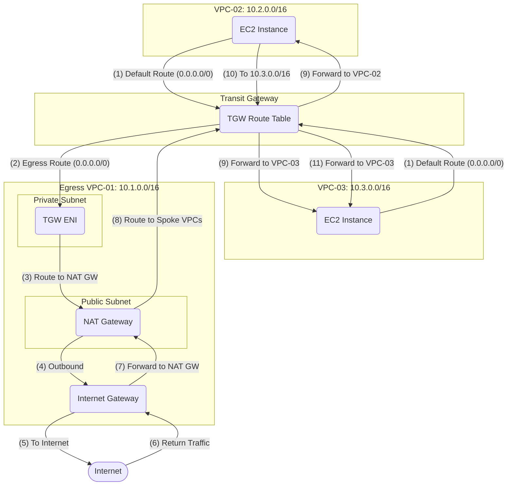

클라우드 환경에서 여러 개의 VPC(Virtual Private Cloud)를 운영할 때, 각 VPC가 개별적으로 인터넷 게이트웨이나 NAT 게이트웨이를 보유하는 구성은 관리의 복잡성과 보안 비용을 증가시키는 원인이 되곤 합니다. 이러한 문제를 효과적으로 해결할 수 있는 방안이 바로 **중앙 집중식 Egress 아키텍처**입니다. 이 모델은 AWS Transit Gateway(TGW)를 중심으로, 여러 VPC의 인터넷 바운드 트래픽을 단 하나의 'Egress VPC'에서 통합 관리하는 방식입니다. 이 포스트에서는 `kkom4k-vpc-01`(Egress VPC), `kkom4k-vpc-02`(Spoke VPC), `kkom4k-vpc-03`(Spoke VPC)의 세 가지 VPC를 사용하는 시나리오를 통해, 중앙 집중식 Egress 아키텍처를 구축하는 과정을 단계별로 살펴보겠습니다.

---

## 아키텍처 개요

우리가 구축할 아키텍처의 구성 요소와 역할은 다음과 같습니다.

- **`kkom4k-vpc-01` (Egress VPC):** 인터넷과 통신하는 유일한 지점(Single Point of Contact)입니다. 이곳에 NAT 게이트웨이와 인터넷 게이트웨이를 배치하여 모든 VPC의 인터넷 바운드 트래픽을 처리하는 관문 역할을 수행합니다.
- **`kkom4k-vpc-02`, `kkom4k-vpc-03` (Spoke VPCs):** 애플리케이션 서버와 같이 내부 워크로드가 위치하는 VPC입니다. 이 VPC들은 인터넷과 직접 연결되지 않는 프라이빗 서브넷으로만 구성되며, 인터넷 통신이 필요할 경우 모든 트래픽을 Transit Gateway를 통해 Egress VPC로 전달합니다.
- **Transit Gateway (TGW):** 모든 VPC를 연결하는 중앙 허브로서, VPC 간 및 인터넷 방향 트래픽을 올바른 경로로 라우팅하는 핵심 요소입니다.

### 데이터 통신 흐름 (Mermaid Diagram)

---

## 보안 관점에서의 이점

이 아키텍처는 분산된 관리 포인트를 제거하고 트래픽 제어 및 모니터링을 중앙화함으로써 보안을 크게 강화합니다.

1.  **트래픽 검사 및 필터링의 중앙화 (Centralized Traffic Inspection)**
    모든 아웃바운드 트래픽이 Egress VPC라는 단일 지점을 통과하므로, 이곳에 AWS Network Firewall이나 차세대 방화벽(NGFW) 같은 보안 솔루션을 통합하여 모든 VPC에 대한 침입 방지(IPS), 웹 필터링, 악성 트래픽 차단 정책을 일괄적으로 적용할 수 있습니다.

2.  **일관된 보안 정책 적용 (Consistent Security Policy)**
    보안 정책을 Egress VPC 한 곳에서만 관리하므로, 설정 오류나 누락의 위험이 크게 줄어듭니다. 새로운 VPC가 추가되더라도 TGW에 연결하기만 하면 즉시 동일한 보안 정책의 보호를 받게 되어 정책의 일관성을 유지할 수 있습니다.

3.  **감사(Audit) 및 로깅의 간소화 (Simplified Auditing & Logging)**
    인터넷 통신과 관련된 모든 로그(VPC Flow Logs, Firewall Logs 등)가 Egress VPC 한 곳에서 생성됩니다. 이는 보안 감사나 침해 사고 분석 시 로그 수집 및 분석 작업을 매우 용이하게 만듭니다.

4.  **공격 표면(Attack Surface) 감소**
    실제 애플리케이션이 동작하는 Spoke VPC들은 인터넷에 직접 노출되지 않습니다. 외부 공격자는 내부 서버에 직접 접근할 수 없으며, 여러 겹으로 보호되는 Egress VPC를 먼저 통과해야 하므로 전체적인 보안 리스크가 크게 감소합니다.

---

## 사전 준비 사항

본격적인 구축에 앞서, 다음 리소스들이 준비되어 있어야 합니다.

- **VPCs & Subnets:**
    - `kkom4k-vpc-01`: `10.1.0.0/16`
        - `public-subnet-01`: `10.1.1.0/24`
        - `private-subnet-01` (TGW용): `10.1.2.0/24`
    - `kkom4k-vpc-02`: `10.2.0.0/16`
        - `private-subnet-02`: `10.2.1.0/24`
    - `kkom4k-vpc-03`: `10.3.0.0/16`
        - `private-subnet-03`: `10.3.1.0/24`
- **Internet Gateway (IGW):** `kkom4k-vpc-01`에 연결되어 있어야 합니다.
- **NAT Gateway:** `kkom4k-vpc-01`의 `public-subnet-01`에 생성되어 있어야 합니다.
- **Transit Gateway (TGW):** 리전 내에 생성되어 있어야 합니다.

---

## 구축 단계

### 1단계: Transit Gateway 어태치먼트 생성

각 VPC를 TGW에 연결하기 위한 어태치먼트를 생성합니다.

1.  **VPC-01 어태치먼트:**
    - 이름: `tgw-attach-vpc01`
    - TGW에 `kkom4k-vpc-01`을 연결하고, 서브넷은 `private-subnet-01`을 선택합니다.
2.  **VPC-02 어태치먼트:**
    - 이름: `tgw-attach-vpc02`
    - TGW에 `kkom4k-vpc-02`를 연결하고, 서브넷은 `private-subnet-02`를 선택합니다.
3.  **VPC-03 어태치먼트:**
    - 이름: `tgw-attach-vpc03`
    - TGW에 `kkom4k-vpc-03`를 연결하고, 서브넷은 `private-subnet-03`을 선택합니다.

### 2단계: Spoke VPC (VPC-02, VPC-03) 라우팅 설정

Spoke VPC의 모든 인터넷 바운드 트래픽(`0.0.0.0/0`)이 TGW를 향하도록 라우팅 테이블을 수정합니다.

- **`private-subnet-02`의 라우팅 테이블:**
    - 대상: `0.0.0.0/0`
    - 타겟: `Transit Gateway ID`
- **`private-subnet-03`의 라우팅 테이블:**
    - 대상: `0.0.0.0/0`
    - 타겟: `Transit Gateway ID`

### 3단계: Egress VPC (VPC-01) 라우팅 설정

Egress VPC는 TGW에서 수신한 트래픽을 NAT Gateway로, 인터넷에서 돌아온 트래픽을 다시 TGW로 전달해야 합니다.

1.  **`private-subnet-01` (TGW ENI 및 워크로드용) 라우팅 테이블:**
    > 이 서브넷은 TGW를 통해 다른 VPC와 통신하고, 인터넷으로 나가는 트래픽은 NAT Gateway로 전달해야 합니다. 따라서 Spoke VPC로 향하는 경로를 명시적으로 추가해야 합니다.
    - **규칙 1 (VPC-02로):**
        - 대상: `10.2.0.0/16` (VPC-02 CIDR)
        - 타겟: `Transit Gateway ID`
    - **규칙 2 (VPC-03으로):**
        - 대상: `10.3.0.0/16` (VPC-03 CIDR)
        - 타겟: `Transit Gateway ID`
    - **규칙 3 (인터넷으로):**
        - 대상: `0.0.0.0/0`
        - 타겟: `NAT Gateway ID`

> **참고:** 규칙 1, 2가 없으면, `vpc-01`의 인스턴스가 `vpc-02`나 `vpc-03`으로 보내는 트래픽이 `0.0.0.0/0` 규칙에 따라 NAT Gateway로 잘못 전송되어 통신이 실패합니다. Spoke VPC로 향하는 트래픽을 TGW로 명확하게 지정해야 합니다.

2.  **`public-subnet-01` (NAT GW용) 라우팅 테이블:**
    > 인터넷으로 나가는 경로와, Spoke VPC로 돌아가는 경로를 모두 설정해야 합니다.
    - **규칙 1 (인터넷으로):**
        - 대상: `0.0.0.0/0`
        - 타겟: `Internet Gateway ID`
    - **규칙 2 (VPC-02로):**
        - 대상: `10.2.0.0/16` (VPC-02 CIDR)
        - 타겟: `Transit Gateway ID`
    - **규칙 3 (VPC-03으로):**
        - 대상: `10.3.0.0/16` (VPC-03 CIDR)
        - 타겟: `Transit Gateway ID`

> **중요:** 규칙 2, 3이 없으면 인터넷에서 돌아온 응답 트래픽이 Spoke VPC로 돌아가지 못해 통신이 실패합니다.

### 4단계: Transit Gateway 라우팅 테이블 설정

TGW가 Spoke VPC에서 온 인터넷 트래픽을 Egress VPC로 보내도록 라우팅 테이블을 구성합니다.

1.  TGW에 `TGW-Egress-Route-Table`이라는 새 라우팅 테이블을 생성합니다.
2.  **연결(Associations):** `tgw-attach-vpc01`, `tgw-attach-vpc02`, `tgw-attach-vpc03` 어태치먼트를 모두 이 라우팅 테이블에 연결합니다.
3.  **경로(Routes):**
    - **규칙 1 (인터넷 경로):**
        - CIDR: `0.0.0.0/0`
        - 타겟 어태치먼트: `tgw-attach-vpc01`
4.  **전파(Propagations):**
    - `tgw-attach-vpc01`, `tgw-attach-vpc02`, `tgw-attach-vpc03` 어태치먼트가 자신의 CIDR을 이 라우팅 테이블에 자동으로 전파하도록 설정합니다. 이 설정을 통해 VPC 간 통신 경로가 동적으로 생성됩니다.

### 5단계: 통신 확인

4단계의 전파(Propagation) 설정이 완료되면, Spoke VPC 간 통신이 활성화됩니다. Spoke VPC의 라우팅 테이블에서 `0.0.0.0/0` 경로의 타겟을 TGW로 지정했기 때문에, 인터넷뿐만 아니라 다른 VPC로 향하는 트래픽도 TGW로 전달되기 때문입니다.

**통신 흐름:**

1.  `kkom4k-vpc-02`의 EC2 인스턴스에서 `kkom4k-vpc-03`에 있는 EC2 인스턴스의 프라이빗 IP (예: `10.3.1.10`)로 `ping`을 전송합니다.
2.  `vpc-02`의 라우팅 테이블은 `10.3.0.0/16`에 대한 특정 경로가 없으므로, 가장 넓은 범위의 `0.0.0.0/0` 경로 규칙을 따라 트래픽을 Transit Gateway로 보냅니다.
3.  TGW는 `TGW-Egress-Route-Table`을 참조합니다. 전파(Propagation) 설정 덕분에, TGW는 `10.3.0.0/16` 대역이 `tgw-attach-vpc03` 어태치먼트에 연결된 것을 인지하고 있습니다.
4.  TGW는 트래픽을 `vpc-03`으로 포워딩하고, `vpc-03`의 EC2 인스턴스는 `ping` 요청을 수신합니다.
5.  응답 트래픽은 역순으로 동일한 경로를 통해 `vpc-02`로 돌아옵니다.

**검증:**

- 각 Spoke VPC에 EC2 인스턴스를 배치하고, 보안 그룹에서 상대방 VPC의 CIDR 대역에 대한 ICMP(Ping) 트래픽을 허용하도록 설정합니다.
- 한 인스턴스에서 다른 인스턴스의 프라이빗 IP로 `ping`을 실행하여 통신이 정상적으로 이루어지는지 확인합니다.

이처럼 TGW를 사용하면 VPC 피어링처럼 각 연결을 개별적으로 설정할 필요 없이, 중앙의 라우팅 테이블 하나로 모든 VPC 간의 통신을 효율적으로 제어할 수 있습니다.
