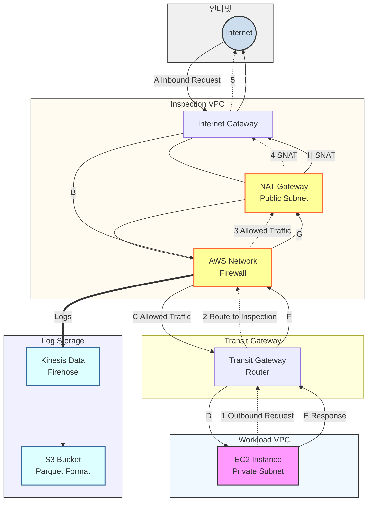

현대 기업의 클라우드 여정에서 가장 큰 도전 과제 중 하나는 바로 '보안'입니다. 특히 AWS 환경에서 수십, 수백 개의 워크로드를 운영하다 보면, 각각의 VPC와 서브넷에서 발생하는 트래픽을 일일이 추적하고 통제하는 것이 얼마나 복잡한 일인지 실감하게 됩니다. 예로, 새벽에 갑작스러운 알람이 울리고, 확인해보니 특정 EC2 인스턴스에서 의심스러운 대량의 아웃바운드 트래픽이 발생했다면, 이미 때는 늦었고, 데이터는 외부로 유출되었으며, 막대한 AWS 비용 청구서와 정보유출사고에 직면하게 됩니다. 
이러한 악몽 같은 시나리오를 방지하기 위해서는 사전에 공격 표면을 제거하고 모니터링을 강화하고 아웃바운드 통신도 통제해야 합니다. AWS는 **AWS Network Firewall(NFW)**이라는 관리형 서비스 제공합니다.이를 통해서 공격 탐지에 대한 가시성과 네트워크 트래픽 제어를 할수 있습니다.

## 왜 AWS Network Firewall을 사용해야 하는가?

"우리는 이미 보안 그룹과 NACL을 잘 활용하고 있는데, 굳이 NFW가 필요할까요?" 보안 그룹과 NACL은 AWS의 기본적인 보안 도구로서 중요한 역할을 합니다. 하지만 현실은 그리 단순하지 않습니다. 최근 발생한 한 사례를 들어보겠습니다. 실수로 S3 버킷의 권한을 잘못 설정했고, 악의적인 공격자가 이를 악용해 EC2 인스턴스에 악성코드를 심었습니다. 이 악성코드는 정상적인 HTTPS 포트(443)를 통해 C&C 서버와 통신하며 데이터를 유출했습니다. 보안 그룹은 443 포트를 허용하고 있었기 때문에 이를 막을 수 없었고, NACL은 stateless 특성상 이러한 정교한 공격을 탐지할 수 없었습니다.

### 1. 중앙 집중형 보안 관리: 복잡성을 단순함으로

AWS 환경을 운영해보신 분이라면 공감하실 겁니다. 프로젝트가 성장하면서 VPC가 하나둘 늘어나고, 각 VPC마다 서로 다른 보안 규칙이 적용되며, 어느 순간 전체 보안 정책을 파악하는 것조차 어려워집니다. NFW는 전통적인 방화벽의 단순한 IP/포트 기반 필터링을 훨씬 뛰어넘는 정교한 트래픽 검사 기능을 제공합니다.  

가장 핵심적인 기능인 **Stateful Inspection**은 단순히 개별 패킷을 검사하는 것이 아니라, 전체 연결의 상태를 지속적으로 추적하고 모니터링합니다. 이를 통해 정상적인 통신 패턴을 벗어나는 이상 행위를 즉시 감지하고, 세션 하이재킹이나 중간자 공격과 같은 정교한 위협을 효과적으로 차단할 수 있습니다. **IPS/IDS 기능**은 실시간으로 네트워크 트래픽을 분석하여 알려진 악성 행위나 취약점 공격 패턴을 탐지합니다. 지속적으로 업데이트되는 위협 인텔리전스를 기반으로, 제로데이 공격이나 최신 악성코드의 활동도 신속하게 식별하고 차단할 수 있습니다. **웹 필터링** 기능은 도메인 이름과 URL을 기반으로 아웃바운드 트래픽을 세밀하게 제어합니다. 이는 특히 악성 C&C(Command and Control) 서버와의 통신을 차단하거나, 조직의 정책에 어긋나는 부적절한 사이트로의 접근을 원천적으로 막는 데 매우 효과적입니다. 또한 암호화된 HTTPS 트래픽에 대해서도 SNI(Server Name Indication) 정보를 활용하여 도메인 기반 필터링이 가능합니다.

### 2. 규정 준수 및 감사 용이성

"3개월 전 특정 IP에서 우리 시스템에 접근한 모든 기록을 제출해 주세요." 금융감독원의 이런 요청을 받았을 때, 여러분의 조직은 얼마나 빠르게 대응할 수 있을까요? 많은 기업들이 이런 순간 당황하게 됩니다. 로그는 있지만 어디에 어떻게 저장되어 있는지, 어떻게 검색해야 하는지 막막하기 때문입니다. NFW는 이러한 컴플라이언스 요구사항을 염두에 두고 설계되었습니다. 모든 트래픽에 대한 상세한 Flow 로그와 보안 이벤트에 대한 Alert 로그를 자동으로 생성하며, 이를 S3에 체계적으로 저장할 수 있습니다. 

**트래픽 흐름 범례:**

• 실선 화살표 (→): 인바운드 트래픽 및 그에 대한 응답 패킷의 흐름을 나타냅니다
• 점선 화살표 (-->): 내부에서 시작된 아웃바운드 트래픽의 경로를 표시합니다
• 이중선 화살표 (⇒): NFW에서 생성된 로그가 저장소로 전송되는 흐름을 보여줍니다




## 상세 트래픽 흐름 분석

### 1. 아웃바운드(Egress) 트래픽 흐름: 내부에서 외부로의 여정

#### 시나리오: EC2 인스턴스의 소프트웨어 업데이트

금요일 오후, DevOps 엔지니어가 프로덕션 EC2 인스턴스에서 보안 패치를 적용하기 위해 `yum update` 명령을 실행합니다. 이 순간부터 흥미로운 네트워크 여정이 시작됩니다.

**Step 1 - 출발점 [EC2 → TGW]**
Private Subnet (10.0.1.0/24)에 위치한 EC2 인스턴스가 패키지 저장소(예: amazonlinux.us-east-1.amazonaws.com)에 접근을 시도합니다. 인스턴스의 라우팅 테이블을 확인하면, 모든 외부 트래픽(0.0.0.0/0)은 Transit Gateway ENI로 향하도록 설정되어 있습니다. 패킷은 자신의 사설 IP(10.0.1.100)를 소스로 하여 TGW로 전송됩니다.

**Step 2 - 중앙 라우터 통과 [TGW → NFW]**
Transit Gateway는 패킷을 받아 자신의 라우트 테이블을 확인합니다. 인터넷 행(0.0.0.0/0) 트래픽은 Inspection VPC의 NFW Endpoint로 라우팅하도록 설정되어 있습니다. 여기서 중요한 점은, TGW가 VPC 간 라우팅 시 원본 패킷의 소스/목적지 정보를 그대로 유지한다는 것입니다.

**Step 3 - 보안 검사 [NFW 검사 및 결정]**
이제 가장 중요한 단계입니다. NFW는 다층적 검사를 수행합니다:
- **도메인 검사**: amazonlinux.us-east-1.amazonaws.com이 허용된 도메인 리스트에 있는지 확인
- **포트/프로토콜 검사**: HTTPS(443) 트래픽이 허용되는지 확인
- **IPS 검사**: 패킷 페이로드에 악성 패턴이 없는지 심층 분석
- **상태 추적**: 이 연결을 상태 테이블에 기록하여 응답 패킷을 자동 허용

모든 검사를 통과한 패킷은 NAT Gateway로 전달됩니다. 만약 차단되었다면, Drop 로그가 생성되고 연결은 즉시 종료됩니다.

**Step 4 - 주소 변환 [NAT → IGW]**
NAT Gateway는 패킷의 소스 IP를 자신의 Elastic IP(예: 52.1.2.3)로 변환합니다. 이는 외부 서버가 응답을 보낼 수 있는 공인 주소를 제공합니다. 동시에 이 변환 정보를 내부 테이블에 저장하여, 응답이 돌아왔을 때 원래의 EC2 인스턴스로 전달할 수 있도록 준비합니다.

**Step 5 - 인터넷으로 [IGW → Internet]**
마침내 Internet Gateway를 통해 패킷이 AWS 네트워크를 벗어나 인터넷으로 나갑니다. IGW는 VPC와 인터넷 간의 경계 역할을 하며, 공인 IP 주소를 가진 트래픽만 통과시킵니다.

### 2. 인바운드(Ingress) 트래픽 흐름: 외부에서 내부로의 진입

#### 시나리오: 고객의 웹 애플리케이션 접근

월요일 아침, 전 세계의 고객들이 여러분의 전자상거래 웹사이트에 접속하기 시작합니다. 각 HTTPS 요청이 어떻게 처리되는지 살펴보겠습니다.

**Step A - 진입점 [Internet → IGW]**
고객의 브라우저에서 시작된 HTTPS 요청이 여러분의 도메인에 할당된 Elastic IP로 도착합니다. Internet Gateway는 이 트래픽을 받아 VPC 내부로 전달할 준비를 합니다.

**Step B - 첫 번째 관문 [IGW → NFW]**
여기서 핵심은 IGW의 라우트 테이블 설정입니다. 모든 인바운드 트래픽이 NFW를 거치도록 강제하기 위해, IGW 라우트 테이블(Edge Association)에 대상 서브넷으로의 트래픽을 NFW ENI로 향하도록 설정합니다. 이는 공격자가 NFW를 우회할 수 없도록 하는 중요한 보안 조치입니다.

**Step C - 심층 검사 [NFW 분석 및 결정]**
NFW는 인바운드 트래픽에 대해서도 철저한 검사를 수행합니다:
- **GeoIP 검사**: 요청이 허용된 국가에서 왔는지 확인
- **Rate Limiting**: 특정 IP에서 과도한 요청이 오고 있지 않은지 확인
- **WAF 규칙**: SQL Injection, XSS 등의 웹 공격 패턴 검사
- **DDoS 방어**: 비정상적인 트래픽 패턴 탐지

정상적인 트래픽으로 판단되면 Transit Gateway로 전달됩니다.

**Step D - 최종 목적지 [TGW → EC2/ALB]**
Transit Gateway는 패킷의 목적지 IP를 확인하고, 해당하는 Workload VPC로 라우팅합니다. 최종적으로 Application Load Balancer나 웹 서버 인스턴스가 요청을 받아 처리합니다.

### 3. 응답 트래픽의 귀환: 왕복 여정의 완성

여기서 많은 분들이 놓치는 중요한 포인트가 있습니다. 인바운드 요청에 대한 응답도 동일한 보안 검사를 거쳐야 한다는 것입니다. 웹 서버가 생성한 응답 패킷(예: HTML 페이지)은 다시 TGW → NFW → NAT → IGW를 거쳐 고객에게 전달됩니다. NFW는 Stateful 특성 덕분에 이미 허용된 연결의 응답 트래픽은 자동으로 허용하지만, 여전히 IPS 검사는 수행하여 데이터 유출이나 악성코드 전파를 방지합니다.

## Parquet 형식의 로그 저장 및 활용: 보안 인텔리전스의 기반 구축

보안은 단순히 위협을 차단하는 것에서 끝나지 않습니다. 진정한 보안은 모든 활동을 기록하고, 분석하며, 그로부터 인사이트를 도출하는 것입니다. NFW의 로깅 기능과 Parquet 형식의 조합은 이러한 '보안 인텔리전스'를 구현하는 강력한 도구입니다.

### NFW가 생성하는 두 가지 핵심 로그

NFW는 네트워크 활동에 대한 두 가지 유형의 로그를 생성합니다:

**Flow 로그**: 모든 네트워크 연결에 대한 메타데이터를 기록합니다. 소스/목적지 IP, 포트, 프로토콜, 바이트 수, 패킷 수, 연결 시작/종료 시간 등이 포함됩니다. 이는 마치 전화 통화 기록처럼, 누가 누구와 언제 얼마나 통신했는지를 보여줍니다.

**Alert 로그**: 보안 규칙에 의해 탐지되거나 차단된 이벤트를 상세히 기록합니다. 어떤 규칙이 트리거되었는지, 어떤 위협이 탐지되었는지, 그리고 어떤 조치가 취해졌는지를 포함합니다. 이는 보안 사고의 직접적인 증거가 됩니다.

### 실전 설정 가이드: Step by Step

이제 실제로 Parquet 변환을 설정하는 방법을 상세히 알아보겠습니다.

**Step 1: NFW 로깅 활성화**
```
AWS Console → VPC → Network Firewall → 해당 방화벽 선택
→ Logging configuration → Edit
→ Log type: Flow logs, Alert logs 모두 선택
→ Log destination: Kinesis Data Firehose 선택
```

**Step 2: Kinesis Data Firehose 스트림 생성**
```
AWS Console → Kinesis → Data Firehose → Create delivery stream
→ Source: Direct PUT
→ Destination: Amazon S3
```

**Step 3: Parquet 변환 설정**
Transform 섹션에서:
- Record transformation: Enabled
- Transform source records with AWS Lambda: 
  - 새 Lambda 함수 생성 또는 AWS 제공 블루프린트 사용
  - "Kinesis Data Firehose Process Record - JSON to Parquet" 선택

**Step 4: S3 버킷 구성**
- Bucket: 전용 로그 버킷 생성 (예: company-nfw-logs-parquet)
- Prefix: year=!{timestamp:yyyy}/month=!{timestamp:MM}/day=!{timestamp:dd}/
- Error prefix: error/
- Compression: GZIP (Parquet 자체 압축과 함께 추가 압축)

**Step 5: 버퍼 설정 최적화**
- Buffer size: 128 MB (대용량 환경) 또는 64 MB (일반 환경)
- Buffer interval: 60 seconds
- 이 설정은 비용과 실시간성 간의 균형을 맞춥니다

### 고급 활용 시나리오

**시나리오 1: 데이터 유출 탐지**
Athena 쿼리입니다:
```sql
SELECT 
  sourceAddress,
  destinationAddress,
  SUM(bytes) as total_bytes,
  COUNT(*) as connection_count
FROM nfw_flow_logs
WHERE 
  date BETWEEN current_date - interval '7' day AND current_date
  AND destinationPort NOT IN (80, 443)
  AND bytes > 10000000  -- 10MB 이상
GROUP BY sourceAddress, destinationAddress
ORDER BY total_bytes DESC
LIMIT 20;
```

이 쿼리는 일주일간 비표준 포트로 대량 데이터를 전송한 상위 20개 연결을 찾아냅니다.

**시나리오 2: 자동화된 위협 대응**
Lambda와 EventBridge를 활용한 자동 대응 시스템:
1. Athena가 5분마다 의심스러운 패턴을 검색
2. 임계값 초과 시 SNS 알림 발송
3. 심각한 경우 자동으로 NFW 규칙 업데이트하여 차단

**시나리오 3: 컴플라이언스 리포팅**
월간 보안 리포트 자동 생성:
- QuickSight를 S3의 Parquet 데이터에 직접 연결
- 트래픽 트렌드, 위협 통계, 상위 통신 패턴 등 시각화
- 규제 기관 제출용 PDF 리포트 자동 생성