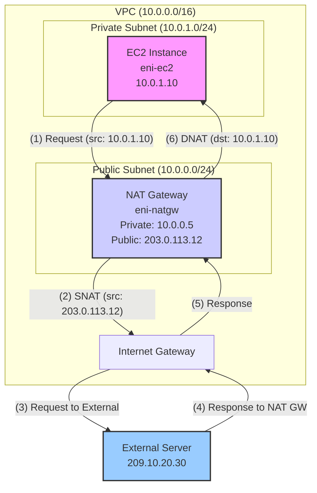

AWS 환경에서 보안을 강화하기 위해 데이터베이스나 백엔드 애플리케이션 서버 등 외부에서 직접 접근할 필요가 없는 리소스들은 보통 Private Subnet에 배치합니다. 하지만 이 서버들도 소프트웨어 패치, 외부 API 호출 등 인터넷으로 아웃바운드 통신이 필요한 경우가 발생합니다.

이때 Private Subnet의 인스턴스들이 인터넷과 안전하게 통신할 수 있도록 해주는 핵심 서비스가 바로 **NAT(Network Address Translation) Gateway**입니다. NAT Gateway는 여러 사설 IP 주소를 단일 공인 IP 주소로 변환하여 외부와 통신하게 해주는 역할을 합니다.

그런데 여기서 한 가지 궁금증이 생깁니다. "만약 여러 EC2 인스턴스가 동시에 NAT Gateway를 통해 외부와 통신했다면, 어떤 인스턴스가 어느 외부 서비스와 통신했는지 어떻게 알 수 있을까?" 특히 보안 감사, 침해사고, 그리고 트러블슈팅 상황에서 이러한 트래픽 추적은 매우 중요합니다. VPC의 네트워크 트래픽을 모니터링하는 **VPC Flow Logs**를 활용하여 NAT Gateway를 통과하는 트래픽의 원래 출발지(EC2 인스턴스)를 추적, 그리고 EKS POD에서 출발지를 추적하고 분석하는 방법을 구체적인 데이터 플로우와 로그 샘플을 통해 알아보겠습니다.

## 핵심 원리: VPC Flow Logs는 어떻게 동작하는가?

먼저 VPC Flow Logs는 VPC 내의 네트워크 인터페이스(ENI)를 오가는 IP 트래픽을 기록한다는 점을 이해해야 합니다. 무엇보다도, **하나의 로그 항목에 'EC2의 사설 IP'와 'NAT Gateway의 공인 IP'가 동시에 기록되지는 않습니다.**  트래픽이 흘러가는 경로에 있는 각기 다른 ENI(EC2의 ENI, NAT Gateway의 ENI)에서 생성된 로그들을 **연결(correlate)**하여 간접적으로 전체 흐름을 파악해야 합니다.

## 전체 통신 흐름도

아래 다이어그램은 Private Subnet의 EC2 인스턴스가 NAT Gateway를 통해 외부 서버와 통신하는 전체 과정을 보여줍니다.



### 시나리오 가정

분석을 위해 아래와 같은 환경을 가정합니다.

- **EC2 인스턴스**: 사설 IP `10.0.1.10`, ENI ID `eni-ec2`
- **NAT Gateway**: 사설 IP `10.0.0.5`, 할당된 공인 IP `203.0.113.12`, ENI ID `eni-natgw`
- **외부 서버**: 공인 IP `209.10.20.30`
- **상황**: EC2 인스턴스가 외부 서버의 443 포트로 HTTPS 요청

## 단계별 데이터 플로우와 VPC Flow Log 분석

### 1. Outbound: EC2 인스턴스 → NAT Gateway

EC2 인스턴스(`10.0.1.10`)가 외부 서버(`209.10.20.30`)로 요청을 시작합니다. Private Subnet의 라우팅 테이블은 `0.0.0.0/0` 트래픽을 NAT Gateway로 전달하도록 설정되어 있습니다.

#### 📜 EC2 인스턴스 ENI (`eni-ec2`) 로그
EC2에서 나가는 트래픽입니다. 출발지(`srcaddr`)는 EC2의 사설 IP, 목적지(`dstaddr`)는 최종 목적지인 외부 서버의 공인 IP로 기록됩니다.

```bash
# version account-id interface-id srcaddr dstaddr srcport dstport protocol packets bytes start end action log-status
2 123456789012 eni-ec2 10.0.1.10 209.10.20.30 49152 443 6 10 480 <timestamp> <timestamp> ACCEPT OK
```

#### 📜 NAT Gateway ENI (`eni-natgw`) 로그
동일한 트래픽이 NAT Gateway로 들어옵니다. 이 로그에서도 출발지는 **여전히 EC2의 사설 IP**입니다.

```bash
# version account-id interface-id srcaddr dstaddr srcport dstport protocol packets bytes start end action log-status
2 123456789012 eni-natgw 10.0.1.10 209.10.20.30 49152 443 6 10 480 <timestamp> <timestamp> ACCEPT OK
```

> **Point!** 
> 이 단계까지의 로그에서는 NAT Gateway의 공인 IP(`203.0.113.12`)가 전혀 나타나지 않습니다.

### 2. Outbound: NAT Gateway → 외부 서버 (SNAT)

NAT Gateway는 트래픽의 출발지 IP 주소를 자신의 공인 IP(`203.0.113.12`)로 변환(Source NAT)한 후, Internet Gateway를 통해 외부 서버로 전송합니다. **이 변환 과정 자체는 VPC Flow Log에 기록되지 않습니다.**

### 3. Inbound: 외부 서버 → NAT Gateway

외부 서버는 요청의 출발지였던 NAT Gateway의 공인 IP(`203.0.113.12`)로 응답을 보냅니다.

### 4. Inbound: NAT Gateway → EC2 인스턴스 (DNAT)

응답 트래픽이 NAT Gateway에 도착하면, NAT Gateway는 자신의 상태 테이블(state table)을 참조하여 목적지 IP 주소를 원래 요청을 보냈던 EC2 인스턴스의 사설 IP(`10.0.1.10`)로 다시 변환(Destination NAT)합니다.

#### 📜 NAT Gateway ENI (`eni-natgw`) 로그
NAT Gateway에서 EC2로 나가는 응답 트래픽입니다. 출발지는 외부 서버 IP, 목적지는 EC2의 사설 IP로 기록됩니다.

```bash
# version account-id interface-id srcaddr dstaddr srcport dstport protocol packets bytes start end action log-status
2 123456789012 eni-natgw 209.10.20.30 10.0.1.10 443 49152 6 8 520 <timestamp> <timestamp> ACCEPT OK
```

#### 📜 EC2 인스턴스 ENI (`eni-ec2`) 로그
최종적으로 응답 트래픽이 EC2에 도착합니다.

```bash
# version account-id interface-id srcaddr dstaddr srcport dstport protocol packets bytes start end action log-status
2 123456789012 eni-ec2 209.10.20.30 10.0.1.10 443 49152 6 8 520 <timestamp> <timestamp> ACCEPT OK
```

## 심화: `pkt-srcaddr`와 `pkt-dstaddr` 필드로 가시성 높이기

VPC Flow Logs는 **2020년 12월에 발표된 버전 5**부터 `pkt-srcaddr`와 `pkt-dstaddr`라는 매우 유용한 필드를 추가로 제공하기 시작했습니다. 이 필드들은 특히 EKS와 같은 컨테이너 환경이나 NAT Gateway, Gateway Load Balancer 등 중간에서 패킷을 처리하는 서비스들의 트래픽을 분석할 때 가시성을 획기적으로 높여줍니다.

- **`srcaddr` / `dstaddr`**: 네트워크 인터페이스(ENI) 레벨에서 보이는 출발지/목적지 IP입니다. (겉에 싸여있는 패킷의 IP)
- **`pkt-srcaddr` / `pkt-dstaddr`**: 캡슐화된 원본 패킷(inner packet)의 실제 출발지/목적지 IP입니다. (패킷 속 진짜 IP)

### 보안 사고 조사 관점에서의 중요성

이 필드들은 보안 사고 대응 및 포렌식 조사에서 결정적인 역할을 합니다.

- **정확한 공격 출처 식별**: 과거에는 EKS 환경에서 악성 트래픽이 발생해도 워커 노드의 IP만 기록되어 어떤 Pod이 문제의 원인인지 즉시 파악하기 어려웠습니다. 하지만 `pkt-srcaddr`를 통해 **공격을 유발한 특정 Pod을 정확히 식별**할 수 있게 되어, 다른 서비스에 영향을 주지 않고 해당 Pod만 신속하게 격리하고 분석할 수 있습니다.

- **피해 범위 및 내부망 이동(Lateral Movement) 추적**: 공격자가 클러스터 내부의 다른 Pod이나 서비스로 공격을 확산하려 할 때, `pkt-` 필드는 Pod 간의 모든 통신을 명확하게 기록합니다. 이를 통해 공격자의 내부 이동 경로를 추적하고 피해 범위를 파악하는 데 필수적인 데이터를 확보할 수 있습니다.

- **신뢰할 수 있는 증거**: 명확한 출발지(Pod)와 목적지가 기록된 로그는 포렌식 분석과 감사 추적을 위한 신뢰도 높은 증거 자료로 활용됩니다.

### 1. EKS 환경에서 Pod IP 식별

보안 관점에서의 중요성은 EKS 환경에서 가장 잘 드러납니다. EKS 워커 노드(EC2)의 ENI에서 Flow Log를 수집할 때, 버전 4까지는 모든 트래픽의 `srcaddr`가 노드의 IP로 기록되었습니다.

하지만 버전 5부터는 `pkt-srcaddr`를 통해 실제 통신을 시작한 Pod의 IP를 직접 확인할 수 있습니다.

**시나리오:**
- EKS 워커 노드 IP: `10.0.10.100`
- 노드 위에서 실행 중인 Pod IP: `10.0.10.150`
- Pod가 외부 IP `209.10.20.30`으로 통신

**📜 EKS 워커 노드 ENI에서 수집된 v5 Flow Log 샘플:**

```bash
# version ... srcaddr dstaddr ... pkt-srcaddr pkt-dstaddr ...
5 ... 10.0.10.100 209.10.20.30 ... 10.0.10.150 209.10.20.30 ... ACCEPT OK
```

- `srcaddr`는 노드의 IP(`10.0.10.100`)이지만, **`pkt-srcaddr`**에는 실제 통신을 유발한 **Pod의 IP(`10.0.10.150`)**가 정확히 기록됩니다.

### 2. NAT Gateway 통신 분석의 명확성 증가

`pkt-` 필드는 NAT Gateway를 통과하는 트래픽의 양방향 흐름을 모두 더 명확하게 만들어 줍니다.

#### 아웃바운드 (EC2 → 외부) 요청 트래픽

아웃바운드 요청이 NAT Gateway의 ENI에 도달하는 시점을 살펴보겠습니다. 이 트래픽은 아직 다른 무언가에 의해 캡슐화되지 않은 원본 패킷입니다. 따라서 Flow Log를 보면 **`srcaddr`와 `pkt-srcaddr` 필드의 값이 동일하게** EC2 인스턴스의 사설 IP로 나타납니다.

**📜 NAT Gateway ENI의 Outbound v5 Flow Log 샘플:**
```bash
# version ... srcaddr dstaddr ... pkt-srcaddr pkt-dstaddr ...
5 ... 10.0.1.10 209.10.20.30 ... 10.0.1.10 209.10.20.30 ... ACCEPT OK
```
- **`srcaddr` (10.0.1.10)**: NAT GW의 ENI로 패킷을 보낸 리소스의 IP, 즉 EC2의 IP입니다.
- **`pkt-srcaddr` (10.0.1.10)**: 패킷 헤더의 원본 출발지 IP로, 역시 EC2의 IP입니다.

> **중요**: NAT Gateway가 출발지 IP를 자신의 공인 IP로 변환하는 **SNAT 과정 자체**와, 변환된 후 인터넷 게이트웨이로 나가는 트래픽은 VPC Flow Log에 기록되지 않습니다. Flow Log는 ENI를 통과하는 트래픽을 기록하므로, 우리가 볼 수 있는 마지막 아웃바운드 기록은 변환 전의 패킷이 NAT Gateway의 ENI에 도착하는 시점입니다.

#### 인바운드 (외부 → EC2) 응답 트래픽

이 필드들의 진정한 가치는 외부에서 NAT Gateway를 통해 내부 EC2로 돌아오는 **인바운드 응답 트래픽**에서 나타납니다.

**📜 NAT Gateway ENI의 Inbound v5 Flow Log 샘플:**

```bash
# version ... srcaddr dstaddr ... pkt-srcaddr pkt-dstaddr ...
5 ... 209.10.20.30 10.0.0.5 ... 209.10.20.30 10.0.1.10 ... ACCEPT OK
```

- **`dstaddr` (10.0.0.5)**: 패킷이 도착한 ENI의 주소, 즉 NAT Gateway의 사설 IP입니다.
- 하지만 **`pkt-dstaddr` (10.0.1.10)**를 보면, 이 패킷의 **최종 목적지**가 원래 요청을 보냈던 **EC2 인스턴스의 사설 IP**임을 명확하게 알 수 있습니다.

결론적으로 `pkt-` 필드는 트래픽의 양방향을 모두 분석할 때, 패킷의 겉과 속을 모두 보여줌으로써 복잡한 라우팅 환경에서도 흐름을 혼동 없이 파악할 수 있게 도와줍니다.

## 결론: 그래서 어떻게 IP를 매핑하는가?

지금까지의 과정을 통해 우리는 VPC Flow Logs와 AWS 리소스 정보를 결합하여 IP 매핑을 추적하는 방법을 알 수 있습니다. 방법은 다음과 같습니다.

1.  **NAT Gateway의 ENI ID로 Flow Logs를 필터링**하는 것이 가장 중요합니다.
2.  필터링된 로그에서 **`srcaddr`가 VPC 내부 사설 IP**이고 **`dstaddr`가 외부 공인 IP**인 아웃바운드 로그 항목을 찾습니다.
3.  위 조건에 맞는 로그 (예: `srcaddr: 10.0.1.10`, `dstaddr: 209.10.20.30`)를 찾았다면, 이는 "**`10.0.1.10` 인스턴스가 해당 NAT Gateway를 통해 `209.10.20.30` 서버와 통신했다**"는 명백한 증거가 됩니다.
4.  **[핵심]** 이때 EC2의 사설 IP(`10.0.1.10`)가 어떤 공인 IP로 변환(SNAT)되었는지는 Flow Log에 직접 기록되지 않습니다. 따라서 로그에서 찾은 **NAT Gateway의 `interface-id`**를 사용하여 AWS에 직접 그 정보를 조회해야 합니다.
5.  아래와 같이 AWS CLI 명령어를 사용하면 로그에 기록된 ENI ID를 통해 NAT Gateway의 공인 IP를 확인할 수 있습니다.

    ```bash
    # 로그에서 찾은 NAT Gateway의 ENI ID로 공인 IP를 확인하는 명령어
    aws ec2 describe-nat-gateways --filter "Name=network-interface-id,Values=<eni-natgw-from-log>" --query "NatGateways[].NatGatewayAddresses[].PublicIp" --output text
    ```
    위 명령어를 통해 얻은 공인 IP (`203.0.113.12`)가 바로 외부 서버와 통신한 실제 IP가 되는 것입니다.

대규모 환경에서는 수많은 로그가 쌓이기 때문에 수동으로 분석하기는 어렵습니다. **Amazon Athena**나 **CloudWatch Logs Insights**를 사용하여 특정 ENI ID를 필터링하고 `srcaddr`와 `dstaddr`를 기준으로 쿼리하면 원하는 통신 기록을 훨씬 효율적으로 찾아낼 수 있습니다.

이처럼 VPC Flow Logs의 동작 방식을 이해하면 복잡해 보이는 NAT 환경의 트래픽도 명확하게 추적하고 분석할 수 있습니다.

---

## 별첨: v5 Flow Log 전체 흐름 상세 분석

이 섹션에서는 EC2 인스턴스가 NAT Gateway를 통해 외부와 통신하고 응답을 받는 전체 과정에서, 각 네트워크 인터페이스(ENI)에서 v5 포맷으로 기록되는 모든 VPC Flow Log를 단계별로 상세하게 추적합니다.

**시나리오 정보:**
- **EC2 인스턴스**: `eni-ec2`, 사설 IP `10.0.1.10`
- **NAT Gateway**: `eni-natgw`, 사설 IP `10.0.0.5`, 공인 IP `203.0.113.12`
- **외부 서버**: 공인 IP `209.10.20.30`
- **로그 포맷**: v5 (pkt-srcaddr, pkt-dstaddr 필드 포함)

### 1. 아웃바운드 (EC2 → 외부 서버)

#### 1-1. EC2 ENI Egress (EC2에서 패킷 출발)
EC2 인스턴스가 외부 서버로 통신을 시작하며 자신의 ENI(`eni-ec2`)를 통해 패킷을 내보냅니다.

**📜 `eni-ec2` 로그:**
```bash
# version interface-id srcaddr dstaddr pkt-srcaddr pkt-dstaddr ...
5 eni-ec2 10.0.1.10 209.10.20.30 10.0.1.10 209.10.20.30 ... ACCEPT OK
```
- **해석**: `eni-ec2`에서 트래픽이 나가는(Egress) 기록입니다. 아직 캡슐화가 없으므로 `srcaddr`와 `pkt-srcaddr`는 모두 EC2의 IP이고, `dstaddr`와 `pkt-dstaddr`는 모두 외부 서버의 IP로 동일합니다.

#### 1-2. NAT Gateway ENI Ingress (NAT GW에 패킷 도착)
위 패킷이 라우팅 테이블에 따라 NAT Gateway의 ENI(`eni-natgw`)에 도착합니다.

**📜 `eni-natgw` 로그:**
```bash
# version interface-id srcaddr dstaddr pkt-srcaddr pkt-dstaddr ...
5 eni-natgw 10.0.1.10 209.10.20.30 10.0.1.10 209.10.20.30 ... ACCEPT OK
```
- **해석**: `eni-natgw`로 트래픽이 들어오는(Ingress) 기록입니다. 이 시점까지도 패킷의 내용은 변하지 않았습니다. 출발지는 여전히 EC2 IP, 목적지는 외부 서버 IP입니다.

#### 1-3. NAT Gateway 내부 (SNAT 변환)
NAT Gateway 서비스 내부에서 패킷의 출발지 IP 주소를 자신의 공인 IP(`203.0.113.12`)로 변환(SNAT)합니다.

- **🚫 VPC Flow Log 없음**: 이 변환 과정은 AWS 관리형 서비스 내부에서 일어나며, 특정 ENI를 통과하는 트래픽이 아니므로 VPC Flow Log에 기록되지 않습니다.

#### 1-4. NAT Gateway → 인터넷 게이트웨이
변환된 패킷이 인터넷 게이트웨이를 통해 외부로 나갑니다.

- **🚫 VPC Flow Log 없음**: 인터넷 게이트웨이는 Flow Log를 설정할 수 있는 ENI를 가지지 않으므로, 이 구간의 트래픽은 VPC Flow Log에 기록되지 않습니다.

#### 1-5. Internet Gateway → 외부 서버
Internet Gateway는 NAT Gateway로부터 받은 패킷(이제 출발지 IP는 NAT Gateway의 공인 IP)을 최종 목적지인 외부 서버로 라우팅합니다. 이 단계는 VPC 외부의 통신으로, ENI를 거치지 않기 때문에 VPC Flow Log에 기록되지 않습니다.

### 2. 인바운드 (외부 서버 → EC2)

#### 2-1. Internet Gateway (IGW) Ingress & Destination NAT
외부 서버에서 출발한 응답 패킷은 가장 먼저 VPC의 관문인 Internet Gateway(IGW)에 도착합니다. 이때 패킷의 목적지 주소는 NAT Gateway의 공인 IP(`203.0.113.12`)입니다.

IGW는 이 공인 IP와 연결된 NAT Gateway의 사설 IP(`10.0.0.5`)를 내부 맵핑 정보를 통해 인지하고 있으며, 패킷의 목적지 주소를 사설 IP로 변환(Destination NAT)하여 VPC 내부로 전달합니다.

- **🚫 VPC Flow Log 없음**: Internet Gateway는 ENI를 가지지 않으므로, IGW에서 일어나는 이 주소 변환 과정은 VPC Flow Log에 기록되지 않습니다.

#### 2-2. NAT Gateway ENI Ingress (NAT GW에 응답 패킷 도착)
외부 서버가 보낸 응답 패킷이 NAT Gateway의 공인 IP를 목적지로 하여 `eni-natgw`에 도착합니다. **이 로그가 v5의 핵심입니다.**

**📜 `eni-natgw` 로그:**
```bash
# version interface-id srcaddr dstaddr pkt-srcaddr pkt-dstaddr ...
5 eni-natgw 209.10.20.30 10.0.0.5 209.10.20.30 10.0.1.10 ... ACCEPT OK
```
- **해석**: `eni-natgw`로 트래픽이 들어오는(Ingress) 기록입니다.
  - `dstaddr: 10.0.0.5`: 패킷의 겉 목적지는 **NAT Gateway의 사설 IP**입니다.
  - `pkt-dstaddr: 10.0.1.10`: 하지만 패킷의 진짜 최종 목적지는 **EC2의 사설 IP**임을 명확히 보여줍니다.

#### 2-3. NAT Gateway 내부 (DNAT 변환)
NAT Gateway가 상태 테이블을 참조하여 패킷의 목적지 IP를 원래 요청을 보냈던 EC2의 사설 IP(`10.0.1.10`)로 변환(DNAT)합니다.

- **🚫 VPC Flow Log 없음**: SNAT와 마찬가지로 서비스 내부 동작이므로 로그가 기록되지 않습니다.

#### 2-4. NAT Gateway ENI Egress (NAT GW에서 패킷 출발)
DNAT 변환이 완료된 패킷이 `eni-natgw`를 떠나 VPC 내부망을 통해 EC2로 향합니다.

**📜 `eni-natgw` 로그:**
```bash
# version interface-id srcaddr dstaddr pkt-srcaddr pkt-dstaddr ...
5 eni-natgw 209.10.20.30 10.0.1.10 209.10.20.30 10.0.1.10 ... ACCEPT OK
```
- **해석**: `eni-natgw`에서 트래픽이 나가는(Egress) 기록입니다. DNAT이 이미 끝났으므로, 이제 `dstaddr`와 `pkt-dstaddr`는 모두 최종 목적지인 EC2의 IP로 동일합니다.

#### 2-5. EC2 ENI Ingress (EC2에 패킷 도착)
최종적으로 응답 패킷이 EC2 인스턴스의 ENI(`eni-ec2`)에 도착합니다.

**📜 `eni-ec2` 로그:**
```bash
# version interface-id srcaddr dstaddr pkt-srcaddr pkt-dstaddr ...
5 eni-ec2 209.10.20.30 10.0.1.10 209.10.20.30 10.0.1.10 ... ACCEPT OK
```
- **해석**: `eni-ec2`로 트래픽이 들어오는(Ingress) 기록입니다. EC2가 받은 패킷의 출발지는 외부 서버, 목적지는 자기 자신입니다.

