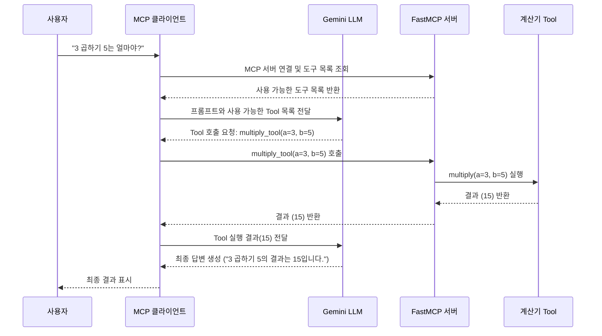

최신 애플리케이션 아키텍처에서는 특정 기능을 수행하는 모듈을 "Tool"로 정의하고, 필요에 따라 이를 호출하여 사용하는 방식이 보편화되고 있습니다. 예를 들어, 계산기 기능, 데이터베이스 조회, 외부 API 호출 등이 모두 Tool이 될 수 있습니다. **LLM을 이용한 Tool 호출**: LLM이 사용자의 자연어 요청을 해석하여 적절한 Tool을 찾아 호출하는 방식에 대해서 Gemini LLM를 사용하는 케이스를 정리하였다.


## Gemini LLM을 이용한 Tool 호출 방식 (LLM-based Tool Call)

이 방식은 사용자의 자연어 요청을 LLM이 이해하고, 그 의도에 가장 적합한 Tool과 필요한 인자를 스스로 찾아내어 호출을 요청하는 방식입니다. 개발자는 LLM에게 사용할 수 있는 Tool의 목록과 명세(이름, 설명, 인자)만 제공하면 됩니다.

### 다이어그램 (Mermaid)



### 샘플 코드 및 단계별 설명

Gemini API를 사용하여 사용자의 자연어 요청을 처리하는 전체 과정을 단계별로 설명합니다.

#### **1단계: 라이브러리 설치**

필요한 라이브러리들을 설치합니다.

```bash
pip install google-generativeai fastmcp mcp
```

#### **2단계: API 키 설정**

Google AI Studio에서 발급받은 API 키를 설정합니다. 보안을 위해 환경 변수를 사용하는 것이 좋습니다.

```python
import google.generativeai as genai
import os

# API_KEY = "YOUR_API_KEY" # 실제 키로 교체하거나 환경 변수 사용
# genai.configure(api_key=API_KEY)

# 또는 환경 변수에서 로드
genai.configure(api_key=os.environ["GEMINI_API_KEY"])
```

#### **3단계: FastMCP 서버 구현 (mcp_server.py)**

계산기 도구를 제공하는 MCP 서버를 구현합니다.

```python
"""
FastMCP 서버 구현
계산기 도구를 제공하는 MCP 서버
"""

import asyncio
from fastmcp import FastMCP
from calculator_tool import multiply, divide, add, subtract

# FastMCP 서버 인스턴스 생성
mcp = FastMCP("Calculator Server")

@mcp.tool()
def multiply_tool(a: int, b: int) -> int:
    """두 정수를 곱한 결과를 반환합니다."""
    return multiply(a, b)

@mcp.tool()
def divide_tool(a: int, b: int) -> float | str:
    """첫 번째 정수를 두 번째 정수로 나눈 결과를 반환합니다."""
    return divide(a, b)

@mcp.tool()
def add_tool(a: int, b: int) -> int:
    """두 정수를 더한 결과를 반환합니다."""
    return add(a, b)

@mcp.tool()
def subtract_tool(a: int, b: int) -> int:
    """첫 번째 정수에서 두 번째 정수를 뺀 결과를 반환합니다."""
    return subtract(a, b)

if __name__ == "__main__":
    # 서버 실행
    mcp.run(transport="stdio")
```

#### **4단계: MCP 클라이언트 구현 (mcp_client.py)**

MCP 서버와 연동하여 Gemini LLM이 계산기 도구를 사용할 수 있도록 하는 클라이언트를 구현합니다.

```python
"""
MCP 클라이언트를 사용하여 Gemini LLM과 연동하는 코드
"""

import asyncio
import google.generativeai as genai
import os
from mcp import ClientSession, StdioServerParameters
from mcp.client.stdio import stdio_client

class MCPGeminiClient:
    def __init__(self, server_script_path: str):
        self.server_script_path = server_script_path
        self.session = None
        self.available_tools = []
        
        # Gemini API 설정
        genai.configure(api_key=os.environ["GEMINI_API_KEY"])
        
    async def connect_to_server(self):
        """MCP 서버에 연결하고 사용 가능한 도구를 가져옵니다."""
        server_params = StdioServerParameters(
            command="python",
            args=[self.server_script_path]
        )
        
        async with stdio_client(server_params) as (read, write):
            async with ClientSession(read, write) as session:
                self.session = session
                
                # 서버 초기화
                await session.initialize()
                
                # 사용 가능한 도구 목록 가져오기
                tools_result = await session.list_tools()
                self.available_tools = tools_result.tools
                
                print(f"✅ MCP 서버 연결됨. 사용 가능한 도구: {len(self.available_tools)}개")
                for tool in self.available_tools:
                    print(f"  - {tool.name}: {tool.description}")
                
                return session
    
    async def handle_user_request(self, user_prompt: str):
        """사용자 요청을 처리합니다."""
        print(f"👤 사용자: {user_prompt}")
        
        # Gemini 모델 설정
        model = genai.GenerativeModel(
            model_name="gemini-1.5-flash",
            tools=self.create_gemini_function_declarations()
        )
        
        try:
            response = model.generate_content(
                user_prompt,
                tool_config={"function_calling_config": {"mode": "AUTO"}}
            )
            
            # 함수 호출이 요청된 경우
            if (response.candidates[0].content.parts and
                len(response.candidates[0].content.parts) > 0 and
                hasattr(response.candidates[0].content.parts[0], 'function_call') and
                response.candidates[0].content.parts[0].function_call):
                
                function_call = response.candidates[0].content.parts[0].function_call
                function_name = function_call.name
                function_args = {key: value for key, value in function_call.args.items()}
                
                print(f"🔧 MCP 도구 호출: {function_name}({function_args})")
                
                # MCP 도구 실행
                tool_result = await self.call_mcp_tool(function_name, function_args)
                
                # 결과를 포함하여 다시 Gemini에 요청
                function_response_content = genai.protos.Content(
                    parts=[genai.protos.Part(
                        function_response=genai.protos.FunctionResponse(
                            name=function_name,
                            response={"result": tool_result}
                        )
                    )],
                    role="user"
                )
                
                response = model.generate_content([
                    genai.protos.Content(parts=[genai.protos.Part(text=user_prompt)], role="user"),
                    response.candidates[0].content,
                    function_response_content
                ])
            
            print(f"🤖 Gemini: {response.text}")
            
        except Exception as e:
            print(f"🤖 Gemini: 오류가 발생했습니다: {str(e)}")

async def main():
    """메인 실행 함수"""
    server_script = "mcp_server.py"
    client = MCPGeminiClient(server_script)
    
    async with await client.connect_to_server():
        await client.handle_user_request("안녕 제미니")
        print("-" * 40)
        
        await client.handle_user_request("3이랑 5를 곱해줘")
        print("-" * 40)
        
        await client.handle_user_request("100을 4로 나누면 결과가 뭐야?")
        print("-" * 40)
        
        await client.handle_user_request("50 더하기 30에서 15를 뺀 값은?")

if __name__ == "__main__":
    asyncio.run(main())
```

### 실행 방법

1. **환경 변수 설정**: `GEMINI_API_KEY` 환경 변수에 Google AI Studio에서 발급받은 API 키를 설정합니다.
2. **서버 실행**: `python mcp_server.py`로 MCP 서버를 실행할 수도 있지만, 클라이언트에서 자동으로 서버를 시작합니다.
3. **클라이언트 실행**: `python mcp_client.py`로 MCP 클라이언트를 실행합니다.

MCP 아키텍처를 사용함으로써 도구의 모듈화가 향상되고, 서로 다른 LLM 클라이언트들이 동일한 MCP 서버의 도구를 공유할 수 있게 됩니다.