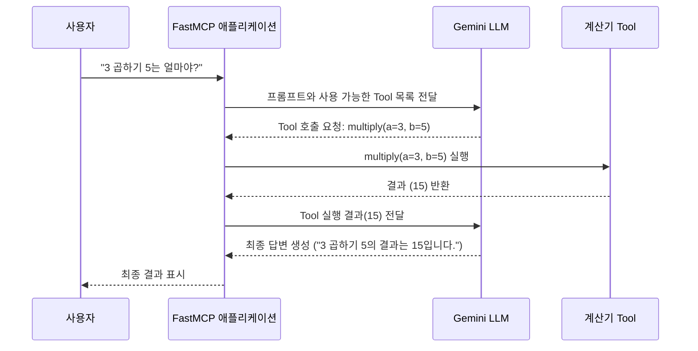

최신 애플리케이션 아키텍처에서는 특정 기능을 수행하는 모듈을 "Tool"로 정의하고, 필요에 따라 이를 호출하여 사용하는 방식이 보편화되고 있습니다. 예를 들어, 계산기 기능, 데이터베이스 조회, 외부 API 호출 등이 모두 Tool이 될 수 있습니다. **LLM을 이용한 Tool 호출**: LLM이 사용자의 자연어 요청을 해석하여 적절한 Tool을 찾아 호출하는 방식에 대해서 Gemini LLM를 사용하는 케이스를 정리하였다.


## Gemini LLM을 이용한 Tool 호출 방식 (LLM-based Tool Call)

이 방식은 사용자의 자연어 요청을 LLM이 이해하고, 그 의도에 가장 적합한 Tool과 필요한 인자를 스스로 찾아내어 호출을 요청하는 방식입니다. 개발자는 LLM에게 사용할 수 있는 Tool의 목록과 명세(이름, 설명, 인자)만 제공하면 됩니다.

### 다이어그램 (Mermaid)



### 특징

-   **높은 유연성**: "5에서 3 빼줘", "10을 2로 나누면?", "2 더하기 2는" 등 다양한 형태의 자연어 요청을 처리할 수 있습니다.
-   **향상된 사용자 경험**: 사용자는 복잡한 명령어 대신 일상 언어로 시스템과 상호작용할 수 있습니다.
-   **느린 속도 및 비용**: LLM API를 호출하는 과정에서 네트워크 지연이 발생하며, API 사용 비용이 발생할 수 있습니다.
-   **낮은 예측 가능성**: LLM의 창의성으로 인해 때로는 예상치 못한 방식으로 Tool을 호출하거나 답변을 생성할 수 있습니다.
-   **적용 분야**: 챗봇, AI 비서 등 대화형 인터페이스나 복잡한 자연어 명령을 처리해야 하는 서비스에 적합합니다.

### 샘플 코드 및 단계별 설명

Gemini API를 사용하여 사용자의 자연어 요청을 처리하는 전체 과정을 단계별로 설명합니다.

#### **1단계: 라이브러리 설치**

먼저 Google AI Python SDK를 설치합니다.

```bash
pip install google-generativeai
```

#### **2단계: API 키 설정**

Google AI Studio에서 발급받은 API 키를 설정합니다. 보안을 위해 환경 변수를 사용하는 것이 좋습니다.

```python
import google.generativeai as genai
import os

# API_KEY = "YOUR_API_KEY" # 실제 키로 교체하거나 환경 변수 사용
# genai.configure(api_key=API_KEY)

# 또는 환경 변수에서 로드
genai.configure(api_key=os.environ["GEMINI_API_KEY"])
```

#### **3단계: Tool 함수 정의**

LLM에게 제공할 Tool(함수)들을 정의합니다. 이때 함수 설명(docstring)과 타입 힌트(`a: int`)를 명확하게 작성하는 것이 매우 중요합니다. LLM은 이 정보를 바탕으로 각 Tool의 용도와 필요한 인자를 파악합니다.

```python
# 직접 호출 방식에서 사용한 Calculator 클래스의 메서드를 그대로 사용하거나,
# 아래와 같이 개별 함수로 정의할 수 있습니다.

def multiply(a: int, b: int) -> int:
    """두 정수를 곱한 결과를 반환합니다."""
    return a * b

def divide(a: int, b: int) -> float:
    """첫 번째 정수를 두 번째 정수로 나눈 결과를 반환합니다."""
    if b == 0:
        return "오류: 0으로 나눌 수 없습니다."
    return a / b

def add(a: int, b: int) -> int:
    """두 정수를 더한 결과를 반환합니다."""
    return a + b

def subtract(a: int, b: int) -> int:
    """첫 번째 정수에서 두 번째 정수를 뺀 결과를 반환합니다."""
    return a - b
```

#### **4단계: Gemini 모델 및 Tool 설정**

사용할 모델(`gemini-1.5-flash`는 빠르고 비용 효율적)을 선택하고, 위에서 정의한 함수들을 `tools` 파라미터에 등록합니다.

```python
# 사용할 함수(Tool)들을 리스트로 묶기
available_tools = [multiply, divide, add, subtract]

# 모델 설정: 사용할 모델과 Tool 목록 지정
model = genai.GenerativeModel(
    model_name="gemini-1.5-flash",
    tools=available_tools
)
```

#### **5단계: 사용자 입력으로 LLM에 요청 및 결과 처리**

사용자의 자연어 입력을 받아 LLM에 전달하고, LLM이 Tool 호출을 요청하면 해당 Tool을 실행한 뒤 결과를 다시 LLM에 알려주어 최종 답변을 받습니다.

```python
import google.generativeai as genai
from google.protobuf.struct_pb2 import Struct

# --- 1~4단계 코드 (위에서 정의) ---

# 5단계: 실제 요청 처리
def llm_tool_handler(user_prompt: str):
    print(f"👤 사용자: {user_prompt}")

    # generate_content를 사용하여 직접 요청
    response = model.generate_content(
        user_prompt,
        tool_config={"function_calling_config": {"mode": "AUTO"}}
    )
    
    # LLM이 Tool 호출을 요청한 경우
    if response.candidates[0].content.parts[0].function_call:
        # 요청된 함수 호출 정보 추출
        function_call = response.candidates[0].content.parts[0].function_call
        function_name = function_call.name
        function_args = {key: value for key, value in function_call.args.items()}
        
        # 함수 실행
        function_to_call = globals()[function_name]
        result = function_to_call(**function_args)
        
        # 함수 실행 결과를 포함하여 다시 generate_content 호출
        response = model.generate_content([
            user_prompt,
            response.candidates[0].content,
            genai.protos.Content(
                parts=[genai.protos.Part(
                    function_response=genai.protos.FunctionResponse(
                        name=function_name,
                        response={"result": result}
                    )
                )]
            )
        ])
    
    # 최종 답변 출력
    print(f"🤖 Gemini: {response.text}")


# --- 실행 예시 ---
llm_tool_handler("안녕 제미니")
print("-" * 20)
llm_tool_handler("3이랑 5를 곱해줘")
print("-" * 20)
llm_tool_handler("100을 4로 나누면 결과가 뭐야?")
print("-" * 20)
llm_tool_handler("50 더하기 30에서 15를 뺀 값은?")
```

`generate_content` 메서드를 사용할 때는 `tool_config`에서 `mode: "AUTO"`를 설정하여 Tool 호출을 활성화합니다. LLM이 Tool 호출을 요청하면, 개발자가 직접 함수를 실행하고 그 결과를 다시 LLM에 전달하는 과정을 구현해야 합니다.