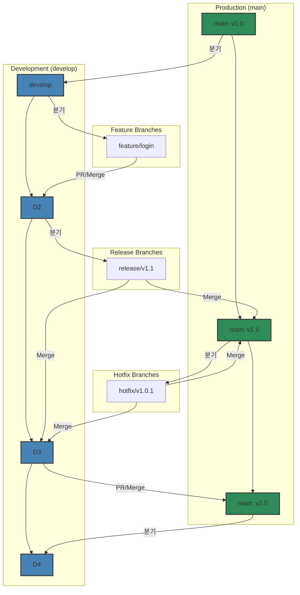

안녕하세요! 개발자에게 버전 관리 시스템(Version Control System)은 선택이 아닌 필수입니다. 그중에서도 Git은 전 세계적으로 가장 널리 사용되는 도구이죠. 이 글에서는 Git의 가장 기본적인 개념과 명령어부터, 브랜치를 활용한 병렬 작업, 그리고 Git-Flow와 풀 리퀘스트(Pull Request)를 이용한 실전 협업 전략까지 예제 중심으로 깊이 있게 알아보겠습니다.

### Git이란 무엇인가?

Git은 소스 코드의 변경 이력을 관리하는 **분산 버전 관리 시스템**입니다. 코드를 특정 시점의 스냅샷으로 저장하고, 여러 개발자가 동시에 작업하는 환경에서 코드 충돌을 최소화하며 협업할 수 있도록 돕습니다.

### 로컬 저장소와 원격 저장소: 개념 이해하기

Git은 '분산' 버전 관리 시스템이라는 점이 중요합니다. 이는 저장소가 내 컴퓨터와 원격 서버에 각각 독립적으로 존재한다는 의미입니다.

-   **로컬 저장소 (Local Repository)**: 개발자 개인의 컴퓨터에 저장되는 저장소입니다. 여기서 자유롭게 코드를 수정하고, 버전을 기록(커밋)할 수 있습니다. 네트워크 연결 없이도 대부분의 작업이 가능하여 매우 빠릅니다.
-   **원격 저장소 (Remote Repository)**: GitHub, GitLab과 같은 서버에 존재하는 저장소입니다. 여러 개발자가 작업한 내용을 공유하고 통합하는 중앙 허브 역할을 합니다. 팀원들과 코드를 주고받으려면(`push`, `pull`) 반드시 원격 저장소가 필요합니다.

---

### 1. Git 기본 명령어 마스터하기

프로젝트를 시작하고 코드를 관리하는 데 필요한 핵심 명령어들입니다.

#### 1.1. Git 저장소 시작하기: `git init`
내 컴퓨터의 프로젝트 폴더를 Git이 관리하도록 초기화합니다.
```bash
mkdir my-awesome-project && cd my-awesome-project
git init
```

#### 1.2. 버전 관리에서 제외하기: `.gitignore`
추적하고 싶지 않은 파일(보안 정보, 로그, 빌드 파일 등)을 지정합니다.
```bash
echo "node_modules/" >> .gitignore
echo "*.log" >> .gitignore
```

#### 1.3. 변경 사항 확인 및 스테이징: `git status` & `git add`
`git status`로 변경된 파일을 확인하고, `git add`로 커밋할 파일들을 스테이징 영역(Staging Area)에 추가합니다.
```bash
# 파일 생성 및 수정
echo "# My Project" > README.md

# 변경 상태 확인
git status

# 스테이징 영역에 추가
git add README.md
```

#### 1.4. 변경 이력 저장하기: `git commit`
스테이징된 파일들을 하나의 의미 있는 변경 단위(버전)로 묶어 로컬 저장소에 기록합니다.
```bash
git commit -m "Initial commit: Add README.md"
```

#### 1.5. 원격 저장소 연결 및 업로드: `git remote` & `git push`
로컬 저장소를 원격 저장소와 연결하고, 로컬의 커밋 내역을 원격으로 업로드합니다.
```bash
# 원격 저장소 주소를 'origin'이라는 이름으로 추가
git remote add origin https://github.com/your-username/my-awesome-project.git

# 'main' 브랜치의 내용을 'origin' 원격 저장소로 푸시
git push -u origin main
```

#### 1.6. 커밋 이력 확인하기: `git log`
지금까지의 커밋 이력을 시간순으로 보여줍니다.
```bash
git log
```

---

### 2. 효율적인 협업의 시작: 브랜치와 병합

브랜치(Branch)는 기존 코드에 영향을 주지 않고 독립적인 작업을 수행하기 위해 만드는 '코드의 복사본'과 같습니다. 신기능 개발, 버그 수정 등 여러 작업을 동시에 안전하게 진행할 수 있습니다.

#### 2.1. 브랜치 생성 및 확인: `git branch`
새로운 브랜치를 만들거나, 현재 로컬에 있는 브랜치 목록을 확인할 수 있습니다.
```bash
# 'develop' 브랜치 생성
git branch develop

# 'feature/login' 브랜치 생성
git branch feature/login

# 모든 로컬 브랜치 목록 확인
git branch
# 출력:
# * main
#   develop
#   feature/login
```
`*` 표시는 현재 내가 위치한 브랜치를 의미합니다.

#### 2.2. 브랜치 이동: `git checkout`
다른 브랜치로 작업 공간을 전환합니다.
```bash
# 'develop' 브랜치로 이동
git checkout develop

# 브랜치를 새로 만들면서 동시에 해당 브랜치로 이동
git checkout -b feature/signup
# 위 명령어는 아래 두 명령어와 동일합니다.
# git branch feature/signup
# git checkout feature/signup
```

#### 2.3. 로컬에서 브랜치 병합: `git merge`
한 브랜치에서 완료된 작업을 다른 브랜치로 합칠 때 사용합니다. 예를 들어 `feature/login` 기능 개발이 끝나면 `develop` 브랜치로 병합합니다.
```bash
# 1. 병합의 기준이 될 'develop' 브랜치로 이동
git checkout develop

# 2. 'feature/login' 브랜치의 변경 사항을 'develop'으로 가져와 병합
git merge feature/login
```

---

### 3. 코드 리뷰와 협업: 풀 리퀘스트(Pull Request)

로컬에서 `git merge`를 통해 직접 브랜치를 합칠 수도 있지만, 팀 프로젝트에서는 **풀 리퀘스트(Pull Request, PR)** 또는 **머지 리퀘스트(Merge Request, MR)** 방식을 사용하는 것이 일반적입니다.

풀 리퀘스트는 내가 작업한 브랜치의 변경 사항을 다른 브랜치에 합치기 전에, **팀원들에게 코드 리뷰를 요청하는 과정**입니다. 이를 통해 코드의 품질을 높이고, 잠재적인 버그를 사전에 발견하며, 팀 전체가 프로젝트의 변경 사항을 쉽게 파악할 수 있습니다.

**기본적인 PR 흐름:**
1.  로컬에서 기능 개발 완료 후, 원격 저장소에 내 `feature` 브랜치를 `push`합니다.
2.  GitHub/GitLab 사이트에서 `feature` 브랜치를 `develop`이나 `main` 브랜치로 보내는 풀 리퀘스트를 생성합니다.
3.  팀원들이 코드를 리뷰하고 의견을 남깁니다.
4.  리뷰가 완료되고 승인(Approve)되면, PR을 통해 원격 저장소에서 브랜치를 병합합니다.

---

### 4. 실전 협업 전략: Git-Flow 워크플로우

Git-Flow는 복잡한 프로젝트에서 여러 개발자가 효율적으로 협업하기 위한 브랜치 관리 전략입니다.

#### 4.1. Git-Flow의 핵심 브랜치
-   **`main` (또는 `master`)**: **배포 가능한** 안정적인 버전의 코드를 관리하는 가장 중요한 브랜치입니다.
-   **`develop`**: 다음 버전 배포를 위해 **개발 중인 코드**를 통합하는 브랜치입니다. 모든 기능 개발은 이 브랜치를 기준으로 시작됩니다.
-   **`feature`**: 신기능 개발을 위한 브랜치. `develop`에서 분기하여 개발 완료 후 `develop`으로 병합됩니다.
-   **`release`**: 배포 준비를 위한 브랜치. `develop`에서 분기하여 버그 수정, 버전 기록 등을 수행한 후 `main`과 `develop`에 모두 병합됩니다.
-   **`hotfix`**: 배포된 `main` 브랜치의 긴급 버그를 수정하는 브랜치. `main`에서 분기하여 수정 후 `main`과 `develop`에 모두 병합됩니다.

#### 4.2. Feature 브랜치 워크플로우 (풀 리퀘스트 활용)
가장 일반적인 기능 개발 흐름입니다.
1.  **`develop` 브랜치의 최신 코드를 가져옵니다.**
    ```bash
    git checkout develop
    git pull origin develop
    ```
2.  **새로운 `feature` 브랜치를 생성하고 이동합니다.**
    ```bash
    git checkout -b feature/new-awesome-feature
    ```
3.  **기능을 개발하고, 작업 내용을 커밋합니다.**
    ```bash
    # 코드 작업...
    git add .
    git commit -m "Feat: Implement new awesome feature"
    ```
4.  **원격 저장소에 `feature` 브랜치를 푸시합니다.**
    ```bash
    git push origin feature/new-awesome-feature
    ```
5.  **GitHub에서 풀 리퀘스트를 생성합니다.**
    -   `feature/new-awesome-feature` 브랜치를 `develop` 브랜치로 향하는 PR을 생성합니다.
    -   팀원들의 코드 리뷰를 거친 후, PR을 병합(Merge)합니다.

#### 4.3. 릴리즈와 태그 관리: `git tag`
`release` 브랜치가 `main`으로 병합되어 새로운 버전이 배포될 때, 해당 커밋 지점을 영구적으로 기억하기 위해 **태그(Tag)**를 사용합니다. 태그는 특정 버전을 쉽게 찾아볼 수 있도록 하는 '책갈피'와 같습니다.

```bash
# 1. main 브랜치로 이동하여 최신 코드를 받습니다.
git checkout main
git pull origin main

# 2. 'v1.0.0'이라는 이름의 Annotated 태그를 생성합니다.
# -a: 태그 이름, -m: 태그에 대한 설명
git tag -a v1.0.0 -m "Release version 1.0.0"

# 3. 생성한 태그를 원격 저장소에 푸시합니다.
git push origin v1.0.0
```

#### 4.4. Git-Flow 플로우 다이어그램 (Mermaid)


---

### 5. 자동화: GitHub Actions로 Git 저장소 미러링하기

(이 부분은 기존 내용과 동일하게 유지됩니다. 필요시 수정 가능)

---

### 마무리하며

Git은 현대 개발 환경의 근간을 이루는 강력한 도구입니다. 오늘 다룬 기본 개념과 명령어부터 시작하여 브랜치, 풀 리퀘스트, 그리고 Git-Flow와 같은 협업 전략을 팀에 도입해 보세요. 더 나아가 GitHub Actions를 활용하면 반복적인 작업을 자동화하여 개발 생산성을 크게 향상시킬 수 있습니다.

이 글이 여러분의 Git 여정에 든든한 발판이 되기를 바랍니다!
