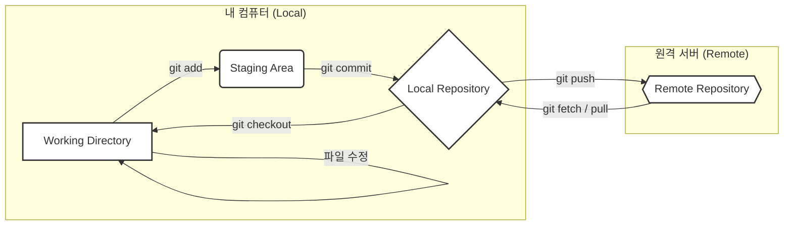
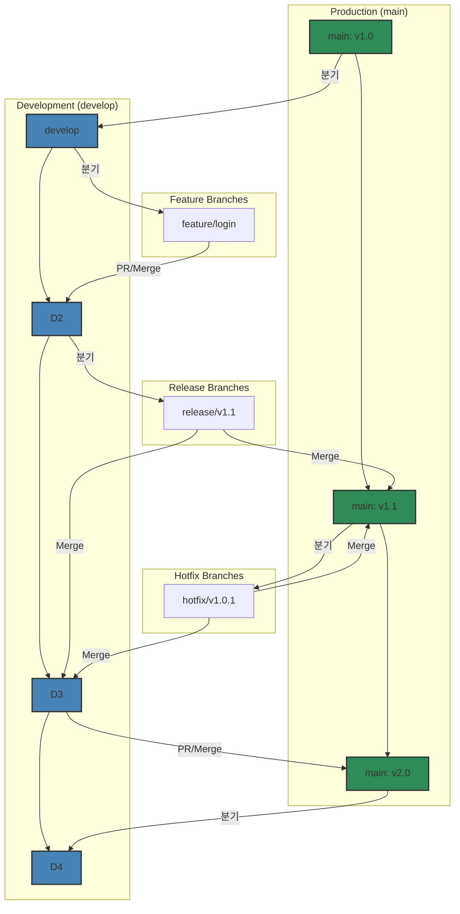

안녕하세요! 개발자에게 버전 관리 시스템(Version Control System)은 선택이 아닌 필수입니다. 그중에서도 Git은 전 세계적으로 가장 널리 사용되는 도구이죠. 이 글에서는 Git의 가장 기본적인 개념과 명령어부터, 브랜치를 활용한 병렬 작업, 그리고 Git-Flow와 풀 리퀘스트(Pull Request)를 이용한 실전 협업 전략까지 예제 중심으로 깊이 있게 알아보겠습니다.

### Git이란 무엇인가?

Git은 소스 코드의 변경 이력을 관리하는 **분산 버전 관리 시스템**입니다. 코드를 특정 시점의 스냅샷으로 저장하고, 여러 개발자가 동시에 작업하는 환경에서 코드 충돌을 최소화하며 협업할 수 있도록 돕습니다.

### 로컬 저장소와 원격 저장소: 개념 이해하기

Git은 '분산' 버전 관리 시스템이라는 점이 중요합니다. 이는 저장소가 내 컴퓨터와 원격 서버에 각각 독립적으로 존재한다는 의미입니다.

-   **로컬 저장소 (Local Repository)**: 개발자 개인의 컴퓨터에 저장되는 저장소입니다. 여기서 자유롭게 코드를 수정하고, 버전을 기록(커밋)할 수 있습니다. 네트워크 연결 없이도 대부분의 작업이 가능하여 매우 빠릅니다.
-   **원격 저장소 (Remote Repository)**: GitHub, GitLab과 같은 서버에 존재하는 저장소입니다. 여러 개발자가 작업한 내용을 공유하고 통합하는 중앙 허브 역할을 합니다. 팀원들과 코드를 주고받으려면(`push`, `pull`) 반드시 원격 저장소가 필요합니다.

### Git의 핵심 키워드 이해하기

Git을 효과적으로 사용하려면 몇 가지 핵심 용어와 각 영역 간의 관계를 시각적으로 이해하는 것이 중요합니다. 아래 다이어그램은 Git의 주요 작업 흐름을 보여줍니다.



-   **Working Directory (작업 디렉토리)**: 현재 작업 중인, 실제 파일들로 이루어진 프로젝트 폴더입니다. 여기서 파일을 수정, 생성, 삭제합니다.
-   **Staging Area (Index)**: 커밋할 변경 사항들을 임시로 모아두는 가상의 공간입니다. `git add` 명령을 통해 작업 디렉토리의 변경 사항 중, 커밋에 포함하고 싶은 내용만 선택적으로 추가할 수 있습니다.
-   **Local Repository (.git)**: 프로젝트의 모든 이력(커밋, 브랜치, 태그 등)이 저장되는 데이터베이스입니다. `git commit`을 실행하면 Staging Area에 있던 변경 사항들이 이곳에 영구적인 스냅샷으로 기록됩니다.
-   **Remote Repository**: GitHub와 같은 원격 서버에 있는 저장소입니다. `git push`를 통해 로컬 저장소의 변경 사항을 공유하고, `git pull`이나 `git fetch`를 통해 다른 사람의 변경 사항을 가져올 수 있습니다.
-   **HEAD**: 현재 작업중인 브랜치의 가장 최신 커밋을 가리키는 포인터입니다. 즉, 현재 작업 위치를 나타냅니다.
-   **Commit**: 프로젝트의 특정 시점을 기록한 스냅샷입니다. 각 커밋은 고유한 해시(hash) 값을 가지며, 이전 커밋을 가리키는 포인터를 포함하여 체인처럼 연결됩니다.
-   **Branch**: 독립적인 개발 라인을 의미합니다. 기존 코드에 영향을 주지 않고 새로운 기능을 개발하거나 버그를 수정할 때 사용합니다.
-   **Tag**: 특정 커밋에 붙이는 영구적인 이름표입니다. 주로 `v1.0.0`과 같이 릴리즈 버전을 표시하는 데 사용됩니다.

---

### 1. Git 기본 명령어 마스터하기

프로젝트를 시작하고 코드를 관리하는 데 필요한 핵심 명령어들입니다.

#### 1.1. Git 저장소 시작하기: `git init`
내 컴퓨터의 프로젝트 폴더를 Git이 관리하도록 초기화합니다.
```bash
mkdir my-awesome-project && cd my-awesome-project
git init
```

#### 1.2. 버전 관리에서 제외하기: `.gitignore`
추적하고 싶지 않은 파일(보안 정보, 로그, 빌드 파일 등)을 지정합니다.
```bash
echo "node_modules/" >> .gitignore
echo "*.log" >> .gitignore
```

#### 1.3. 변경 사항 확인 및 스테이징: `git status` & `git add`
`git status`로 변경된 파일을 확인하고, `git add`로 커밋할 파일들을 스테이징 영역(Staging Area)에 추가합니다.
```bash
# 파일 생성 및 수정
echo "# My Project" > README.md

# 변경 상태 확인
git status

# 스테이징 영역에 추가
git add README.md
```

#### 1.4. 변경 이력 저장하기: `git commit`
스테이징된 파일들을 하나의 의미 있는 변경 단위(버전)로 묶어 로컬 저장소에 기록합니다.
```bash
git commit -m "Initial commit: Add README.md"
```

#### 1.5. 변경 내용 비교하기: `git diff`
`git diff`는 코드의 변경된 부분을 비교하는 데 사용되는 강력한 명령어입니다.
```bash
# 1. 작업 디렉토리와 스테이징 영역 비교
# (아직 add 하지 않은 변경 사항 확인)
git diff

# 2. 스테이징 영역과 마지막 커밋 비교
# (add는 했지만 아직 commit 하지 않은 변경 사항 확인)
git diff --staged

# 3. 두 브랜치 간의 차이점 비교
git diff main develop
```

#### 1.6. 원격 저장소 다루기: `remote`, `push`, `fetch`, `pull`
로컬 저장소를 원격 저장소와 연결하고, 코드를 주고받습니다.

-   **`git remote add`**: 로컬 저장소에 원격 저장소 주소를 추가합니다.
    ```bash
    git remote add origin https://github.com/your-username/my-awesome-project.git
    ```
-   **`git push`**: 로컬의 커밋 내역을 원격 저장소로 업로드합니다.
    ```bash
    git push -u origin main
    ```
-   **`git fetch`**: 원격 저장소의 최신 변경 이력을 로컬로 가져오기만 합니다. **로컬 브랜치에 자동으로 병합하지 않습니다.**
    ```bash
    git fetch origin
    ```
    `fetch`를 실행하면 `origin/main`, `origin/develop`과 같은 '원격 추적 브랜치'가 업데이트됩니다. 이를 통해 내 로컬 작업에 영향을 주지 않고 팀원들의 작업 내용을 확인할 수 있습니다. (`git diff main origin/main`)

-   **`git pull`**: 원격 저장소의 변경 사항을 가져와 **현재 브랜치와 즉시 병합(merge)**합니다.
    ```bash
    git pull origin main
    ```
    `git pull`은 내부적으로 `git fetch` + `git merge`를 순차적으로 실행하는 것과 같습니다. 편리하지만, 원격의 변경 내용을 확인하지 않고 바로 병합하므로 예상치 못한 충돌이 발생할 수 있습니다.

> **`fetch` vs `pull` 언제 무엇을 쓸까?**
> - **안전하게 원격의 변경 사항을 확인하고 싶을 때**: `git fetch`를 사용한 후, `git log origin/main` 등으로 변경 내용을 검토하고 원하는 시점에 `git merge origin/main`을 실행하세요.
> - **개인 브랜치에서 작업하거나, 원격의 변경 내용이 확실할 때**: `git pull`을 사용하여 과정을 단축할 수 있습니다.

#### 1.7. 커밋 이력 확인하기: `git log`
지금까지의 커밋 이력을 시간순으로 보여줍니다.
```bash
git log
```

---

### 2. 효율적인 협업의 시작: 브랜치와 병합

브랜치(Branch)는 기존 코드에 영향을 주지 않고 독립적인 작업을 수행하기 위해 만드는 '코드의 복사본'과 같습니다. 신기능 개발, 버그 수정 등 여러 작업을 동시에 안전하게 진행할 수 있습니다.

#### 2.1. 브랜치 생성 및 확인: `git branch`
새로운 브랜치를 만들거나, 현재 로컬에 있는 브랜치 목록을 확인할 수 있습니다.
```bash
# 'develop' 브랜치 생성
git branch develop

# 'feature/login' 브랜치 생성
git branch feature/login

# 모든 로컬 브랜치 목록 확인
git branch
# 출력:
# * main
#   develop
#   feature/login
```
`*` 표시는 현재 내가 위치한 브랜치를 의미합니다.

#### 2.2. 브랜치 이동: `git checkout`
다른 브랜치로 작업 공간을 전환합니다.
```bash
# 'develop' 브랜치로 이동
git checkout develop

# 브랜치를 새로 만들면서 동시에 해당 브랜치로 이동
git checkout -b feature/signup
# 위 명령어는 아래 두 명령어와 동일합니다.
# git branch feature/signup
# git checkout feature/signup
```

#### 2.3. 로컬에서 브랜치 병합: `git merge`
한 브랜치에서 완료된 작업을 다른 브랜치로 합칠 때 사용합니다. 예를 들어 `feature/login` 기능 개발이 끝나면 `develop` 브랜치로 병합합니다.
```bash
# 1. 병합의 기준이 될 'develop' 브랜치로 이동
git checkout develop

# 2. 'feature/login' 브랜치의 변경 사항을 'develop'으로 가져와 병합
git merge feature/login
```
`merge`는 두 브랜치의 이력을 합치면서 새로운 **'머지 커밋'**을 생성합니다. 이를 통해 누가, 언제, 어떤 브랜치를 병합했는지 명확한 이력을 남길 수 있습니다.

---

### 3. 히스토리 관리: Rebase로 깔끔한 커밋 라인 만들기

`rebase`는 `merge`와 같이 다른 브랜치의 변경 사항을 합치는 또 다른 방법입니다. `merge`가 이력을 그대로 보존하며 합친다면, `rebase`는 커밋 히스토리를 **재작성**하여 더 깔끔하고 선형적인 이력을 만듭니다.

#### 3.1. Rebase는 어떻게 동작하는가?
`feature` 브랜치에서 `develop` 브랜치의 최신 변경 사항을 반영하고 싶다고 가정해 봅시다.

```bash
# 1. feature 브랜치에서 작업
git checkout feature/new-feature
# ... 기능 개발 및 커밋 ...

# 2. develop 브랜치의 최신 코드를 가져옴
git fetch origin develop

# 3. feature 브랜치의 베이스를 develop의 최신 커밋으로 변경
git rebase origin/develop
```
이 과정은 `feature` 브랜치에서 했던 커밋들을 잠시 떼어놓고, `develop` 브랜치의 최신 커밋 위로 하나씩 다시 쌓는 것과 같습니다. 그 결과, `feature` 브랜치는 마치 `develop`의 가장 최신 버전에서 막 작업을 시작한 것처럼 보이게 됩니다.

#### 3.2. Merge vs Rebase
- **Merge**: 이력을 보존하는 데 중점을 둡니다. "언제, 무엇을 합쳤는가"가 중요한 공개 브랜치(`main`, `develop`)에 적합합니다.
- **Rebase**: 깔끔한 선형 히스토리를 만드는 데 중점을 둡니다. PR을 올리기 전, 개인 `feature` 브랜치를 정리하는 데 매우 유용합니다.

> **Rebase의 황금률: 절대로 공유된 브랜치를 Rebase하지 마라!**
> `main`이나 `develop`처럼 여러 사람이 함께 사용하는 브랜치를 `rebase`하면, 다른 팀원들의 저장소와 히스토리가 꼬여버리는 대재앙이 발생할 수 있습니다. `rebase`는 아직 원격에 푸시하지 않았거나, 나만 사용하는 개인 브랜치에만 사용해야 합니다.

---

### 4. 충돌 해결하기 (Conflict Resolution)

협업 시 여러 개발자가 같은 파일의 같은 부분을 수정하면 **충돌(Conflict)**이 발생합니다. Git은 어떤 코드를 선택해야 할지 모르기 때문에 사용자에게 직접 해결을 요청합니다.

#### 4.1. 충돌은 언제 발생하는가?
- `git merge` 또는 `git pull` 실행 시
- `git rebase` 실행 시

#### 4.2. Merge 충돌 해결하기
1.  `git pull` 또는 `git merge`를 실행했을 때 충돌이 발생하면, Git은 어떤 파일에서 충돌이 났는지 알려줍니다.
2.  `git status`를 통해 충돌 중인 파일 목록을 확인할 수 있습니다.
3.  해당 파일을 열면 아래와 같은 충돌 표시자(conflict marker)가 보입니다.

    ```
    <<<<<<< HEAD
    // 내가 작업한 내용 (현재 브랜치)
    const message = "Hello World";
    =======
    // 상대방이 작업한 내용 (병합하려는 브랜치)
    const message = "Hello Git";
    >>>>>>> origin/main
    ```

4.  `<<<<<<<`, `=======`, `>>>>>>>` 표시자를 모두 제거하고, 두 코드를 비교하여 최종적으로 남길 코드를 결정하고 파일을 수정합니다.
    ```
    // 예시: 두 내용을 모두 반영하기로 결정
    const myMessage = "Hello World";
    const theirMessage = "Hello Git";
    ```
5.  수정이 완료되면 파일을 저장하고, `git add`를 통해 충돌이 해결되었음을 Git에 알립니다.
    ```bash
    git add <충돌이 발생했던 파일명>
    ```
6.  마지막으로 `git commit`을 실행하여 병합을 완료합니다. (`rebase` 중이었다면 `git rebase --continue`)

#### 4.3. Rebase 후 강제 푸시 (`force push`)
`feature` 브랜치를 `rebase`하면 로컬 브랜치의 커밋 히스토리가 변경됩니다. 만약 이 브랜치를 이미 원격에 `push`한 적이 있다면, 원격 저장소의 이력과 로컬의 이력이 달라져 일반적인 `git push`가 거부됩니다.

이때는 히스토리가 의도적으로 변경되었음을 Git에 알리고 강제로 푸시해야 합니다.

```bash
# Rebase 후 원격에 강제로 푸시 (주의!)
git push origin feature/my-feature --force
```

> **더 안전한 강제 푸시: `--force-with-lease`**
> `git push --force`는 매우 위험한 옵션입니다. 만약 내가 모르는 사이에 다른 팀원이 해당 브랜치에 새로운 커밋을 푸시했다면, 그 커밋을 덮어쓰고 유실시킬 수 있습니다.
>
> `git push --force-with-lease`는 내가 마지막으로 `fetch`한 이후 원격 브랜치에 변경 사항이 없는 경우에만 강제 푸시를 허용합니다. 이는 다른 사람의 작업을 덮어쓸 위험을 크게 줄여주는 훨씬 안전한 대안입니다.
>
> **결론: 웬만하면 `--force-with-lease`를 사용하세요.**
> ```bash
> git push origin feature/my-feature --force-with-lease
> ```

---

### 5. 코드 리뷰와 협업: 풀 리퀘스트(Pull Request)

로컬에서 `git merge`를 통해 직접 브랜치를 합칠 수도 있지만, 팀 프로젝트에서는 **풀 리퀘스트(Pull Request, PR)** 또는 **머지 리퀘스트(Merge Request, MR)** 방식을 사용하는 것이 일반적입니다.

풀 리퀘스트는 내가 작업한 브랜치의 변경 사항을 다른 브랜치에 합치기 전에, **팀원들에게 코드 리뷰를 요청하는 과정**입니다. 이를 통해 코드의 품질을 높이고, 잠재적인 버그를 사전에 발견하며, 팀 전체가 프로젝트의 변경 사항을 쉽게 파악할 수 있습니다.

**기본적인 PR 흐름:**
1.  로컬에서 기능 개발 완료 후, 원격 저장소에 내 `feature` 브랜치를 `push`합니다.
2.  GitHub/GitLab 사이트에서 `feature` 브랜치를 `develop`이나 `main` 브랜치로 보내는 풀 리퀘스트를 생성합니다.
3.  팀원들이 코드를 리뷰하고 의견을 남깁니다.
4.  리뷰가 완료되고 승인(Approve)되면, PR을 통해 원격 저장소에서 브랜치를 병합합니다.

---

### 6. 실전 협업 전략: Git-Flow 워크플로우

Git-Flow는 복잡한 프로젝트에서 여러 개발자가 효율적으로 협업하기 위한 브랜치 관리 전략입니다.

#### 6.1. Git-Flow의 핵심 브랜치
-   **`main` (또는 `master`)**: **배포 가능한** 안정적인 버전의 코드를 관리하는 가장 중요한 브랜치입니다.
-   **`develop`**: 다음 버전 배포를 위해 **개발 중인 코드**를 통합하는 브랜치입니다. 모든 기능 개발은 이 브랜치를 기준으로 시작됩니다.
-   **`feature`**: 신기능 개발을 위한 브랜치. `develop`에서 분기하여 개발 완료 후 `develop`으로 병합됩니다.
-   **`release`**: 배포 준비를 위한 브랜치. `develop`에서 분기하여 버그 수정, 버전 기록 등을 수행한 후 `main`과 `develop`에 모두 병합됩니다.
-   **`hotfix`**: 배포된 `main` 브랜치의 긴급 버그를 수정하는 브랜치. `main`에서 분기하여 수정 후 `main`과 `develop`에 모두 병합됩니다.

#### 6.2. Feature 브랜치 워크플로우 (풀 리퀘스트 활용)
가장 일반적인 기능 개발 흐름입니다.
1.  **`develop` 브랜치의 최신 코드를 가져옵니다.**
    ```bash
    git checkout develop
    git pull origin develop
    ```
2.  **새로운 `feature` 브랜치를 생성하고 이동합니다.**
    ```bash
    git checkout -b feature/new-awesome-feature
    ```
3.  **기능을 개발하고, 작업 내용을 커밋합니다.**
    ```bash
    # 코드 작업...
    git add .
    git commit -m "Feat: Implement new awesome feature"
    ```
4.  **원격 저장소에 `feature` 브랜치를 푸시합니다.**
    ```bash
    git push origin feature/new-awesome-feature
    ```
5.  **GitHub에서 풀 리퀘스트를 생성합니다.**
    -   `feature/new-awesome-feature` 브랜치를 `develop` 브랜치로 향하는 PR을 생성합니다.
    -   팀원들의 코드 리뷰를 거친 후, PR을 병합(Merge)합니다.

#### 6.3. 릴리즈와 태그 관리: `git tag`
`release` 브랜치가 `main`으로 병합되어 새로운 버전이 배포될 때, 해당 커밋 지점을 영구적으로 기억하기 위해 **태그(Tag)**를 사용합니다. 태그는 특정 버전을 쉽게 찾아볼 수 있도록 하는 '책갈피'와 같습니다.

```bash
# 1. main 브랜치로 이동하여 최신 코드를 받습니다.
git checkout main
git pull origin main

# 2. 'v1.0.0'이라는 이름의 Annotated 태그를 생성합니다.
# -a: 태그 이름, -m: 태그에 대한 설명
git tag -a v1.0.0 -m "Release version 1.0.0"

# 3. 생성한 태그를 원격 저장소에 푸시합니다.
git push origin v1.0.0
```

#### 6.4. Git-Flow 플로우 다이어그램 (Mermaid)


---

### 7. 자동화: GitHub Actions로 Git 저장소 미러링하기

GitHub Actions를 사용하면 한 저장소의 변경 사항을 다른 저장소로 자동으로 동기화하는 **미러링(Mirroring)** 파이프라인을 쉽게 구축할 수 있습니다. 예를 들어, GitHub에 있는 개인 프로젝트를 회사 GitLab이나 다른 원격 저장소로 백업하고 싶을 때 유용합니다.

#### GitHub Actions 워크플로우 설정하기

1.  **미러링 대상 저장소에 대한 접근 토큰 생성**:
    미러링할 대상 저장소(예: 다른 GitHub 저장소, GitLab)에 접근할 수 있는 권한을 가진 **Personal Access Token (PAT)** 을 생성합니다. 토큰은 `repo` 스코프를 가져야 합니다.

2.  **소스 저장소에 시크릿 등록**:
    소스 GitHub 저장소의 `Settings` > `Secrets and variables` > `Actions`로 이동하여, 위에서 생성한 PAT를 `DESTINATION_PAT`와 같은 이름의 시크릿으로 등록합니다. 또한, 미러링할 대상 저장소의 URL(사용자 이름 포함)을 `DESTINATION_REPO_URL`과 같은 이름으로 등록합니다.
    *   `DESTINATION_PAT`: `ghp_xxxxxxxx`
    *   `DESTINATION_REPO_URL`: `https://<your-username>@github.com/your-username/destination-repo.git`

3.  **워크플로우 파일 작성**:
    소스 저장소의 `.github/workflows/mirror.yml` 경로에 아래와 같이 워크플로우 파일을 작성합니다.

    ```yaml
    name: Mirror Repository

    on:
      push:
        branches:
          - main # main 브랜치에 push될 때마다 실행

    jobs:
      mirror:
        runs-on: ubuntu-latest
        steps:
          - name: Checkout source repository
            uses: actions/checkout@v4
            with:
              fetch-depth: 0 # 모든 히스토리를 가져옵니다.

          - name: Mirror to destination repository
            env:
              DESTINATION_REPO_URL: ${{ secrets.DESTINATION_REPO_URL }}
              DESTINATION_PAT: ${{ secrets.DESTINATION_PAT }}
            run: |
              # 원격 저장소 URL에 인증 정보를 포함하여 재구성합니다.
              # URL 형식: https://<username>:<token>@github.com/user/repo.git
              DEST_URL_WITH_AUTH=$(echo "$DESTINATION_REPO_URL" | sed "s|://|://$DESTINATION_PAT@|")

              # 대상 저장소로 미러링 푸시를 실행합니다.
              # --mirror 옵션은 모든 브랜치, 태그 등 모든 참조를 그대로 복제합니다.
              git push --mirror "$DEST_URL_WITH_AUTH"
    ```

#### 워크플로우 설명

-   `on: push: branches: [main]`: 이 워크플로우는 `main` 브랜치에 새로운 커밋이 `push`될 때마다 자동으로 실행됩니다.
-   `actions/checkout@v4`: 소스 코드를 체크아웃하는 공식 액션입니다. `fetch-depth: 0` 옵션은 모든 커밋 히스토리를 가져와 완전한 미러링을 보장합니다.
-   `git push --mirror`: 이 명령어가 핵심입니다. 현재 로컬에 복제된 저장소의 모든 참조(브랜치, 태그 등)를 지정된 원격 저장소로 그대로 푸시하여 완벽한 복제본을 만듭니다. `DESTINATION_PAT`를 이용해 인증을 수행합니다.

이제 `main` 브랜치에 변경 사항이 생길 때마다 GitHub Actions가 자동으로 대상 저장소에 모든 내용을 동기화해 줄 것입니다.

---

### 마무리하며

Git은 현대 개발 환경의 근간을 이루는 강력한 도구입니다. 오늘 다룬 기본 개념과 명령어부터 시작하여 브랜치, 풀 리퀘스트, 그리고 Git-Flow와 같은 협업 전략을 팀에 도입해 보세요. 더 나아가 GitHub Actions를 활용하면 반복적인 작업을 자동화하여 개발 생산성을 크게 향상시킬 수 있습니다.

이 글이 여러분의 Git 여정에 든든한 발판이 되기를 바랍니다!
