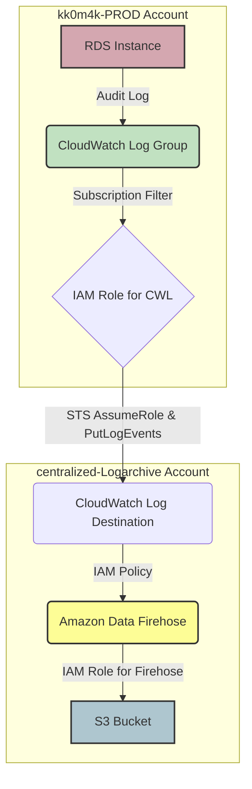

--- 
layout: single
title: "📜 AWS 교차 계정을 활용한 RDS Audit Log 중앙 관리 아키텍처 구축하기"
date: 2025-12-02 10:00:00 +0900
categories:
  - aws
tags:
  - aws
  - cloudwatch
  - firehose
---

👋 여러 AWS 계정에 분산된 RDS 데이터베이스의 감사 로그(Audit Log)를 중앙 로깅 계정으로 안전하고 효율적으로 수집하여 아카이빙하는 방법에 대해서 다루고자 합니다. 이 아키텍처는 컴플라이언스 요구사항 충족, 보안 모니터링 강화, 그리고 사후 분석 및 감사 대응에 매우 중요합니다.

## 🚀 왜 중앙 로깅이 필요한가요?

기업 환경에서는 여러 개의 AWS 계정을 운영하는 경우가 많습니다. (e.g., Prod, Dev, Staging) 각 계정의 리소스에서 생성되는 로그를 개별적으로 관리하는 것은 비효율적이며 보안에 허점을 만들 수 있습니다.

-   **📜 컴플라이언스 준수**: PCI-DSS, HIPAA, SOX 등 많은 규제 및 표준에서는 로그 데이터의 장기 보관 및 무결성 유지를 요구합니다. 중앙화된 로깅은 이를 체계적으로 관리할 수 있게 해줍니다.
-   **🔒 보안 모니터링 및 탐지**: 분산된 로그를 한 곳에서 통합 분석함으로써, 비정상적인 접근 시도나 내부자 위협 같은 보안 이벤트를 더 빠르고 정확하게 탐지할 수 있습니다.
-   **🕵️‍♀️ 신속한 사후 조사**: 장애 발생이나 보안 사고 시, 관련된 모든 로그가 한곳에 모여있다면 원인 분석과 영향도 파악에 걸리는 시간을 크게 단축할 수 있습니다.

## 🏗️ 아키텍처 개요

오늘 우리가 구축할 아키텍처의 데이터 흐름은 다음과 같습니다.

1.  **PROD 계정**: 운영 RDS 인스턴스에서 생성된 Audit Log가 CloudWatch Logs 그룹으로 전송됩니다.
2.  **CloudWatch 구독 필터**: PROD 계정의 CloudWatch Logs 그룹에 구독 필터(Subscription Filter)를 생성합니다. 이 필터는 특정 패턴의 로그를 실시간으로 스트리밍합니다.
3.  **Cross-Account Role & Destination**: 구독 필터는 PROD 계정의 IAM Role을 사용하여 `centralized-Logarchive` (중앙 로깅) 계정에 있는 CloudWatch Log Destination으로 로그를 전송합니다.
4.  **Amazon Data Firehose**: Log Destination은 수신된 로그를 Amazon Data Firehose로 전달합니다.
5.  **S3 버킷 저장**: Firehose는 버퍼링, 압축, 변환 등의 처리를 거쳐 최종적으로 중앙 로깅 계정의 S3 버킷에 로그를 저장합니다. 이때, `연/월/일/시` 형태의 파티셔닝을 적용하여 데이터 조회 효율성을 높입니다.

### Mermaid 다이어그램



## 🛠️ 단계별 구축 가이드 (AWS CLI)

이제 AWS CLI를 사용하여 각 구성 요소를 단계별로 생성해 보겠습니다.

**변수 설정**: CLI 명령어를 실행하기 전에, 자신의 환경에 맞게 아래 변수들을 설정해주세요.

```bash
# Centralized Log Archive Account
export LOG_ARCHIVE_ACCOUNT_ID="<CENTRALIZED_LOG_ARCHIVE_ACCOUNT_ID>"
export LOG_ARCHIVE_REGION="ap-northeast-2"

# Production Account
export PROD_ACCOUNT_ID="<PRODUCTION_ACCOUNT_ID>"
export PROD_REGION="ap-northeast-2"

# Resource Names
export S3_BUCKET_NAME="centralized-rds-audit-log-s3"
export FIREHOSE_NAME="firehose-to-s3"
export CWL_DESTINATION_NAME="cwl-destination-logarchive"
export RDS_LOG_GROUP_NAME="/aws/rds/instance/your-rds-instance/audit"
```

### AWS SSO를 활용한 인증 설정

기업 환경에서는 IAM User 대신 AWS IAM Identity Center(구 AWS SSO)를 사용하여 임시 자격 증명으로 AWS 리소스에 접근하는 것이 보안상 권장됩니다.

#### SSO 프로필 설정

`~/.aws/config` 파일에 SSO 프로필을 설정합니다:

```ini
# 중앙 로깅 계정 (Log Archive)
[profile log-archive-profile]
sso_start_url = https://your-org.awsapps.com/start
sso_region = ap-northeast-2
sso_account_id = <CENTRALIZED_LOG_ARCHIVE_ACCOUNT_ID>
sso_role_name = AdministratorAccess
region = ap-northeast-2
output = json

# 운영 계정 (PROD)
[profile prod-profile]
sso_start_url = https://your-org.awsapps.com/start
sso_region = ap-northeast-2
sso_account_id = <PRODUCTION_ACCOUNT_ID>
sso_role_name = AdministratorAccess
region = ap-northeast-2
output = json
```

#### SSO 로그인 및 CLI 명령 실행

```bash
# 중앙 로깅 계정 SSO 로그인
aws sso login --profile log-archive-profile

# PROD 계정 SSO 로그인
aws sso login --profile prod-profile

# 로그인 확인 (각 프로필에서 호출자 ID 확인)
aws sts get-caller-identity --profile log-archive-profile
aws sts get-caller-identity --profile prod-profile
```

> **💡 Tip**: SSO 세션은 기본적으로 8시간 후 만료됩니다. 장시간 작업 시 `aws sso login` 명령을 다시 실행하여 세션을 갱신하세요.

#### 자동 로그인 스크립트 (선택사항)

여러 계정에 동시에 로그인해야 할 경우, 다음 스크립트를 활용할 수 있습니다:

```bash
#!/bin/bash
# multi-account-sso-login.sh

PROFILES=("log-archive-profile" "prod-profile")

for profile in "${PROFILES[@]}"; do
    echo "Logging in to $profile..."
    aws sso login --profile "$profile"

    # 로그인 확인
    if aws sts get-caller-identity --profile "$profile" > /dev/null 2>&1; then
        echo "✅ $profile: Login successful"
    else
        echo "❌ $profile: Login failed"
    fi
done
```

---

### 단계 1: Centralized Log Archive 계정 설정 (`centralized-Logarchive`)

먼저 로그를 최종적으로 저장하고 처리할 중앙 로깅 계정의 리소스를 생성합니다.

#### 1.1. S3 버킷 생성

Firehose가 로그를 저장할 S3 버킷을 생성합니다.

```bash
aws s3api create-bucket \
    --bucket ${S3_BUCKET_NAME} \
    --region ${LOG_ARCHIVE_REGION} \
    --create-bucket-configuration LocationConstraint=${LOG_ARCHIVE_REGION} \
    --profile log-archive-profile # 중앙 계정 프로필
```

#### 1.2. Firehose를 위한 IAM Role 및 Policy 생성

Firehose가 S3 버킷에 데이터를 쓸 수 있도록 허용하는 IAM 역할이 필요합니다.

**Policy JSON (`firehose-s3-policy.json`):**
```json
{
    "Version": "2012-10-17",
    "Statement": [
        {
            "Effect": "Allow",
            "Action": [
                "s3:AbortMultipartUpload",
                "s3:GetBucketLocation",
                "s3:GetObject",
                "s3:ListBucket",
                "s3:ListBucketMultipartUploads",
                "s3:PutObject"
            ],
            "Resource": [
                "arn:aws:s3:::${S3_BUCKET_NAME}",
                "arn:aws:s3:::${S3_BUCKET_NAME}/*"
            ]
        }
    ]
}
```

**Trust Policy JSON (`firehose-trust-policy.json`):**
```json
{
    "Version": "2012-10-17",
    "Statement": [
        {
            "Effect": "Allow",
            "Principal": {
                "Service": "firehose.amazonaws.com"
            },
            "Action": "sts:AssumeRole"
        }
    ]
}
```

**CLI 명령어:**
```bash
# Policy 내용 파일에 맞게 수정
sed -i.bak "s/">${S3_BUCKET_NAME}/${S3_BUCKET_NAME}/g" firehose-s3-policy.json

# IAM Role 생성
aws iam create-role \
    --role-name Firehose-S3-Role \
    --assume-role-policy-document file://firehose-trust-policy.json \
    --profile log-archive-profile

# IAM Policy 생성 및 연결
FIREHOSE_POLICY_ARN=$(aws iam create-policy \
    --policy-name Firehose-S3-Policy \
    --policy-document file://firehose-s3-policy.json \
    --query 'Policy.Arn' --output text \
    --profile log-archive-profile)

aws iam attach-role-policy \
    --role-name Firehose-S3-Role \
    --policy-arn ${FIREHOSE_POLICY_ARN} \
    --profile log-archive-profile
```

#### 1.3. Amazon Data Firehose 생성

S3로 데이터를 전송할 Firehose Delivery Stream을 생성합니다.

##### 📊 Firehose 파티셔닝 전략: 정적 vs 동적

Firehose는 S3에 데이터를 저장할 때 **정적 파티셔닝**과 **동적 파티셔닝** 두 가지 방식을 지원합니다.

| 구분 | 정적 파티셔닝 (Static Partitioning) | 동적 파티셔닝 (Dynamic Partitioning) |
|------|-------------------------------------|--------------------------------------|
| **파티션 키** | 타임스탬프 기반 (`!{timestamp:yyyy}`) | 데이터 내용 기반 (JSON 필드, Lambda 변환) |
| **S3 경로 예시** | `audit-logs/2025/12/02/10/` | `audit-logs/cluster=prod-db-01/2025/12/02/` |
| **설정 복잡도** | 낮음 | 높음 (JQ 표현식 또는 Lambda 필요) |
| **추가 비용** | 없음 | 동적 파티셔닝 처리 비용 발생 |
| **버퍼링** | 시간/크기 기반 | 파티션별 버퍼링 (메모리 사용량 증가) |
| **적합한 경우** | 단일 소스, 시간순 분석 | 멀티 소스 구분, 세분화된 쿼리 필요 시 |

**정적 파티셔닝의 장점:**
- 설정이 단순하고 비용이 저렴
- 시간순 로그 분석에 최적화
- 버퍼링이 효율적

**정적 파티셔닝의 단점:**
- 데이터 내용 기반 분류 불가
- 멀티 소스 구분이 어려움

**동적 파티셔닝의 장점:**
- 로그 데이터 내 필드로 파티션 생성 가능 (예: `cluster_id`, `db_instance`)
- Athena/Glue에서 파티션 프루닝으로 쿼리 성능 향상
- 데이터 소스별 격리 및 접근 제어 가능

**동적 파티셔닝의 단점:**
- 추가 처리 비용 발생
- 설정 복잡도 증가
- 파티션당 버퍼가 필요하여 메모리 사용량 증가

##### 방법 A: 정적 파티셔닝 (단일 RDS 또는 간단한 구성)

`YYYY/MM/DD/HH` 형식의 타임스탬프 기반 파티셔닝을 사용합니다.

```bash
FIREHOSE_ROLE_ARN="arn:aws:iam::${LOG_ARCHIVE_ACCOUNT_ID}:role/Firehose-S3-Role"
S3_BUCKET_ARN="arn:aws:s3:::${S3_BUCKET_NAME}"

aws firehose create-delivery-stream \
    --delivery-stream-name ${FIREHOSE_NAME} \
    --delivery-stream-type DirectPut \
    --extended-s3-destination-configuration '{
        "RoleARN": "'${FIREHOSE_ROLE_ARN}'",
        "BucketARN": "'${S3_BUCKET_ARN}'",
        "Prefix": "audit-logs/!{timestamp:yyyy}/!{timestamp:MM}/!{timestamp:dd}/!{timestamp:HH}/",
        "ErrorOutputPrefix": "error-logs/!{firehose:error-output-type}/!{timestamp:yyyy}/!{timestamp:MM}/!{timestamp:dd}/",
        "BufferingHints": {
            "IntervalInSeconds": 300,
            "SizeInMBs": 5
        },
        "CompressionFormat": "GZIP"
    }' \
    --region ${LOG_ARCHIVE_REGION} \
    --profile log-archive-profile
```

---

## 🗂️ 멀티 RDS 클러스터 로그 수집 아키텍처

여러 RDS 인스턴스/클러스터에서 Audit Log를 수집할 때, 각 데이터베이스를 식별할 수 있어야 사후 분석이 용이합니다.

### 식별 방법 비교

| 방법 | 파티셔닝 유형 | 구현 복잡도 | 비용 | 식별 정확도 |
|------|--------------|-------------|------|-------------|
| CloudWatch Log Group 이름 기반 | 정적 | 낮음 | 없음 | 높음 |
| 각 RDS별 별도 Firehose | 정적 | 중간 | Firehose 수 × 비용 | 높음 |
| 동적 파티셔닝 + Lambda | 동적 | 높음 | Lambda + 동적파티셔닝 비용 | 매우 높음 |

### 방법 1: CloudWatch Log Group 이름 기반 식별 (권장 - 정적 파티셔닝)

RDS Audit Log는 CloudWatch로 전송될 때 로그 그룹 이름에 인스턴스 식별자가 포함됩니다:
- `/aws/rds/instance/{db-instance-id}/audit`
- `/aws/rds/cluster/{cluster-id}/audit`

이 정보는 CloudWatch Logs 구독 필터를 통해 Firehose로 전송될 때 **메타데이터**로 함께 전달됩니다. 따라서 **동적 파티셔닝 없이도 로그 데이터 내에서 RDS 인스턴스를 식별**할 수 있습니다.

**S3에 저장되는 로그 형식 예시:**
```json
{
    "messageType": "DATA_MESSAGE",
    "owner": "123456789012",
    "logGroup": "/aws/rds/instance/prod-mysql-01/audit",
    "logStream": "prod-mysql-01",
    "subscriptionFilters": ["rds-auditlog-firehose-filter"],
    "logEvents": [
        {
            "id": "...",
            "timestamp": 1701489600000,
            "message": "20231202 10:00:00,ip-10-0-1-50,admin,10.0.1.100,12345,67890,QUERY,mydb,'SELECT * FROM users',0"
        }
    ]
}
```

> **💡 핵심**: `logGroup` 필드에 RDS 인스턴스 식별자가 포함되어 있어, Athena 쿼리 시 이 필드로 필터링할 수 있습니다.

**Athena 쿼리 예시:**
```sql
SELECT *
FROM rds_audit_logs
WHERE logGroup LIKE '%prod-mysql-01%'
  AND year = '2025' AND month = '12' AND day = '02';
```

### 방법 2: 각 RDS별 별도 구독 필터 + Prefix 분리 (정적 파티셔닝)

RDS 인스턴스별로 별도의 구독 필터를 생성하고, 각기 다른 S3 prefix로 저장하는 방법입니다.

```bash
# RDS 인스턴스 목록 정의
RDS_INSTANCES=("prod-mysql-01" "prod-mysql-02" "prod-postgres-01")

for RDS_INSTANCE in "${RDS_INSTANCES[@]}"; do
    # 각 RDS별 Firehose 생성 (또는 단일 Firehose 사용 시 prefix만 다르게)
    aws firehose create-delivery-stream \
        --delivery-stream-name "firehose-${RDS_INSTANCE}" \
        --delivery-stream-type DirectPut \
        --extended-s3-destination-configuration '{
            "RoleARN": "'${FIREHOSE_ROLE_ARN}'",
            "BucketARN": "'${S3_BUCKET_ARN}'",
            "Prefix": "audit-logs/rds='${RDS_INSTANCE}'/!{timestamp:yyyy}/!{timestamp:MM}/!{timestamp:dd}/!{timestamp:HH}/",
            "ErrorOutputPrefix": "error-logs/'${RDS_INSTANCE}'/!{firehose:error-output-type}/!{timestamp:yyyy}/!{timestamp:MM}/!{timestamp:dd}/",
            "BufferingHints": { "IntervalInSeconds": 300, "SizeInMBs": 5 },
            "CompressionFormat": "GZIP"
        }' \
        --region ${LOG_ARCHIVE_REGION} \
        --profile log-archive-profile

    echo "Created Firehose for ${RDS_INSTANCE}"
done
```

**S3 경로 구조:**
```
s3://centralized-rds-audit-log-s3/
├── audit-logs/
│   ├── rds=prod-mysql-01/
│   │   └── 2025/12/02/10/
│   ├── rds=prod-mysql-02/
│   │   └── 2025/12/02/10/
│   └── rds=prod-postgres-01/
│       └── 2025/12/02/10/
```

### 방법 3: 동적 파티셔닝 (Lambda 변환 활용)

로그 데이터를 Lambda로 변환하여 RDS 인스턴스 ID를 추출하고, 이를 파티션 키로 사용하는 방법입니다.

> **⚠️ 주의**: CloudWatch Logs에서 Firehose로 전송되는 데이터는 Base64 + Gzip으로 인코딩되어 있어 JQ 표현식만으로는 파싱이 어렵습니다. Lambda 변환이 필요합니다.

**Lambda 함수 코드 예시 (`firehose-transform.py`):**
```python
import base64
import gzip
import json

def lambda_handler(event, context):
    output = []

    for record in event['records']:
        # Base64 + Gzip 디코딩
        compressed_payload = base64.b64decode(record['data'])
        uncompressed_payload = gzip.decompress(compressed_payload)
        log_data = json.loads(uncompressed_payload)

        # logGroup에서 RDS 인스턴스 ID 추출
        log_group = log_data.get('logGroup', '')
        # /aws/rds/instance/prod-mysql-01/audit -> prod-mysql-01
        parts = log_group.split('/')
        rds_instance = parts[4] if len(parts) > 4 else 'unknown'

        # 파티션 키 추가
        result = {
            'recordId': record['recordId'],
            'result': 'Ok',
            'data': base64.b64encode(
                (json.dumps(log_data) + '\n').encode('utf-8')
            ).decode('utf-8'),
            'metadata': {
                'partitionKeys': {
                    'rds_instance': rds_instance
                }
            }
        }
        output.append(result)

    return {'records': output}
```

**동적 파티셔닝이 적용된 Firehose 생성:**
```bash
aws firehose create-delivery-stream \
    --delivery-stream-name ${FIREHOSE_NAME} \
    --delivery-stream-type DirectPut \
    --extended-s3-destination-configuration '{
        "RoleARN": "'${FIREHOSE_ROLE_ARN}'",
        "BucketARN": "'${S3_BUCKET_ARN}'",
        "Prefix": "audit-logs/rds_instance=!{partitionKeyFromLambda:rds_instance}/year=!{timestamp:yyyy}/month=!{timestamp:MM}/day=!{timestamp:dd}/hour=!{timestamp:HH}/",
        "ErrorOutputPrefix": "error-logs/!{firehose:error-output-type}/!{timestamp:yyyy}/!{timestamp:MM}/!{timestamp:dd}/",
        "BufferingHints": { "IntervalInSeconds": 300, "SizeInMBs": 5 },
        "CompressionFormat": "GZIP",
        "DynamicPartitioningConfiguration": {
            "Enabled": true,
            "RetryOptions": { "DurationInSeconds": 300 }
        },
        "ProcessingConfiguration": {
            "Enabled": true,
            "Processors": [
                {
                    "Type": "Lambda",
                    "Parameters": [
                        { "ParameterName": "LambdaArn", "ParameterValue": "arn:aws:lambda:'${LOG_ARCHIVE_REGION}':'${LOG_ARCHIVE_ACCOUNT_ID}':function:firehose-rds-transform" },
                        { "ParameterName": "BufferSizeInMBs", "ParameterValue": "1" },
                        { "ParameterName": "BufferIntervalInSeconds", "ParameterValue": "60" }
                    ]
                }
            ]
        }
    }' \
    --region ${LOG_ARCHIVE_REGION} \
    --profile log-archive-profile
```

### 권장 사항

| 상황 | 권장 방법 |
|------|-----------|
| RDS 인스턴스 1~3개, 비용 최소화 | **방법 1**: Log Group 이름 기반 식별 |
| RDS 인스턴스 다수, S3 파티션 분리 필요 | **방법 2**: 각 RDS별 별도 구독 필터 |
| 복잡한 쿼리 요구, Athena 파티션 프루닝 필수 | **방법 3**: 동적 파티셔닝 + Lambda |

대부분의 경우 **방법 1 (CloudWatch Log Group 이름 기반 식별)**이 가장 비용 효율적이며, Athena에서 JSON 파싱을 통해 충분히 RDS 인스턴스를 구분할 수 있습니다.

---

#### 1.4. CloudWatch Log Destination 생성

PROD 계정의 CloudWatch Logs가 데이터를 보낼 수 있는 엔드포인트인 Log Destination을 생성합니다.

```bash
FIREHOSE_DESTINATION_ARN="arn:aws:firehose:${LOG_ARCHIVE_REGION}:${LOG_ARCHIVE_ACCOUNT_ID}:deliverystream/${FIREHOSE_NAME}"

aws logs put-destination \
    --destination-name ${CWL_DESTINATION_NAME} \
    --target-arn ${FIREHOSE_DESTINATION_ARN} \
    --role-arn ${FIREHOSE_ROLE_ARN} \
    --region ${LOG_ARCHIVE_REGION} \
    --profile log-archive-profile
```

#### 1.5. Log Destination에 대한 권한 정책 설정

PROD 계정(`kk0m4k-PROD`)이 이 Log Destination으로 로그를 보낼 수 있도록 허용하는 정책을 설정합니다.

**Destination Policy JSON (`destination-policy.json`):**
```json
{
  "Version" : "2012-10-17",
  "Statement" : [
    {
      "Effect" : "Allow",
      "Principal" : {
        "AWS" : "${PROD_ACCOUNT_ID}"
      },
      "Action" : "logs:PutSubscriptionFilter",
      "Resource" : "arn:aws:logs:${LOG_ARCHIVE_REGION}:${LOG_ARCHIVE_ACCOUNT_ID}:destination:${CWL_DESTINATION_NAME}"
    }
  ]
}
```

**CLI 명령어:**
```bash
# Policy 내용 파일에 맞게 수정
LOG_DESTINATION_ARN="arn:aws:logs:${LOG_ARCHIVE_REGION}:${LOG_ARCHIVE_ACCOUNT_ID}:destination:${CWL_DESTINATION_NAME}"
sed -i.bak "s/">${PROD_ACCOUNT_ID}/${PROD_ACCOUNT_ID}/g" destination-policy.json
sed -i.bak "s,">${LOG_ARCHIVE_REGION},${LOG_ARCHIVE_REGION},g" destination-policy.json
sed -i.bak "s,">${LOG_ARCHIVE_ACCOUNT_ID},${LOG_ARCHIVE_ACCOUNT_ID},g" destination-policy.json
sed -i.bak "s,">${CWL_DESTINATION_NAME},${CWL_DESTINATION_NAME},g" destination-policy.json

# 정책 적용
aws logs put-destination-policy \
    --destination-name ${CWL_DESTINATION_NAME} \
    --access-policy file://destination-policy.json \
    --region ${LOG_ARCHIVE_REGION} \
    --profile log-archive-profile
```

---

### 단계 2: PROD 계정 설정 (`kk0m4k-PROD`)

이제 로그를 생성하는 PROD 계정에서 중앙 로깅 계정으로 로그를 보낼 설정을 합니다.

#### 2.1. CloudWatch Logs 구독을 위한 IAM Role 생성

CloudWatch Logs가 중앙 로깅 계정의 Destination으로 로그를 스트리밍할 때 사용할 IAM Role을 생성합니다.

**Trust Policy JSON (`cwl-trust-policy.json`):**
```json
{
    "Version": "2012-10-17",
    "Statement": [
        {
            "Effect": "Allow",
            "Principal": {
                "Service": "logs.ap-northeast-2.amazonaws.com"
            },
            "Action": "sts:AssumeRole"
        }
    ]
}
```
*주의: `Principal`의 `Service`는 로그 그룹이 위치한 리전에 맞게 `logs.<region>.amazonaws.com` 형식으로 지정해야 합니다.*

**Permission Policy JSON (`cwl-permission-policy.json`):**
```json
{
    "Version": "2012-10-17",
    "Statement": [
        {
            "Effect": "Allow",
            "Action": "logs:PutLogEvents",
            "Resource": "arn:aws:logs:${LOG_ARCHIVE_REGION}:${LOG_ARCHIVE_ACCOUNT_ID}:destination:${CWL_DESTINATION_NAME}"
        }
    ]
}
```

**CLI 명령어:**
```bash
# Policy 내용 파일에 맞게 수정
sed -i.bak "s/">${LOG_ARCHIVE_REGION}/${LOG_ARCHIVE_REGION}/g" cwl-permission-policy.json
sed -i.bak "s/">${LOG_ARCHIVE_ACCOUNT_ID}/${LOG_ARCHIVE_ACCOUNT_ID}/g" cwl-permission-policy.json
sed -i.bak "s/">${CWL_DESTINATION_NAME}/${CWL_DESTINATION_NAME}/g" cwl-permission-policy.json

# IAM Role 생성
aws iam create-role \
    --role-name CWL-to-CrossAccount-Destination-Role \
    --assume-role-policy-document file://cwl-trust-policy.json \
    --profile prod-profile # PROD 계정 프로필

# IAM Policy 생성 및 연결
CWL_POLICY_ARN=$(aws iam create-policy \
    --policy-name CWL-to-CrossAccount-Destination-Policy \
    --policy-document file://cwl-permission-policy.json \
    --query 'Policy.Arn' --output text \
    --profile prod-profile)

aws iam attach-role-policy \
    --role-name CWL-to-CrossAccount-Destination-Role \
    --policy-arn ${CWL_POLICY_ARN} \
    --profile prod-profile
```

#### 2.2. CloudWatch Log Group에 구독 필터 생성 ✅

마지막으로, PROD 계정의 RDS Audit Log 그룹에 구독 필터를 생성하여 모든 설정을 연결합니다.

```bash
LOG_DESTINATION_ARN="arn:aws:logs:${LOG_ARCHIVE_REGION}:${LOG_ARCHIVE_ACCOUNT_ID}:destination:${CWL_DESTINATION_NAME}"
CWL_ROLE_ARN="arn:aws:iam::${PROD_ACCOUNT_ID}:role/CWL-to-CrossAccount-Destination-Role"

aws logs put-subscription-filter \
    --log-group-name ${RDS_LOG_GROUP_NAME} \
    --filter-name "rds-auditlog-firehose-filter" \
    --filter-pattern "" \
    --destination-arn "${LOG_DESTINATION_ARN}" \
    --role-arn "${CWL_ROLE_ARN}" \
    --region ${PROD_REGION} \
    --profile prod-profile
```
*`filter-pattern`을 `""` (공백)으로 설정하면 모든 로그가 전송됩니다. 특정 키워드가 포함된 로그만 보내려면 패턴을 지정할 수 있습니다.*

---

## 🔍 검증 및 트러블슈팅

### 로그 흐름 검증

구성이 완료되면 다음 순서로 로그 흐름을 검증합니다:

```bash
# 1. RDS에서 CloudWatch Log Group으로 로그 전송 확인
aws logs describe-log-streams \
    --log-group-name ${RDS_LOG_GROUP_NAME} \
    --order-by LastEventTime \
    --descending \
    --limit 5 \
    --profile prod-profile

# 2. 구독 필터 상태 확인
aws logs describe-subscription-filters \
    --log-group-name ${RDS_LOG_GROUP_NAME} \
    --profile prod-profile

# 3. Firehose 전송 상태 확인
aws firehose describe-delivery-stream \
    --delivery-stream-name ${FIREHOSE_NAME} \
    --profile log-archive-profile

# 4. S3 버킷에 로그 파일 생성 확인
aws s3 ls s3://${S3_BUCKET_NAME}/audit-logs/ --recursive \
    --profile log-archive-profile | head -20
```

### 일반적인 문제 해결

| 문제 | 원인 | 해결 방법 |
|------|------|-----------|
| 구독 필터 생성 실패 | Destination 정책에 PROD 계정 미허용 | `put-destination-policy`로 정책 재설정 |
| S3에 로그 미도착 | Firehose IAM Role 권한 부족 | S3 PutObject 권한 확인 |
| 로그 지연 발생 | Firehose 버퍼링 설정 | BufferIntervalInSeconds 조정 |
| Cross-Account 인증 실패 | STS AssumeRole 실패 | Trust Policy 및 Principal 확인 |

---