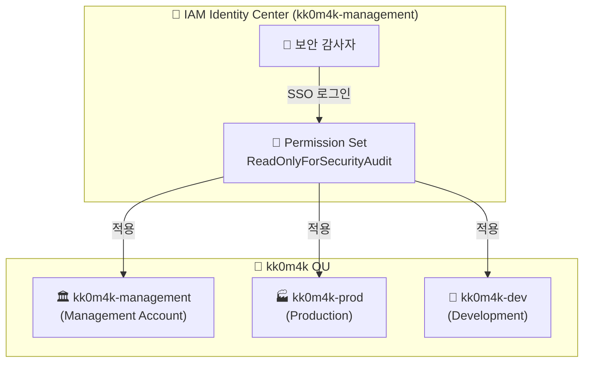
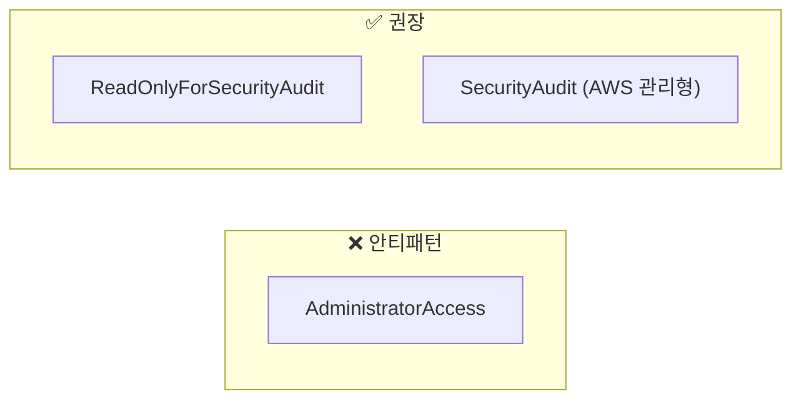

AWS Organizations를 사용하는 환경에서 여러 계정의 리소스에 접근하고, 운영 및 보안 감사를 수행하려면, **안전하고 효율적인 인증 방식**이 필요합니다. 사용자 단말 또는 운영 서버 콘솔환경에서 AWS SSO (IAM Identity Center)를 활용하여 Long-term Access Key 없이도 Multi-Account 환경에서 CLI를 통해 리소스를 접근하는 방법을 다룹니다.

## 🎯 CLI에서 AWS SSO Identity Center를 사용해야 하나?

### 🚫 Long-term Access Key의 위험성

전통적인 IAM User의 Access Key/Secret Key 방식은 사용자 단말에서 직접 Access Keys를 설정하고 관리해야 하므로 여러 보안 취약점을 가지고 있습니다:

| 위험 요소            | 설명                                      |
| -------------------- | ----------------------------------------- |
| 🔓 **유출 위험**     | 코드 저장소, 설정 파일 등에 노출되기 쉬움 |
| ⏰ **영구적 유효성** | 로테이션하지 않으면 영원히 사용 가능      |
| 🎭 **추적 어려움**   | 누가 언제 사용했는지 파악이 어려움        |
| 🔑 **관리 부담**     | 여러 계정에서 각각 키를 관리해야 함       |

### ✅ AWS SSO Identity Center의 장점

AWS SSO (IAM Identity Center)는 이러한 문제를 해결하는 현대적인 인증 방식입니다:

```
┌─────────────────────────────────────────────────────────────────────────┐
│                    AWS SSO Identity Center 인증 흐름                      │
├─────────────────────────────────────────────────────────────────────────┤
│                                                                          │
│  👤 사용자 → 🌐 SSO Portal → 🔐 MFA 인증 → 🎫 임시 토큰 발급              │
│                                                                          │
│  특징:                                                                   │
│  ✅ 최대 12시간 유효 (기본 1시간)                                         │
│  ✅ 자동 갱신 가능                                                        │
│  ✅ CloudTrail 완벽 추적                                                  │
│  ✅ 중앙 집중식 권한 관리                                                  │
│  ✅ MFA 강제 적용 가능                                                    │
│                                                                          │
└─────────────────────────────────────────────────────────────────────────┘
```

## 🔄 SSO Token vs AssumeRole 비교

### 📊 인증 방식 비교표

| 구분              | Long-term Access Key | AssumeRole         | **AWS SSO Token**  |
| ----------------- | -------------------- | ------------------ | ------------------ |
| **자격증명 유형** | 영구적               | 임시 (최대 12시간) | 임시 (최대 12시간) |
| **MFA 지원**      | 별도 설정 필요       | 지원               | ✅ 기본 통합       |
| **중앙 관리**     | ❌                   | △ (Role 관리 필요) | ✅ Identity Center |
| **Multi-Account** | 계정별 키 필요       | Role Chaining 필요 | ✅ Permission Set  |
| **보안 수준**     | 낮음                 | 높음               | **매우 높음**      |
| **관리 편의성**   | 낮음                 | 중간               | **높음**           |

### 🔐 AWS SSO의 핵심: Permission Set

Permission Set은 **IAM 정책의 묶음**으로, 한 번 정의하면 **여러 계정에 동시에 적용**할 수 있습니다.



## 🏗️ 실전 구성: kk0m4k OU 환경

### 📋 환경 가정

| 계정                  | Account ID   | 역할                                           |
| --------------------- | ------------ | ---------------------------------------------- |
| **kk0m4k-management** | 111111111111 | Management Account, IAM Identity Center 호스팅 |
| **kk0m4k-prod**       | 222222222222 | Production 워크로드                            |
| **kk0m4k-dev**        | 333333333333 | Development 워크로드                           |

### 📜 Permission Set 생성: ReadOnlyForSecurityAudit

AWS IAM Identity Center에서 다음과 같은 Permission Set을 생성합니다:

```json
{
  "Version": "2012-10-17",
  "Statement": [
    {
      "Sid": "SecurityAuditReadOnly",
      "Effect": "Allow",
      "Action": [
        "ec2:Describe*",
        "rds:Describe*",
        "s3:GetBucket*",
        "s3:ListBucket*",
        "eks:Describe*",
        "eks:List*",
        "lambda:List*",
        "lambda:GetFunction*",
        "kms:Describe*",
        "kms:List*",
        "guardduty:Get*",
        "guardduty:List*",
        "iam:Get*",
        "iam:List*",
        "organizations:Describe*",
        "organizations:List*",
        "sts:GetCallerIdentity"
      ],
      "Resource": "*"
    }
  ]
}
```

**Permission Set 설정:**

- **세션 지속 시간**: 8시간 (보안 감사 작업에 충분한 시간)
- **Relay State**: 없음 (CLI 사용 목적)
- **적용 대상 계정**: kk0m4k-management, kk0m4k-prod, kk0m4k-dev 모두 적용

## ⚙️ AWS CLI 설정

### 📁 ~/.aws/config 설정

```ini
# ===================================
# SSO Session 설정 (공통)
# ===================================
[sso-session kk0m4k-sso]
sso_start_url = https://kk0m4k.awsapps.com/start
sso_region = ap-northeast-2
sso_registration_scopes = sso:account:access

# ===================================
# Management Account Profile
# ===================================
[profile kk0m4k-management]
sso_session = kk0m4k-sso
sso_account_id = 111111111111
sso_role_name = ReadOnlyForSecurityAudit
region = ap-northeast-2
output = json
```

### 🔑 SSO 로그인

```bash
# SSO 세션으로 로그인 (브라우저가 열림)
aws sso login --sso-session kk0m4k-sso

# 로그인 확인
aws sts get-caller-identity --profile kk0m4k-management
```

로그인하면 브라우저에서 인증을 완료하고, **토큰이 자동으로 캐시**됩니다:

```
~/.aws/sso/cache/
└── xxxxxxxxxxxxxxxxxxxxxxxxxxxxxxx.json  # SSO 토큰 캐시
```

## 🐍 Python (boto3)으로 Multi-Account 리소스 수집

### 📦 전체 코드 구조

```python
#!/usr/bin/env python3
"""
AWS SSO Identity Center를 활용한 Multi-Account 보안 감사 스크립트

이 스크립트는 AWS SSO를 통해 인증하고,
OU 내 모든 계정의 주요 AWS 리소스를 수집합니다.
"""

import boto3
from botocore.exceptions import ClientError
import csv
from datetime import datetime
from typing import Dict, List, Any
import json


class MultiAccountSecurityAuditor:
    """Multi-Account 보안 감사 클래스"""

    # 수집 대상 리전 목록
    TARGET_REGIONS = ['ap-northeast-2', 'ap-northeast-1', 'us-east-1']

    def __init__(self, management_profile: str = 'kk0m4k-management',
                 permission_set_role: str = 'ReadOnlyForSecurityAudit'):
        """
        초기화

        Args:
            management_profile: Management Account의 AWS CLI 프로파일 이름
            permission_set_role: 각 계정에서 사용할 Permission Set Role 이름
        """
        self.management_profile = management_profile
        self.permission_set_role = permission_set_role
        self.results: List[Dict[str, Any]] = []

        # Management Account 세션 (Organizations API 호출용)
        self.management_session = boto3.Session(profile_name=self.management_profile)

    def get_all_accounts(self) -> List[Dict[str, str]]:
        """
        Organizations API를 통해 OU 내 모든 계정 목록 조회

        Management Account의 SSO 인증을 통해 Organizations API에 접근하여
        등록된 모든 활성 계정 목록을 동적으로 가져옵니다.

        Returns:
            [{'id': '111111111111', 'name': 'kk0m4k-management', 'status': 'ACTIVE'}, ...]
        """
        org_client = self.management_session.client('organizations')

        accounts = []
        paginator = org_client.get_paginator('list_accounts')

        for page in paginator.paginate():
            for account in page['Accounts']:
                if account['Status'] == 'ACTIVE':
                    accounts.append({
                        'id': account['Id'],
                        'name': account['Name'],
                        'email': account['Email'],
                        'status': account['Status']
                    })

        print(f"🔍 Organizations에서 발견된 활성 계정 수: {len(accounts)}")
        for acc in accounts:
            print(f"   📌 {acc['name']} ({acc['id']})")

        return accounts

    def get_session_for_account(self, account_id: str, account_name: str) -> boto3.Session:
        """
        STS AssumeRole을 통해 특정 계정에 대한 boto3 세션 생성

        Management Account의 SSO 자격증명을 사용하여 대상 계정의
        Permission Set Role로 AssumeRole 수행

        Args:
            account_id: AWS 계정 ID
            account_name: AWS 계정 이름 (로깅용)

        Returns:
            해당 계정에 대한 boto3.Session (임시 자격증명 사용)
        """
        # SSO Permission Set이 생성한 Role ARN
        # 형식: arn:aws:iam::{account_id}:role/aws-reserved/sso.amazonaws.com/{region}/AWSReservedSSO_{permission_set_name}_{random_suffix}
        # 간단한 형식으로 가정 (실제 환경에 맞게 수정 필요)
        role_arn = f"arn:aws:iam::{account_id}:role/{self.permission_set_role}"

        print(f"   🔐 AssumeRole 수행: {account_name} ({account_id})")

        try:
            # Management 세션의 STS 클라이언트로 AssumeRole
            sts_client = self.management_session.client('sts')

            assumed_role = sts_client.assume_role(
                RoleArn=role_arn,
                RoleSessionName=f"security-audit-{account_id}",
                DurationSeconds=3600  # 1시간
            )

            credentials = assumed_role['Credentials']

            # 임시 자격증명으로 새 세션 생성
            return boto3.Session(
                aws_access_key_id=credentials['AccessKeyId'],
                aws_secret_access_key=credentials['SecretAccessKey'],
                aws_session_token=credentials['SessionToken']
            )

        except ClientError as e:
            print(f"   ⚠️ AssumeRole 실패 ({account_name}): {e}")
            raise

    def collect_ec2_instances(self, session: boto3.Session,
                              account_id: str, account_name: str) -> None:
        """EC2 인스턴스 정보 수집"""
        for region in self.TARGET_REGIONS:
            try:
                ec2 = session.client('ec2', region_name=region)
                paginator = ec2.get_paginator('describe_instances')

                for page in paginator.paginate():
                    for reservation in page['Reservations']:
                        for instance in reservation['Instances']:
                            name_tag = next(
                                (t['Value'] for t in instance.get('Tags', [])
                                 if t['Key'] == 'Name'),
                                'N/A'
                            )
                            self.results.append({
                                'resource_type': 'EC2',
                                'account_id': account_id,
                                'account_name': account_name,
                                'region': region,
                                'resource_id': instance['InstanceId'],
                                'resource_name': name_tag,
                                'state': instance['State']['Name'],
                                'details': json.dumps({
                                    'instance_type': instance['InstanceType'],
                                    'private_ip': instance.get('PrivateIpAddress'),
                                    'public_ip': instance.get('PublicIpAddress'),
                                    'vpc_id': instance.get('VpcId')
                                })
                            })

            except ClientError as e:
                print(f"⚠️ EC2 수집 실패 ({account_name}/{region}): {e}")

    def collect_rds_instances(self, session: boto3.Session,
                               account_id: str, account_name: str) -> None:
        """RDS 인스턴스 및 Aurora 클러스터 정보 수집"""
        for region in self.TARGET_REGIONS:
            try:
                rds = session.client('rds', region_name=region)

                # DB 인스턴스
                paginator = rds.get_paginator('describe_db_instances')
                for page in paginator.paginate():
                    for db in page['DBInstances']:
                        self.results.append({
                            'resource_type': 'RDS',
                            'account_id': account_id,
                            'account_name': account_name,
                            'region': region,
                            'resource_id': db['DBInstanceIdentifier'],
                            'resource_name': db['DBInstanceIdentifier'],
                            'state': db['DBInstanceStatus'],
                            'details': json.dumps({
                                'engine': db['Engine'],
                                'engine_version': db['EngineVersion'],
                                'instance_class': db['DBInstanceClass'],
                                'multi_az': db['MultiAZ'],
                                'encrypted': db.get('StorageEncrypted', False)
                            })
                        })

                # Aurora 클러스터
                cluster_paginator = rds.get_paginator('describe_db_clusters')
                for page in cluster_paginator.paginate():
                    for cluster in page['DBClusters']:
                        self.results.append({
                            'resource_type': 'Aurora',
                            'account_id': account_id,
                            'account_name': account_name,
                            'region': region,
                            'resource_id': cluster['DBClusterIdentifier'],
                            'resource_name': cluster['DBClusterIdentifier'],
                            'state': cluster['Status'],
                            'details': json.dumps({
                                'engine': cluster['Engine'],
                                'engine_version': cluster['EngineVersion'],
                                'multi_az': cluster.get('MultiAZ', False),
                                'encrypted': cluster.get('StorageEncrypted', False)
                            })
                        })

            except ClientError as e:
                print(f"⚠️ RDS 수집 실패 ({account_name}/{region}): {e}")

    def collect_s3_buckets(self, session: boto3.Session,
                           account_id: str, account_name: str) -> None:
        """S3 버킷 정보 수집 (글로벌 리소스)"""
        try:
            s3 = session.client('s3', region_name='ap-northeast-2')
            response = s3.list_buckets()

            for bucket in response['Buckets']:
                bucket_name = bucket['Name']

                # 버킷 위치 확인
                try:
                    location = s3.get_bucket_location(Bucket=bucket_name)
                    region = location.get('LocationConstraint') or 'us-east-1'
                except ClientError:
                    region = 'unknown'

                # 암호화 설정 확인
                try:
                    encryption = s3.get_bucket_encryption(Bucket=bucket_name)
                    encrypted = True
                except ClientError:
                    encrypted = False

                # 퍼블릭 액세스 블록 확인
                try:
                    public_access = s3.get_public_access_block(Bucket=bucket_name)
                    is_public_blocked = all([
                        public_access['PublicAccessBlockConfiguration'].get('BlockPublicAcls', False),
                        public_access['PublicAccessBlockConfiguration'].get('BlockPublicPolicy', False)
                    ])
                except ClientError:
                    is_public_blocked = False

                self.results.append({
                    'resource_type': 'S3',
                    'account_id': account_id,
                    'account_name': account_name,
                    'region': region,
                    'resource_id': bucket_name,
                    'resource_name': bucket_name,
                    'state': 'available',
                    'details': json.dumps({
                        'creation_date': bucket['CreationDate'].isoformat(),
                        'encrypted': encrypted,
                        'public_access_blocked': is_public_blocked
                    })
                })

        except ClientError as e:
            print(f"⚠️ S3 수집 실패 ({account_name}): {e}")

    def collect_eks_clusters(self, session: boto3.Session,
                             account_id: str, account_name: str) -> None:
        """EKS 클러스터 정보 수집"""
        for region in self.TARGET_REGIONS:
            try:
                eks = session.client('eks', region_name=region)
                clusters = eks.list_clusters()['clusters']

                for cluster_name in clusters:
                    cluster = eks.describe_cluster(name=cluster_name)['cluster']
                    self.results.append({
                        'resource_type': 'EKS',
                        'account_id': account_id,
                        'account_name': account_name,
                        'region': region,
                        'resource_id': cluster['arn'],
                        'resource_name': cluster_name,
                        'state': cluster['status'],
                        'details': json.dumps({
                            'version': cluster['version'],
                            'endpoint_public': cluster['resourcesVpcConfig'].get('endpointPublicAccess'),
                            'endpoint_private': cluster['resourcesVpcConfig'].get('endpointPrivateAccess'),
                            'encryption_enabled': bool(cluster.get('encryptionConfig'))
                        })
                    })

            except ClientError as e:
                if 'AccessDeniedException' not in str(e):
                    print(f"⚠️ EKS 수집 실패 ({account_name}/{region}): {e}")

    def collect_lambda_functions(self, session: boto3.Session,
                                  account_id: str, account_name: str) -> None:
        """Lambda 함수 정보 수집"""
        for region in self.TARGET_REGIONS:
            try:
                lambda_client = session.client('lambda', region_name=region)
                paginator = lambda_client.get_paginator('list_functions')

                for page in paginator.paginate():
                    for func in page['Functions']:
                        self.results.append({
                            'resource_type': 'Lambda',
                            'account_id': account_id,
                            'account_name': account_name,
                            'region': region,
                            'resource_id': func['FunctionArn'],
                            'resource_name': func['FunctionName'],
                            'state': func.get('State', 'Active'),
                            'details': json.dumps({
                                'runtime': func.get('Runtime', 'N/A'),
                                'memory': func['MemorySize'],
                                'timeout': func['Timeout'],
                                'last_modified': func['LastModified']
                            })
                        })

            except ClientError as e:
                print(f"⚠️ Lambda 수집 실패 ({account_name}/{region}): {e}")

    def collect_kms_keys(self, session: boto3.Session,
                         account_id: str, account_name: str) -> None:
        """KMS 키 정보 수집"""
        for region in self.TARGET_REGIONS:
            try:
                kms = session.client('kms', region_name=region)
                paginator = kms.get_paginator('list_keys')

                for page in paginator.paginate():
                    for key in page['Keys']:
                        try:
                            key_detail = kms.describe_key(KeyId=key['KeyId'])['KeyMetadata']

                            # AWS 관리형 키는 제외 (선택적)
                            if key_detail.get('KeyManager') == 'AWS':
                                continue

                            self.results.append({
                                'resource_type': 'KMS',
                                'account_id': account_id,
                                'account_name': account_name,
                                'region': region,
                                'resource_id': key['KeyId'],
                                'resource_name': key_detail.get('Description', 'N/A'),
                                'state': key_detail['KeyState'],
                                'details': json.dumps({
                                    'key_usage': key_detail.get('KeyUsage'),
                                    'key_spec': key_detail.get('KeySpec'),
                                    'creation_date': key_detail['CreationDate'].isoformat(),
                                    'rotation_enabled': key_detail.get('RotationEnabled', False)
                                })
                            })
                        except ClientError:
                            continue

            except ClientError as e:
                print(f"⚠️ KMS 수집 실패 ({account_name}/{region}): {e}")

    def collect_guardduty_detectors(self, session: boto3.Session,
                                     account_id: str, account_name: str) -> None:
        """GuardDuty 탐지기 정보 수집"""
        for region in self.TARGET_REGIONS:
            try:
                gd = session.client('guardduty', region_name=region)
                detectors = gd.list_detectors()['DetectorIds']

                for detector_id in detectors:
                    detector = gd.get_detector(DetectorId=detector_id)

                    self.results.append({
                        'resource_type': 'GuardDuty',
                        'account_id': account_id,
                        'account_name': account_name,
                        'region': region,
                        'resource_id': detector_id,
                        'resource_name': f'GuardDuty-{detector_id[:8]}',
                        'state': detector['Status'],
                        'details': json.dumps({
                            'finding_publishing_frequency': detector.get('FindingPublishingFrequency'),
                            'features': detector.get('Features', [])
                        })
                    })

            except ClientError as e:
                if 'AccessDeniedException' not in str(e):
                    print(f"⚠️ GuardDuty 수집 실패 ({account_name}/{region}): {e}")

    def run_audit(self) -> None:
        """전체 보안 감사 실행"""
        print("=" * 60)
        print("🔐 AWS Multi-Account 보안 감사 시작")
        print("=" * 60)

        # 모든 계정 목록 조회
        accounts = self.get_all_accounts()

        for account in accounts:
            account_id = account['id']
            account_name = account['name']

            print(f"\n📊 계정 감사 중: {account_name} ({account_id})")
            print("-" * 40)

            try:
                session = self.get_session_for_account(account_id, account_name)

                # 각 리소스 유형별 수집
                print("   🖥️  EC2 인스턴스 수집 중...")
                self.collect_ec2_instances(session, account_id, account_name)

                print("   🗄️  RDS 인스턴스 수집 중...")
                self.collect_rds_instances(session, account_id, account_name)

                print("   🪣  S3 버킷 수집 중...")
                self.collect_s3_buckets(session, account_id, account_name)

                print("   ☸️  EKS 클러스터 수집 중...")
                self.collect_eks_clusters(session, account_id, account_name)

                print("   ⚡  Lambda 함수 수집 중...")
                self.collect_lambda_functions(session, account_id, account_name)

                print("   🔑  KMS 키 수집 중...")
                self.collect_kms_keys(session, account_id, account_name)

                print("   🛡️  GuardDuty 탐지기 수집 중...")
                self.collect_guardduty_detectors(session, account_id, account_name)

            except Exception as e:
                print(f"   ❌ 계정 접근 실패: {e}")
                continue

        self.export_to_csv()

    def export_to_csv(self) -> None:
        """결과를 CSV 파일로 저장"""
        timestamp = datetime.now().strftime('%Y%m%d_%H%M%S')
        filename = f'security_audit_{timestamp}.csv'

        if not self.results:
            print("\n⚠️ 수집된 데이터가 없습니다.")
            return

        fieldnames = [
            'resource_type', 'account_id', 'account_name',
            'region', 'resource_id', 'resource_name',
            'state', 'details'
        ]

        with open(filename, 'w', newline='', encoding='utf-8') as f:
            writer = csv.DictWriter(f, fieldnames=fieldnames)
            writer.writeheader()
            writer.writerows(self.results)

        print("\n" + "=" * 60)
        print(f"✅ 감사 완료! 총 {len(self.results)}개 리소스 수집")
        print(f"📁 결과 저장: {filename}")
        print("=" * 60)


if __name__ == '__main__':
    auditor = MultiAccountSecurityAuditor(
        management_profile='kk0m4k-management'
    )
    auditor.run_audit()
```

### 🖥️ 실행 결과 예시

```bash
$ python security_audit.py

============================================================
🔐 AWS Multi-Account 보안 감사 시작
============================================================
🔍 발견된 활성 계정 수: 3
   📌 kk0m4k-management (111111111111)
   📌 kk0m4k-prod (222222222222)
   📌 kk0m4k-dev (333333333333)

📊 계정 감사 중: kk0m4k-management (111111111111)
----------------------------------------
   🖥️  EC2 인스턴스 수집 중...
   🗄️  RDS 인스턴스 수집 중...
   🪣  S3 버킷 수집 중...
   ☸️  EKS 클러스터 수집 중...
   ⚡  Lambda 함수 수집 중...
   🔑  KMS 키 수집 중...
   🛡️  GuardDuty 탐지기 수집 중...

📊 계정 감사 중: kk0m4k-prod (222222222222)
----------------------------------------
   🖥️  EC2 인스턴스 수집 중...
   ...

============================================================
✅ 감사 완료! 총 247개 리소스 수집
📁 결과 저장: security_audit_20260107_230000.csv
============================================================
```

## ⚠️ AWS SSO의 한계: 사용자 개입 필수

AWS SSO (Identity Center)는 **대화형(interactive) 인증**을 전제로 설계되어 있어, **배치 작업에는 적합하지 않습니다**.

### 🔄 자동화 시나리오별 권장 인증 방식

```
┌──────────────────────────────────────────────────────────────────────────┐
│                    시나리오별 인증 방식 권장                               │
├──────────────────────────────────────────────────────────────────────────┤
│                                                                          │
│  👤 사용자 단말 (대화형)          → AWS SSO (Identity Center) ✅          │
│                                                                          │
│  🖥️ EC2/ECS/Lambda (AWS 내부)   → IAM Instance Profile / Role ✅        │
│                                                                          │
│  🏢 On-premise 서버 (배치)       → IAM Role + AssumeRole ✅              │
│                                    (Service Account 방식)                │
│                                                                          │
│  🔄 CI/CD (GitHub Actions 등)   → OIDC Federation ✅                     │
│                                                                          │
└──────────────────────────────────────────────────────────────────────────┘
```

### 📋 배치 스크립트를 위한 권장 패턴

| 실행 환경                 | 권장 방식                    | 설명                                    |
| ------------------------- | ---------------------------- | --------------------------------------- |
| **AWS 내부 (EC2/Lambda)** | Instance Profile             | 인스턴스에 IAM Role 연결, 자동 자격증명 |
| **On-premise**            | Service Account + AssumeRole | 제한된 권한의 IAM User로 AssumeRole     |
| **CI/CD**                 | OIDC Federation              | GitHub/GitLab 등과 IAM 연동             |

> 💡 **요약**: 사용자가 직접 실행하는 경우 → SSO, 자동화/배치 작업 → IAM Role + AssumeRole

### 🏢 On-premise에서 AssumeRole 사용 방법

On-premise 서버에서 AWS 리소스에 접근하려면, **초기 자격증명(Bootstrap Credentials)**이 필요합니다. 이것이 바로 SSO와의 차이점입니다.

#### 🔄 동작 흐름

```
┌─────────────────────────────────────────────────────────────────────────────┐
│                     On-premise AssumeRole 인증 흐름                          │
├─────────────────────────────────────────────────────────────────────────────┤
│                                                                              │
│  📁 ~/.aws/credentials                                                       │
│  ┌─────────────────────────────────────────┐                                 │
│  │ [service-account]                       │                                 │
│  │ aws_access_key_id = AKIA...             │  ← 최소 권한 IAM User            │
│  │ aws_secret_access_key = xxxxx           │    (sts:AssumeRole만 허용)       │
│  └─────────────────────────────────────────┘                                 │
│                          │                                                   │
│                          ▼                                                   │
│  ┌─────────────────────────────────────────┐                                 │
│  │  1️⃣ STS AssumeRole 호출                  │                                 │
│  │     RoleArn: arn:aws:iam::111111:role/  │                                 │
│  │              SecurityAuditRole          │                                 │
│  └─────────────────────────────────────────┘                                 │
│                          │                                                   │
│                          ▼                                                   │
│  ┌─────────────────────────────────────────┐                                 │
│  │  2️⃣ 임시 자격증명 수신                    │                                 │
│  │     AccessKeyId (임시)                   │                                 │
│  │     SecretAccessKey (임시)               │                                 │
│  │     SessionToken                        │                                 │
│  │     Expiration: 1시간 후                 │                                 │
│  └─────────────────────────────────────────┘                                 │
│                          │                                                   │
│                          ▼                                                   │
│  ┌─────────────────────────────────────────┐                                 │
│  │  3️⃣ 임시 자격증명으로 AWS 리소스 접근      │                                 │
│  │     ec2:Describe*, rds:Describe* 등     │                                 │
│  └─────────────────────────────────────────┘                                 │
│                                                                              │
└─────────────────────────────────────────────────────────────────────────────┘
```

#### 📋 구성 요소

**1️⃣ Service Account용 IAM User (최소 권한)**

```json
{
  "Version": "2012-10-17",
  "Statement": [
    {
      "Effect": "Allow",
      "Action": "sts:AssumeRole",
      "Resource": [
        "arn:aws:iam::111111111111:role/SecurityAuditRole",
        "arn:aws:iam::222222222222:role/SecurityAuditRole",
        "arn:aws:iam::333333333333:role/SecurityAuditRole"
      ]
    }
  ]
}
```

> ⚠️ 이 IAM User는 **sts:AssumeRole 권한만** 가집니다. 직접 EC2, RDS 등에 접근 불가!

**2️⃣ 대상 계정의 IAM Role (SecurityAuditRole)**

Trust Policy (누가 이 Role을 Assume할 수 있는가):

```json
{
  "Version": "2012-10-17",
  "Statement": [
    {
      "Effect": "Allow",
      "Principal": {
        "AWS": "arn:aws:iam::111111111111:user/batch-service-account"
      },
      "Action": "sts:AssumeRole",
      "Condition": {
        "StringEquals": {
          "sts:ExternalId": "unique-external-id-12345"
        }
      }
    }
  ]
}
```

Permission Policy (이 Role이 할 수 있는 것):

```json
{
  "Version": "2012-10-17",
  "Statement": [
    {
      "Effect": "Allow",
      "Action": ["ec2:Describe*", "rds:Describe*", "s3:List*"],
      "Resource": "*"
    }
  ]
}
```

#### 🐍 Python 코드 예시

```python
import boto3

# 1️⃣ Service Account 자격증명으로 STS 클라이언트 생성
sts_client = boto3.client(
    'sts',
    aws_access_key_id='AKIA...',      # Service Account
    aws_secret_access_key='xxxxx'
)

# 2️⃣ 대상 계정의 Role로 AssumeRole
assumed_role = sts_client.assume_role(
    RoleArn='arn:aws:iam::222222222222:role/SecurityAuditRole',
    RoleSessionName='batch-audit-session',
    ExternalId='unique-external-id-12345',  # 추가 보안
    DurationSeconds=3600  # 1시간
)

# 3️⃣ 임시 자격증명 추출
credentials = assumed_role['Credentials']

# 4️⃣ 임시 자격증명으로 EC2 클라이언트 생성
ec2_client = boto3.client(
    'ec2',
    region_name='ap-northeast-2',
    aws_access_key_id=credentials['AccessKeyId'],
    aws_secret_access_key=credentials['SecretAccessKey'],
    aws_session_token=credentials['SessionToken']
)

# 5️⃣ EC2 리소스 조회
instances = ec2_client.describe_instances()
```

#### 🔐 보안 포인트

| 항목                    | 설명                                                |
| ----------------------- | --------------------------------------------------- |
| **최소 권한 원칙**      | Service Account는 `sts:AssumeRole`만 가능           |
| **External ID**         | Cross-account AssumeRole 시 confused deputy 방지    |
| **Role Chaining**       | 임시 자격증명으로 다시 AssumeRole 가능 (최대 1시간) |
| **Access Key 로테이션** | Service Account의 키는 정기적으로 로테이션 필요     |

#### 📊 SSO vs Service Account 비교

| 구분                | AWS SSO        | Service Account + AssumeRole |
| ------------------- | -------------- | ---------------------------- |
| **사용자 개입**     | 필수 (로그인)  | ❌ 불필요                    |
| **배치 작업**       | ❌ 부적합      | ✅ 적합                      |
| **Access Key 저장** | ❌ 없음        | ⚠️ 필요 (최소 권한)          |
| **MFA**             | ✅ 기본 지원   | 선택적                       |
| **권한 관리**       | Permission Set | IAM Role                     |

> 🔑 **결론**: On-premise 배치에서는 **최소 권한의 Service Account + AssumeRole** 패턴을 사용하세요. Access Key가 저장되지만, 그 키는 **sts:AssumeRole만 가능**하므로 유출되어도 직접적인 리소스 접근은 불가능합니다.

## 🔒 보안 모범 사례 (Best Practices)

### 1. 🎫 최소 권한 원칙 적용



### 2. 📋 CloudTrail 감사 로그 확인

모든 API 호출은 CloudTrail에 기록됩니다:

```json
{
  "eventSource": "sts.amazonaws.com",
  "eventName": "AssumeRoleWithSAML",
  "userIdentity": {
    "type": "SAMLUser",
    "userName": "security-auditor@example.com",
    "identityProvider": "arn:aws:iam::111111111111:saml-provider/AWSSSO"
  },
  "requestParameters": {
    "roleArn": "arn:aws:iam::222222222222:role/aws-reserved/sso.amazonaws.com/ap-northeast-2/AWSReservedSSO_ReadOnlyForSecurityAudit_abc123"
  }
}
```

### 3. 🔐 세션 시간 제한

```yaml
# Permission Set 설정에서
Session Duration: PT8H # 최대 8시간
```

### 4. 🚨 이상 행위 탐지

GuardDuty와 연계하여 비정상적인 API 호출 패턴을 탐지하세요:

- 평소와 다른 시간대의 접근
- 비정상적으로 많은 API 호출
- 처음 접근하는 리전

## 📊 요약: SSO vs Long-term Key

```
┌──────────────────────────────────────────────────────────────────────┐
│                    인증 방식 최종 비교                                  │
├──────────────────────────────────────────────────────────────────────┤
│                                                                       │
│  Long-term Access Key:                                                │
│  ❌ 영구 자격증명 → 유출 시 위험                                        │
│  ❌ 수동 로테이션 필요                                                  │
│  ❌ 계정별 별도 관리                                                    │
│                                                                       │
│  AWS SSO (Identity Center):                                           │
│  ✅ 임시 토큰 (자동 만료)                                               │
│  ✅ MFA 통합                                                           │
│  ✅ 중앙 집중 관리                                                      │
│  ✅ CloudTrail 완벽 추적                                                │
│  ✅ Permission Set으로 Multi-Account 일괄 적용                          │
│                                                                       │
│  🏆 결론: Multi-Account 환경에서는 AWS SSO가 압도적으로 안전하고 편리    │
│                                                                       │
└──────────────────────────────────────────────────────────────────────┘
```

## 🎯 마무리

AWS SSO (IAM Identity Center)를 활용한 Multi-Account 보안 감사 방식은:

1. **🔐 보안성**: Long-term Access Key 없이 임시 토큰으로 안전하게 인증
2. **🎛️ 관리 편의성**: Permission Set 하나로 여러 계정에 동일 권한 적용
3. **📝 감사 추적**: 모든 접근이 CloudTrail에 상세히 기록
4. **⚡ 자동화 용이**: boto3와 AWS CLI가 SSO 토큰을 자동으로 갱신

보안 감사, 리소스 인벤토리 관리, 컴플라이언스 점검 등 다양한 용도로 활용할 수 있습니다.
특히 **금융권**처럼 엄격한 보안 요구사항이 있는 환경에서 Long-term Access Key를 제거하고 SSO 기반 인증으로 전환하는 것을 **강력히 권장**합니다. 🚀
