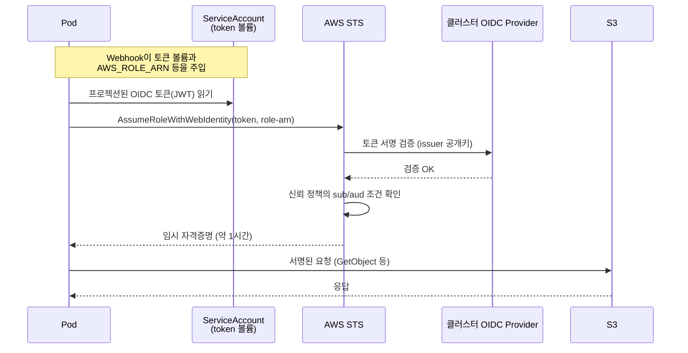
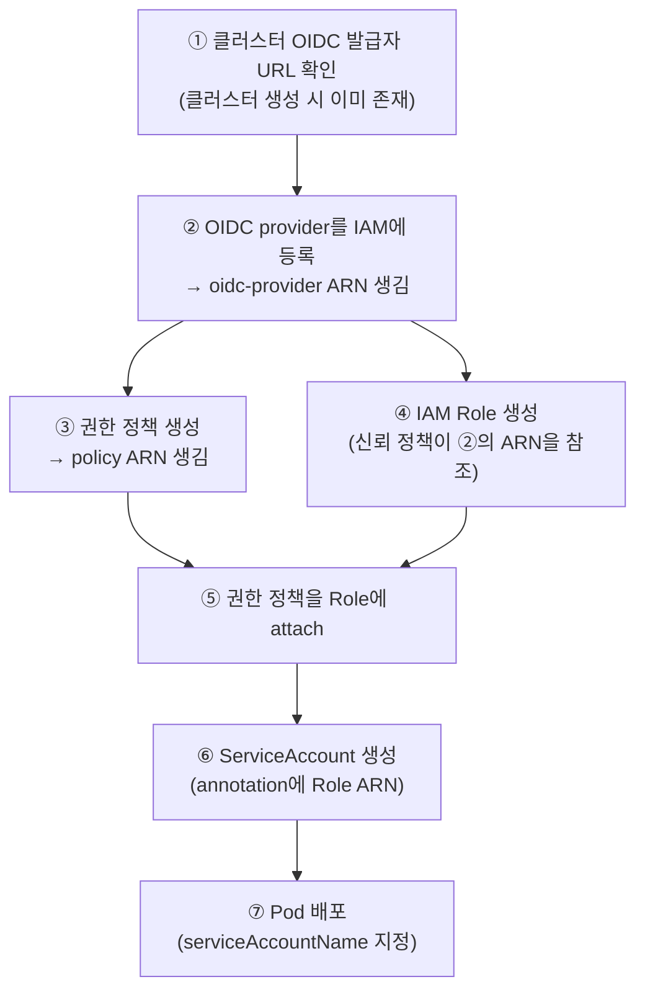
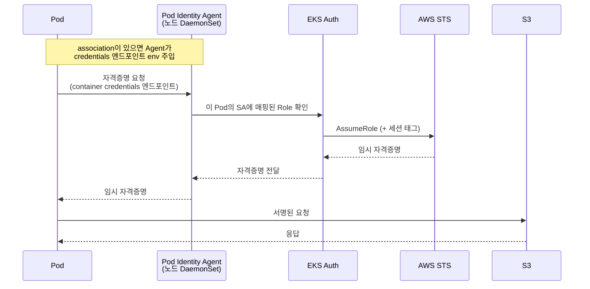
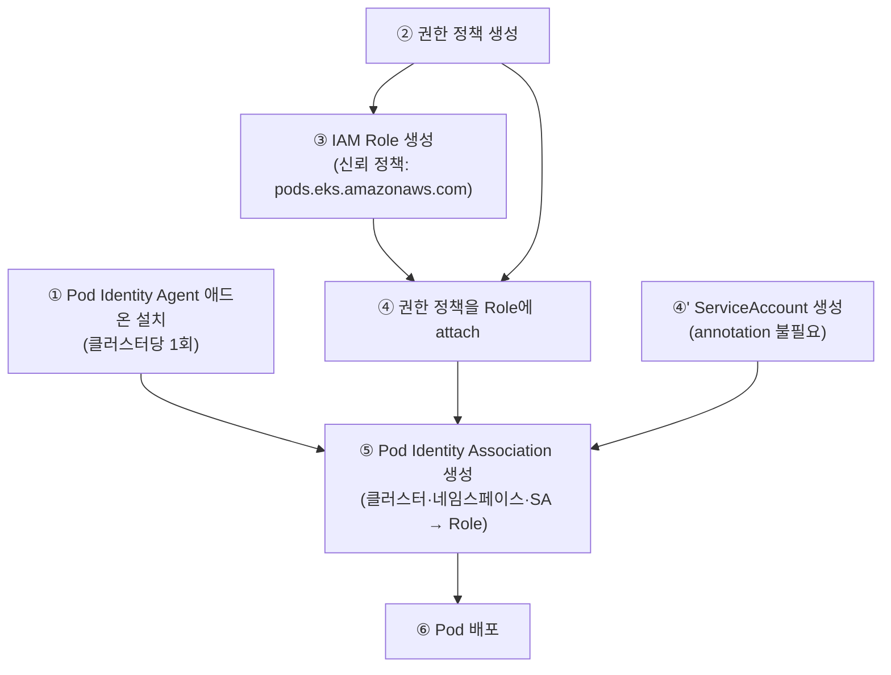

EKS에서 돌아가는 Pod가 S3 버킷을 읽거나 MSK에 붙거나 DynamoDB를 조회하려면 결국 AWS API 요청에 서명할 자격증명이 필요하다. 예전에는 노드에 붙은 Instance Profile을 그대로 쓰거나 Access Key를 Secret에 박아 넣는 식으로 해결했는데, 전자는 같은 노드의 모든 Pod가 동일한 권한을 공유하게 되고 후자는 키가 새면 회수하기 전까지 그대로 뚫린다. 둘 다 최소 권한 원칙과는 거리가 멀다.

지금 EKS에서 권장하는 방식은 두 가지다. **IRSA(IAM Roles for Service Accounts)**와 **EKS Pod Identity**. 둘 다 "Pod가 장기 키를 들고 있지 않고, 자기 ServiceAccount에 매핑된 IAM Role의 임시 자격증명을 필요할 때 받아 쓴다"는 목표는 같다. 다른 건 그걸 어떻게 검증하고 발급하느냐다.

이 문서는 두 방식을 각각 뜯어보고, S3와 MSK를 예로 실제 설정이 어떻게 되는지 정리한다.

## 먼저 짚고 넘어갈 것: ServiceAccount는 IAM 계정이 아니다

헷갈리기 쉬운 지점이라 먼저 정리한다.

- **Kubernetes ServiceAccount(SA)** 는 클러스터 안에서만 의미 있는 신원이다. `kubectl`로 만들고 네임스페이스 안에 산다. AWS는 이 존재를 알지 못한다.
- **IAM Role** 은 AWS 쪽 신원이다. 여기에 S3, MSK 같은 리소스에 대한 권한(정책)이 붙는다.

IRSA든 Pod Identity든 하는 일은 결국 이 별개의 두 신원을 이어 붙이는 것이다. "이 SA를 쓰는 Pod는 이 IAM Role의 자격증명을 받을 자격이 있다"는 매핑을 만드는 게 전부다. SA 자체가 IAM 계정으로 승격되는 게 아니다.

Pod가 SA를 집어 드는 건 spec의 한 줄이다.

```yaml
apiVersion: apps/v1
kind: Deployment
metadata:
  name: my-app
spec:
  template:
    spec:
      serviceAccountName: my-app-sa   # 이 Pod가 사용할 SA
      containers:
        - name: app
          image: my-app:1.0.0
```

지정하지 않으면 네임스페이스의 `default` SA가 붙는다. 즉 SA를 명시하지 않은 Pod에 권한을 주려다 실수하면 `default`에 권한이 붙어 그 네임스페이스 전체가 영향을 받는다. 그래서 워크로드마다 전용 SA를 만드는 게 기본이다.

## IRSA (IAM Roles for Service Accounts)

2019년부터 있던 방식이다. 핵심은 클러스터가 발급하는 **OIDC 토큰**을 AWS STS가 신뢰하도록 만들어 두고, Pod가 그 토큰을 STS에 제출해 Role을 assume 하는 것이다.

### 구성 요소

1. **클러스터의 OIDC provider** — EKS 클러스터마다 OIDC 발급자(issuer) URL이 있고, 이걸 IAM에 OIDC identity provider로 등록해 둔다. 이게 IRSA의 신뢰 뿌리다.
2. **annotation이 붙은 ServiceAccount** — SA에 `eks.amazonaws.com/role-arn`으로 어떤 Role을 쓸지 적는다.
3. **Pod Identity Webhook** — EKS에 기본 내장된 mutating webhook. annotation이 붙은 SA를 쓰는 Pod가 생성되면 자동으로 프로젝션된 토큰 볼륨과 환경변수(`AWS_ROLE_ARN`, `AWS_WEB_IDENTITY_TOKEN_FILE`)를 주입한다.
4. **IAM Role의 신뢰 정책** — 어떤 OIDC provider의, 어떤 SA만 이 Role을 assume 할 수 있는지 조건으로 명시한다.

### 동작 흐름



토큰 검증은 클러스터의 OIDC provider가 뿌리이고, 실제 STS 호출은 Pod 안의 AWS SDK가 한다. SDK가 알아서 `AssumeRoleWithWebIdentity`를 부르고 자격증명을 캐시하며 만료 전에 갱신한다. 애플리케이션 코드는 평소처럼 SDK만 쓰면 되고 자격증명을 직접 다룰 필요가 없다.

### 설정 예시

OIDC provider 등록은 클러스터당 한 번만 한다. `eksctl`을 쓰면 이 과정과 Role 생성, 신뢰 정책 작성을 한 번에 처리해 준다.

```bash
# OIDC provider 등록 (클러스터당 1회)
eksctl utils associate-iam-oidc-provider \
  --cluster my-cluster --approve

# SA + IAM Role 생성 + 신뢰 정책 자동 작성
eksctl create iamserviceaccount \
  --cluster my-cluster \
  --namespace data \
  --name s3-reader-sa \
  --attach-policy-arn arn:aws:iam::123456789012:policy/s3-read-only \
  --approve
```

수동으로 할 경우 SA와 신뢰 정책은 이렇게 생긴다.

```yaml
apiVersion: v1
kind: ServiceAccount
metadata:
  name: s3-reader-sa
  namespace: data
  annotations:
    eks.amazonaws.com/role-arn: arn:aws:iam::123456789012:role/s3-reader-role
```

```json
{
  "Version": "2012-10-17",
  "Statement": [{
    "Effect": "Allow",
    "Principal": {
      "Federated": "arn:aws:iam::123456789012:oidc-provider/oidc.eks.ap-northeast-2.amazonaws.com/id/EXAMPLED539D4633E53DE1B71EXAMPLE"
    },
    "Action": "sts:AssumeRoleWithWebIdentity",
    "Condition": {
      "StringEquals": {
        "oidc.eks.ap-northeast-2.amazonaws.com/id/EXAMPLED539D4633E53DE1B71EXAMPLE:sub": "system:serviceaccount:data:s3-reader-sa",
        "oidc.eks.ap-northeast-2.amazonaws.com/id/EXAMPLED539D4633E53DE1B71EXAMPLE:aud": "sts.amazonaws.com"
      }
    }
  }]
}
```

`sub` 조건이 IRSA 보안의 핵심이다. `system:serviceaccount:<네임스페이스>:<SA이름>` 형식으로, 정확히 그 네임스페이스의 그 SA만 이 Role을 쓸 수 있게 묶는다. 이걸 대충 와일드카드로 열어두면 클러스터 안 아무 SA나 Role을 가져다 쓸 수 있게 되니 주의해야 한다.

### 설정 순서 — 왜 OIDC가 먼저인가

위 예시들은 조각조각이라 순서가 안 보인다. IRSA는 **의존 관계 때문에 만드는 순서가 정해져 있다.** 핵심은 하나다 — **IAM Role의 신뢰 정책이 OIDC provider의 ARN을 참조하기 때문에, OIDC provider가 먼저 IAM에 등록돼 있어야 한다.** OIDC provider 없이 신뢰 정책을 먼저 쓰면 `Federated` 값에 넣을 ARN 자체가 존재하지 않는다.

전체 순서를 의존 관계와 함께 정리하면 이렇다.



- **① → ②**: 클러스터를 만들면 OIDC 발급자 URL(`oidc.eks.<region>.amazonaws.com/id/...`)은 이미 생긴다. 하지만 그것만으로는 STS가 이 클러스터를 신뢰하지 않는다. `associate-iam-oidc-provider`로 IAM에 **OIDC identity provider로 등록**해야 비로소 `arn:aws:iam::<account>:oidc-provider/...` ARN이 만들어지고, 이 ARN이 신뢰 정책의 `Federated`에 들어간다. 이게 IRSA의 신뢰 뿌리다.
- **② → ④**: 그래서 OIDC provider 등록이 IAM Role 생성보다 먼저다. 순서를 뒤집으면 신뢰 정책의 `Federated` ARN이 실재하지 않아 `create-role`이 `MalformedPolicyDocument` / `Invalid principal`로 떨어진다.
- **③ 과 ④ 는 서로 독립**: 권한 정책 생성과 Role 생성은 순서가 상관없다(그림에서 갈라진 두 갈래). 다만 둘 다 있어야 **⑤ attach**가 가능하다. attach는 "policy ARN + role name" 둘을 다 요구하기 때문이다.
- **⑥ SA의 annotation**은 Role ARN을 가리키므로 Role(④)이 있어야 의미가 있다. 다만 SA를 먼저 만들어 둬도 에러는 안 난다 — annotation이 가리키는 Role이 없으면 Pod가 assume 시도할 때 런타임에서 `AccessDenied`가 날 뿐이다.

명령어로 옮기면 아래 순서 그대로다. 이 블록 하나가 앞의 흩어진 예시들을 실제 실행 순서로 이어 붙인 것이다.

```bash
# ① 클러스터의 OIDC 발급자 URL 확인 (등록 여부 점검용)
aws eks describe-cluster --name my-cluster \
  --query "cluster.identity.oidc.issuer" --output text
# → https://oidc.eks.ap-northeast-2.amazonaws.com/id/EXAMPLED539...

# ② OIDC provider를 IAM에 등록 (클러스터당 1회) — 이게 먼저다
eksctl utils associate-iam-oidc-provider \
  --cluster my-cluster --approve
# (수동이면: aws iam create-open-id-connect-provider ...)

# ③ 권한 정책 생성 → policy ARN
aws iam create-policy \
  --policy-name s3-read-only \
  --policy-document file://s3-read-only.json

# ④ Role 생성 — 신뢰 정책(trust.json)이 ②의 oidc-provider ARN을 참조한다
aws iam create-role \
  --role-name s3-reader-role \
  --assume-role-policy-document file://trust.json

# ⑤ 권한 정책을 Role에 attach
aws iam attach-role-policy \
  --role-name s3-reader-role \
  --policy-arn arn:aws:iam::123456789012:policy/s3-read-only

# ⑥ SA 생성 (annotation에 Role ARN) → ⑦ Pod 배포
kubectl apply -f serviceaccount.yaml
kubectl apply -f deployment.yaml
```

여기서 `trust.json`이 바로 앞에서 본 IRSA 신뢰 정책이고, `oidc-provider/oidc.eks...` ARN은 ②를 실행해야 존재한다. 그래서 **②를 건너뛰고 ④부터 하면 반드시 실패한다.** 이 하나만 기억하면 순서는 자연스럽게 따라온다.

> `eksctl create iamserviceaccount` 한 줄은 ③~⑥(권한 정책 등록·Role 생성·신뢰 정책 작성·attach·SA 생성)을 한꺼번에 처리해 준다. 대신 ②(OIDC provider 등록)는 여전히 선행돼 있어야 하고, `eksctl`은 그게 안 돼 있으면 친절히 에러로 알려준다.

### IRSA의 불편한 점

실무에서 걸리는 지점은 대체로 이렇다.

- 클러스터를 새로 만들 때마다 OIDC provider를 IAM에 등록해야 한다. 빠뜨리면 아무리 annotation을 잘 달아도 동작하지 않는다.
- OIDC issuer URL이 클러스터마다 다르기 때문에, 같은 워크로드를 여러 클러스터에 배포하면 Role의 신뢰 정책을 클러스터 수만큼 손봐야 한다. 하나의 Role을 여러 클러스터에서 재사용하려면 신뢰 정책에 조건을 여러 개 나열해야 한다.
- 신뢰 정책 문자열이 길고 오타에 취약하다. `sub` 값 하나 틀리면 조용히 `AccessDenied`가 난다.

## EKS Pod Identity

2023년 말에 나온 방식이다. IRSA의 운영 부담, 특히 클러스터별 OIDC 설정과 신뢰 정책 관리를 걷어내는 게 목적이다.

### 구성 요소

1. **EKS Pod Identity Agent** — 클러스터에 애드온으로 설치하는 DaemonSet. 각 노드에서 돌면서 Pod에 자격증명을 나눠준다.
2. **Pod Identity Association** — AWS API로 만드는 매핑. `(클러스터, 네임스페이스, SA) → IAM Role` 관계를 AWS 쪽에 등록한다. SA에 annotation을 달지 않는다.
3. **IAM Role의 신뢰 정책** — OIDC 대신 `pods.eks.amazonaws.com` 서비스를 신뢰하는 단순한 형태.

### 동작 흐름



Pod는 STS를 직접 부르지 않는다. 노드의 Agent가 링크로컬 주소로 자격증명 엔드포인트를 열어두고, SDK가 그쪽에서 자격증명을 받아 간다. 검증과 STS 호출은 EKS 서비스가 대신 처리한다.

### 설정 예시

```bash
# 1. Pod Identity Agent 애드온 설치 (클러스터당 1회)
aws eks create-addon \
  --cluster-name my-cluster \
  --addon-name eks-pod-identity-agent

# 2. SA와 Role을 매핑 (annotation 불필요)
aws eks create-pod-identity-association \
  --cluster-name my-cluster \
  --namespace data \
  --service-account s3-reader-sa \
  --role-arn arn:aws:iam::123456789012:role/s3-reader-role
```

SA는 특별할 게 없다.

```yaml
apiVersion: v1
kind: ServiceAccount
metadata:
  name: s3-reader-sa
  namespace: data
```

신뢰 정책도 짧다.

```json
{
  "Version": "2012-10-17",
  "Statement": [{
    "Effect": "Allow",
    "Principal": { "Service": "pods.eks.amazonaws.com" },
    "Action": ["sts:AssumeRole", "sts:TagSession"]
  }]
}
```

OIDC provider ARN도, 긴 `sub` 조건도 없다. 클러스터가 바뀌어도 이 신뢰 정책은 그대로다. 그래서 같은 Role을 여러 클러스터에서 재사용하기 쉽다 — 각 클러스터에서 association만 하나씩 만들면 된다.

`sts:TagSession`이 붙는 건 Pod Identity가 세션 태그를 자동으로 실어 주기 때문이다. 클러스터 이름, 네임스페이스, SA 이름 같은 값이 태그로 붙어서, IAM 정책에서 `aws:PrincipalTag/...` 조건으로 ABAC(태그 기반 접근 제어)를 걸 수 있다. IRSA에는 없던 기능이다.

### 설정 순서 — OIDC 의존이 없다

Pod Identity는 신뢰 정책이 특정 클러스터의 OIDC ARN을 참조하지 않는다(`pods.eks.amazonaws.com` 서비스만 신뢰). 그래서 **IAM Role을 클러스터와 무관하게 먼저 만들어 둘 수 있고**, 순서 의존이 IRSA보다 훨씬 느슨하다.



- **② → ③ → ④** (정책·Role·attach)는 IRSA와 똑같은 IAM 3단계지만, ③의 신뢰 정책이 OIDC ARN을 참조하지 않으므로 **애드온 설치(①)나 클러스터 존재 여부와 무관하게** 미리 만들어 둘 수 있다.
- **⑤ Association**이 실제로 "이 클러스터의 이 SA ↔ 이 Role"을 잇는 단계다. 이걸 만들려면 Role(③④)과 대상 SA가 있어야 하고, Agent 애드온(①)이 설치돼 있어야 자격증명이 실제로 주입된다.
- IRSA의 ②(OIDC provider 등록)에 대응하는 "클러스터 1회 준비"가 여기선 ①(Agent 애드온 설치)이다. 다만 이건 신뢰 정책과 얽히지 않아서, 순서를 틀려도 조용한 `AccessDenied`가 아니라 "association을 못 만든다"거나 "자격증명이 안 들어온다" 같은 눈에 띄는 형태로 드러난다.

명령어 순서는 이렇다.

```bash
# ① Agent 애드온 설치 (클러스터당 1회)
aws eks create-addon \
  --cluster-name my-cluster \
  --addon-name eks-pod-identity-agent

# ②~④ 정책 생성 → Role 생성(신뢰 정책은 pods.eks) → attach — IRSA와 동일
aws iam create-policy   --policy-name s3-read-only --policy-document file://s3-read-only.json
aws iam create-role     --role-name s3-reader-role --assume-role-policy-document file://trust-podidentity.json
aws iam attach-role-policy --role-name s3-reader-role \
  --policy-arn arn:aws:iam::123456789012:policy/s3-read-only

# ④' SA 생성 (annotation 없음)
kubectl apply -f serviceaccount.yaml

# ⑤ Association으로 SA ↔ Role 연결
aws eks create-pod-identity-association \
  --cluster-name my-cluster \
  --namespace data \
  --service-account s3-reader-sa \
  --role-arn arn:aws:iam::123456789012:role/s3-reader-role

# ⑥ Pod 배포
kubectl apply -f deployment.yaml
```

여기서 `trust-podidentity.json`은 앞의 `pods.eks.amazonaws.com`를 신뢰하는 짧은 신뢰 정책이다. IRSA의 `trust.json`과 달리 **어떤 클러스터에도 종속되지 않으므로**, 같은 파일을 여러 Role·여러 클러스터에서 그대로 재사용할 수 있다.

## 두 방식 비교

| 항목 | IRSA | Pod Identity |
|---|---|---|
| 등장 시기 | 2019 | 2023 말 |
| 매핑 표현 | SA의 annotation | AWS API association |
| 신뢰 뿌리 | 클러스터별 OIDC provider | EKS 서비스(`pods.eks.amazonaws.com`) |
| 신뢰 정책 | OIDC ARN + `sub`/`aud` 조건 (길다) | 서비스 principal 한 줄 |
| 클러스터 준비 | OIDC provider 등록 필요 | Agent 애드온 설치 |
| Role 재사용 | 클러스터마다 신뢰 정책 수정 | association만 추가하면 됨 |
| 세션 태그(ABAC) | 없음 | 지원 |
| EKS Fargate | 지원 | 미지원 (Agent가 DaemonSet이라) |
| 비-EKS(온프렘 등) | OIDC 방식이라 응용 가능 | EKS 전용 |
| 최소 버전 | 넓게 호환 | EKS 1.24+, 최신 SDK 필요 |

큰 그림에서 선택 기준은 이렇다.

- 새 EKS 클러스터, 새 워크로드라면 **Pod Identity**를 기본으로 둔다. 설정이 단순하고 오설정 여지가 적다.
- **Fargate**를 쓰거나, EKS가 아닌 쿠버네티스거나, 아주 오래된 버전이면 **IRSA**를 써야 한다.
- 이미 IRSA로 잘 돌고 있는 클러스터를 급히 갈아엎을 이유는 없다. 신규 워크로드부터 Pod Identity로 붙이면서 점진적으로 옮기는 편이 무난하다.

보안 관점에서 보면 Pod Identity 쪽이 신뢰 정책이 단순해서 사람이 실수로 권한을 과하게 여는 위험이 줄어든다. 다만 어느 쪽을 쓰든 "SA 하나에 최소 권한 Role 하나"라는 원칙은 동일하게 지켜야 한다. 방식이 편해졌다고 Role 하나에 권한을 몰아 담으면 의미가 없다.

## 예제 1: S3 버킷 접근 제어

`data-lake-prod`라는 버킷의 `raw/` 경로만 읽는 Pod를 만든다고 하자. 권한 정책은 두 방식이 완전히 동일하다. 달라지는 건 SA와 Role을 잇는 부분뿐이다.

먼저 공통으로 쓸 권한 정책. 특정 버킷의 특정 프리픽스로만 범위를 좁힌다.

```json
{
  "Version": "2012-10-17",
  "Statement": [
    {
      "Sid": "ListScopedToPrefix",
      "Effect": "Allow",
      "Action": "s3:ListBucket",
      "Resource": "arn:aws:s3:::data-lake-prod",
      "Condition": { "StringLike": { "s3:prefix": "raw/*" } }
    },
    {
      "Sid": "ReadObjectsUnderPrefix",
      "Effect": "Allow",
      "Action": "s3:GetObject",
      "Resource": "arn:aws:s3:::data-lake-prod/raw/*"
    }
  ]
}
```

`ListBucket`은 버킷 ARN에, `GetObject`는 객체 ARN(`/raw/*`)에 걸어야 한다. 이 둘을 헷갈리면 목록은 되는데 다운로드가 안 되거나 그 반대가 된다.

### 권한 정책을 Role에 붙이기

위 권한 정책 JSON에는 Role 이름도, 주체(principal)도 없다. 정책은 "무엇을 할 수 있나"만 담은 독립 객체이고, "어느 Role이 이 능력을 갖나"는 **attach**라는 별도 단계에서 정해진다. eksctl은 이 과정을 자동으로 처리해 주지만, 수동으로 하면 세 단계다.

```bash
# 1. 권한 정책을 관리형 정책으로 등록 → 정책 ARN이 생김
aws iam create-policy \
  --policy-name s3-read-only \
  --policy-document file://s3-read-only.json

# 2. Role 생성 (신뢰 정책을 함께 지정) — "누가 이 Role이 될 수 있나"
aws iam create-role \
  --role-name s3-reader-role \
  --assume-role-policy-document file://trust.json

# 3. 권한 정책을 Role에 붙임(attach) — "이 Role이 무엇을 할 수 있나"
aws iam attach-role-policy \
  --role-name s3-reader-role \
  --policy-arn arn:aws:iam::123456789012:policy/s3-read-only
```

`create-role`의 `--assume-role-policy-document`에 들어가는 게 앞서 본 신뢰 정책이다(IRSA면 OIDC provider, Pod Identity면 `pods.eks.amazonaws.com`). 그리고 `attach-role-policy`의 `--role-name`에서야 비로소 권한 정책과 Role이 이어진다. 즉 **정책·Role·주체가 각각 따로 정의되고, attach·신뢰 정책·SA 매핑이라는 연결고리로 묶이는** 구조다. 정책에 Role을 박아두지 않기 때문에 같은 `s3-read-only` 정책을 여러 Role에 재사용할 수 있다.

앞서 본 eksctl 예시의 `--attach-policy-arn` 한 줄이 위 1~3단계를 대신 해 주는 것이다.

### IRSA로 붙이기

```yaml
apiVersion: v1
kind: ServiceAccount
metadata:
  name: s3-reader-sa
  namespace: data
  annotations:
    eks.amazonaws.com/role-arn: arn:aws:iam::123456789012:role/s3-reader-role
```

Role `s3-reader-role`에는 위 권한 정책을 붙이고, 신뢰 정책에는 `system:serviceaccount:data:s3-reader-sa`를 `sub` 조건으로 넣는다(앞의 IRSA 신뢰 정책 예시 그대로).

### Pod Identity로 붙이기

```yaml
apiVersion: v1
kind: ServiceAccount
metadata:
  name: s3-reader-sa
  namespace: data
```

```bash
aws eks create-pod-identity-association \
  --cluster-name my-cluster \
  --namespace data \
  --service-account s3-reader-sa \
  --role-arn arn:aws:iam::123456789012:role/s3-reader-role
```

Role의 권한 정책은 동일하고, 신뢰 정책만 `pods.eks.amazonaws.com` 형태로 둔다.

### Pod에서 확인

어느 방식이든 애플리케이션 코드는 그대로다. SDK가 자격증명을 알아서 찾는다.

```python
import boto3

s3 = boto3.client("s3")
obj = s3.get_object(Bucket="data-lake-prod", Key="raw/2026/07/events.parquet")
print(obj["Body"].read()[:100])
```

### (선택) 버킷 정책으로 리소스 쪽에서도 조이기

지금까지 본 건 Role에 붙는 **identity-based 정책**이다. 반대로 버킷 쪽에도 정책을 붙일 수 있는데, 이게 **버킷 정책(resource-based 정책)**이다. identity 정책과 달리 여기엔 `Principal`이 명시된다 — "누가"를 리소스 입장에서 적는 것이다.

```json
{
  "Version": "2012-10-17",
  "Statement": [
    {
      "Sid": "OnlyS3ReaderRoleCanRead",
      "Effect": "Allow",
      "Principal": { "AWS": "arn:aws:iam::123456789012:role/s3-reader-role" },
      "Action": ["s3:GetObject", "s3:ListBucket"],
      "Resource": [
        "arn:aws:s3:::data-lake-prod",
        "arn:aws:s3:::data-lake-prod/raw/*"
      ]
    }
  ]
}
```

같은 계정 안에서라면 버킷 정책이 없어도 identity 정책만으로 접근이 된다(같은 계정에선 둘 중 하나만 Allow여도 통과). 버킷 정책을 굳이 더 두는 이유는 두 가지다.

- **크로스 계정**: 버킷이 다른 계정에 있으면, 그 계정의 버킷 정책에서 이쪽 Role ARN을 `Principal`로 명시적으로 허용해야 한다. 이때는 양쪽(리소스 정책 + identity 정책)이 **모두 Allow**여야 접근이 된다.
- **리소스 쪽 강제**: "이 버킷은 오직 `s3-reader-role`만 읽는다"를 버킷 소유자가 못박고 싶을 때. `Deny`와 조합하면 그 외 주체를 원천 차단할 수 있다.

정리하면 identity 정책과 리소스 정책은 **교차 평가**된다. 같은 계정 단일 접근이면 identity 정책 하나로 충분하고, 크로스 계정이거나 리소스 쪽에서 화이트리스트를 강제해야 할 때 버킷 정책을 더한다.

## 예제 2: MSK(Kafka) 접근 제어

MSK는 IAM 인증을 켜면 접근 제어가 S3와 결이 좀 다르다. `s3:*`처럼 서비스 액션을 쓰는 게 아니라 `kafka-cluster:*` 액션으로 클러스터 연결, 토픽 읽기/쓰기, 컨슈머 그룹 사용까지 IAM 정책으로 통제한다. 즉 Kafka ACL을 IAM 정책으로 대신 표현하는 셈이다.

`orders` 토픽을 읽는 컨슈머 Pod를 예로 든다. 권한 정책은 이렇게 생긴다.

```json
{
  "Version": "2012-10-17",
  "Statement": [
    {
      "Sid": "ConnectToCluster",
      "Effect": "Allow",
      "Action": ["kafka-cluster:Connect", "kafka-cluster:DescribeCluster"],
      "Resource": "arn:aws:kafka:ap-northeast-2:123456789012:cluster/prod-msk/*"
    },
    {
      "Sid": "ReadOrdersTopic",
      "Effect": "Allow",
      "Action": [
        "kafka-cluster:DescribeTopic",
        "kafka-cluster:ReadData"
      ],
      "Resource": "arn:aws:kafka:ap-northeast-2:123456789012:topic/prod-msk/*/orders"
    },
    {
      "Sid": "UseConsumerGroup",
      "Effect": "Allow",
      "Action": [
        "kafka-cluster:DescribeGroup",
        "kafka-cluster:AlterGroup"
      ],
      "Resource": "arn:aws:kafka:ap-northeast-2:123456789012:group/prod-msk/*/order-consumer-*"
    }
  ]
}
```

세 덩어리로 나뉜다. 클러스터에 붙는 권한, 토픽을 읽는 권한, 컨슈머 그룹을 쓰는 권한이다. 프로듀서라면 여기서 `ReadData` 대신 `WriteData`를 주고, 컨슈머 그룹 블록은 대개 필요 없다. 리소스 ARN에 토픽 이름과 그룹 이름 패턴을 넣어 딱 필요한 것만 열 수 있다는 점이 IAM 인증의 장점이다.

SA와 Role을 잇는 방법은 S3 예제와 완전히 같다. IRSA면 annotation, Pod Identity면 association. 권한 정책만 위 MSK 정책으로 바꿔 끼우면 된다.

클라이언트 쪽은 MSK IAM 인증용 라이브러리로 SASL 설정을 해줘야 한다. 이 라이브러리도 결국 SDK와 같은 경로로 자격증명을 집어오기 때문에, IRSA/Pod Identity가 주입한 임시 자격증명을 그대로 쓴다.

```properties
# Kafka client 설정 (aws-msk-iam-auth 사용)
security.protocol=SASL_SSL
sasl.mechanism=AWS_MSK_IAM
sasl.jaas.config=software.amazon.msk.auth.iam.IAMLoginModule required;
sasl.client.callback.handler.class=software.amazon.msk.auth.iam.IAMClientCallbackHandler
```

### (선택) MSK 클러스터 정책 (resource-based)

MSK도 클러스터에 **리소스 기반 정책(cluster policy)**을 붙일 수 있다. 다만 S3 버킷 정책만큼 자주 쓰이진 않는다. MSK IAM 인증의 접근 제어는 기본적으로 위에서 본 것처럼 **주체(Role)에 붙는 identity 정책**으로 하기 때문이다. 같은 계정 안에서 Pod가 클러스터에 붙는 상황이면 클러스터 정책은 없어도 된다.

클러스터 정책이 필요한 대표적 경우는 **크로스 계정**이다. 다른 계정의 Pod(Role)가 이 MSK에 붙어야 할 때, 클러스터 소유 계정에서 그 Role을 `Principal`로 허용해 줘야 한다.

```json
{
  "Version": "2012-10-17",
  "Statement": [
    {
      "Sid": "AllowCrossAccountConsumer",
      "Effect": "Allow",
      "Principal": {
        "AWS": "arn:aws:iam::210987654321:role/orders-consumer-role"
      },
      "Action": [
        "kafka-cluster:Connect",
        "kafka-cluster:DescribeCluster",
        "kafka-cluster:DescribeTopic",
        "kafka-cluster:ReadData",
        "kafka-cluster:DescribeGroup",
        "kafka-cluster:AlterGroup"
      ],
      "Resource": [
        "arn:aws:kafka:ap-northeast-2:123456789012:cluster/prod-msk/*",
        "arn:aws:kafka:ap-northeast-2:123456789012:topic/prod-msk/*/orders",
        "arn:aws:kafka:ap-northeast-2:123456789012:group/prod-msk/*/order-consumer-*"
      ]
    }
  ]
}
```

`aws kafka put-cluster-policy`로 붙인다. 크로스 계정에선 S3와 마찬가지로 **양쪽이 모두 Allow**여야 한다 — 소비자 계정 Role의 identity 정책(앞의 `kafka-cluster:*` 정책)과 클러스터 소유 계정의 이 클러스터 정책이 둘 다 통과해야 연결된다. 같은 계정이면 클러스터 정책은 생략하고 identity 정책만 쓰면 된다.

정리하면 MSK도 "SA ↔ Role 연결"은 S3와 똑같은 두 방식이고, 달라지는 건 Role에 붙이는 권한 정책이 `kafka-cluster:*` 액션이라는 점, 그리고 클라이언트에 SASL/IAM 설정이 필요하다는 점이다.

## 운영하면서 챙길 것들

몇 가지는 방식과 무관하게 공통으로 신경 써야 한다.

**SA 하나에 Role 하나.** 여러 워크로드가 SA를 공유하면 권한도 공유된다. 워크로드별로 SA를 쪼개고 각각 최소 권한 Role을 붙인다. 특히 `default` SA에는 아무 권한도 매핑하지 않는 게 안전하다.

**신뢰 정책과 권한 정책을 구분해서 본다.** 접근이 안 될 때 원인이 둘 중 어디인지부터 가른다. 신뢰 정책 문제면 애초에 Role assume 단계에서 막히고(`AccessDenied` on `AssumeRole...`), 권한 정책 문제면 assume은 됐는데 리소스 접근에서 막힌다. IRSA는 신뢰 정책 쪽 실수가, Pod Identity는 상대적으로 권한 정책 쪽 실수가 잦다.

**노드 Instance Role은 최소한으로.** IRSA/Pod Identity를 써도 노드 자체의 Instance Profile은 남아 있다. Pod가 자기 자격증명을 못 받으면 노드 권한으로 폴백하는 상황을 막으려면, 노드 Role에는 EKS 운영에 필요한 최소 권한만 두고 애플리케이션용 권한은 절대 얹지 않는다.

**감사.** 어느 방식이든 실제 API 호출은 CloudTrail에 assume 된 Role 세션으로 남는다. Pod Identity는 세션 태그에 네임스페이스와 SA가 실려서 "어느 Pod가 이 호출을 했는가"를 역추적하기가 IRSA보다 수월하다.

## 참고

- [IAM roles for service accounts (EKS 문서)](https://docs.aws.amazon.com/eks/latest/userguide/iam-roles-for-service-accounts.html)
- [EKS Pod Identity (EKS 문서)](https://docs.aws.amazon.com/eks/latest/userguide/pod-identities.html)
- [IAM access control for Amazon MSK](https://docs.aws.amazon.com/msk/latest/developerguide/iam-access-control.html)
